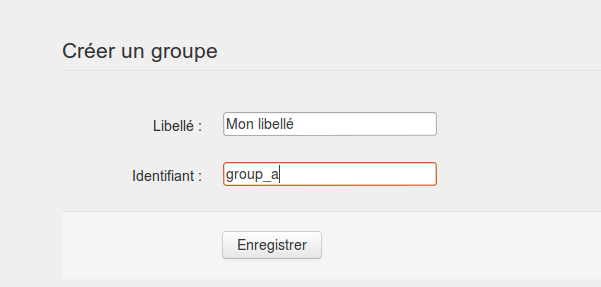
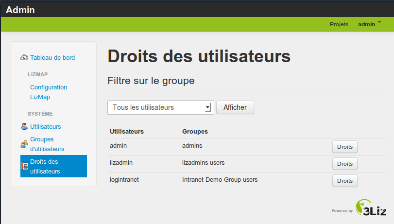

===============================================================
Gérer les groupes et les utilisateurs dans Lizmap
===============================================================

Les groupes et les utilisateurs : principes
===============================================================

En tant qu'administrateur, vous pouvez

* créer, renommer, supprimer des groupes d'utilisateurs
* créer, modifier, supprimer des utilisateurs
* rattacher un utilisateur à un ou plusieurs groupes

Lizmap
  *Les droits sur les répertoires Lizmap sont gérés au niveau des groupes d'utilisateurs, pas au niveau des utilisateurs*
  

Gérer les groupes : créer, renommer, supprimer
===============================================================

* *Créer un groupe* : Menu *Groupes d'utilisateurs* et descendre jusqu'au formulaire *Créer un groupe*
* *Donné un libellé* : il est possible d'utiliser des espaces et des accents
* Donner un identifiant : un seul mot sans caractères spéciaux

Via cette page, on peut aussi *renommer ou supprimer un groupe*

Application
  1. *Supprimer le groupe "lizadmins" et "Intranet demo group"*
  2. *Créer un groupe "prive" qui contiendra les utilisateurs ayant accès aux cartes privées*

.. note:: Le groupe users est un groupe système pour donner les droits à un utilisateurs authentifié de modifier ses propres informations d'utilisateurs dont le mot de passe. Nous avons exclu ce groupe de la configuration lizmap car tous utilisateurs identifiées doivent faire parti de ce groupe.

Gérer les utilisateurs
===============================================================

* *Créer* : Menu *Utilisateurs > Créer un nouvel utilisateur*: donner un identifiant, un email et un mot de passe
* On peut aussi *modifier un utilisateur existant*

Application
  *Créer un ou plusieurs utilisateurs*

Lizmap
  *Une fois les utitilisateurs créés, il faut les mettre dans des groupes pour leur assigner les droits liés*

Mettre les utilisateurs dans des groupes
===============================================================

* Menu *Droits des utilisateurs*
* On peut filtrer les utilisateurs visibles via la liste déroulante
* Pour mettre les utilisateurs, utiliser le bouton *Droits*

 - La page affiche un tableau avec *les droits en ligne et les groupes en colonne*
 - La dernière colonne affiche *les droits résultants*
 - Dans la *ligne d'entête*, des boutons + et - permettent de mettre/enlever l'utilisateur dans un groupe
 - *CONSEIL* : ne pas utiliser la colonne *Droits personnels*

Assigner des groupes pour chacun des utilisateurs créés
-----------------------------------------------------------

