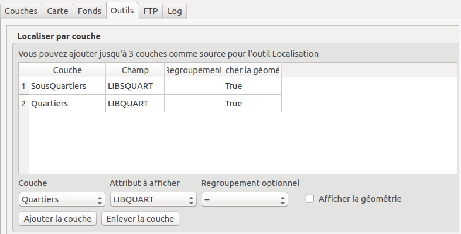
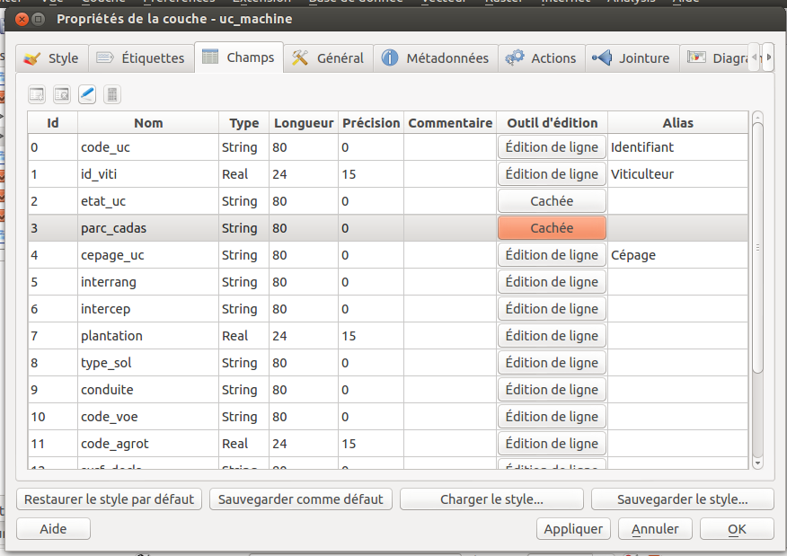
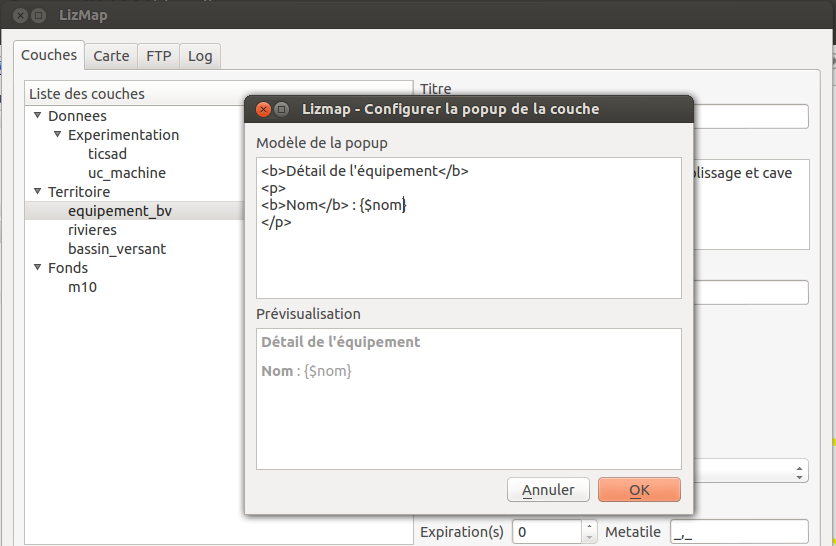
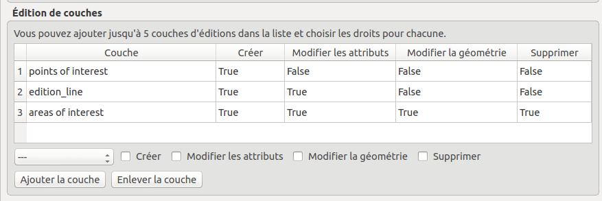

===============================================================
Advanced Configuration
===============================================================

Create an overview map
===============================================================

To add an **overview map**, or location map, in the Lizmap's map, you must:

* Create an independent group in the QGIS project called **Overview** (with the 1st letter capitalized)
* **Add layers**, for example a layer of municipalities, a lighter terrain base layer, etc.

All layers and groups in the *Overview* group will **not be shown in the lizmap's map legend**. They are drawn only in the Overview map.

It is advisable to use:

* **light and simplified** (if necessary) vector layers
* use a **suitable symbology**: small strokes and simple or hidden labels

Here is an example of use:

.. _locate-by-layer:

Add the localization function
===============================================================

The idea of this tool is to present to the Lizmap Web Client user a drop down list that gives the ability to zoom on one or more spatial objects of the layer.

Use case
------------------

Consider a spatial vector layer **districts** contained in the QGIS project. We choose to add these districts in the tool *Locate by layer*, to allow Lizmap Web Client users to quickly position on one of the districts.

Once this layer added in the tool *Locate by layer*, a drop down list of the districts appears on the Lizmap Web interface.

When the Web map user selects one name in this list, the map will automatically refocuses on the selected district and the district's geometry is displayed (optional).

Prerequisites
--------------

.. note:: The layer(s) you want to use must be **published as WFS layer**: check the corresponding box of the *WFS capabilities* in the *OWS Server* tab of the *Project Properties* window.

How to
---------------

To add a layer to this tool:

* **choose the layer** with the first dropdown from the list of the project vector layers
* then **the column that contains the label** you want to display in the dropdown list
* if you want the geometry of the related objects is also displayed on the map when the user selects an item from the list, then check the option *Display the geometry*
* finally click the button **Add layer** to add it to the list.

To remove a layer already configured:

* select the line of the layer you want to remote by clicking on it
* click on the button **Remove layer**.

Hierarchical Lists
-----------------------

If we take the example of districts, it may be interesting to also provide to the user a *sub-districts* dropdown. We wish that when the user chooses a district, the dropdown of sub-districts is automatically filtered to display only the sub-districts of the chosen district.

For this, there are 2 methods:

* you either have **2 separate vector layers**: one for districts and for sub-districts. So you have to use a **field join** between the two layers to enable automatic filtering lists in Lizmap
* either we have **only 1 layer for sub-districts**, and then you can specify with the plugin a **group field**. Two dropdowns will be created instead of one in the Web application.

.. note:: Up to 3 project layers can be added to the *Locate by layer* tool.

.. _media-in-lizmap:

Media in Lizmap
===============================================================

Use principle
-----------------------

It is possible to provide documents through Lizmap. To do this, you simply:

* create a directory called **media** (in lower case and without accents) *at the same level as the QGIS project*
* **place documents in it**: pictures, reports, pdfs, videos, HTML or text files
* the documents contained in this **media** directory are **synchronized as other data** with the plugin FTP synchronisation
* you can use subdirectories per layer or theme: the organization of **media** directory content is free.

Then in Lizmap Web Client you can provide access to these documents for 2 things:

* the **popups**: the content of one or more field for each geometry can specify the path to the media. For example a *photo* or *pdf* field
* the **link** provided for each group or layer in the Lizmap plugin *Layers* tab.

Details of these uses is specified below.

Use for links
---------------------------

It is possible to use a relative path to a document for layers or groups link.

.. note:: Links can be filled with the Lizmap plugin **Layers** tab after selecting the layer or group. See :ref:`layers-tab-metadata`

The path should be written:

* starting with **media/**
* with slashes **/** and not backslashes

Some examples:

* *media/my_layer/metadata_layer.pdf*
* *media/reports/my_report_on_the_layer.doc*
* *media/a_picture.png*

On the Lizmap Web Client map, if a link has been set up this way for one of the layers, then an icon (i) will be placed to the right of the layer. Clicking this icon opens the linked document in a new browser tab.
  
Use in popups
----------------------------

Principle
_________

As described in the introduction above, you can use **a media path** in the spatial data layer.

For example, if you want that the popups associated with a layer displayed a picture that depends on each object, just create a new field that will contain the media path to the picture in each row of the layer attribute table, then activate popups for this layer.

Example
________

Here for example the attribute table of a layer *landscape* configured to display pictures in the popup. The user has created a *picture* field in which he places the path to the pictures, and a *pdf* field in which he puts the paths to a pdf file describing the object corresponding to each line.

======  ======  ===========  ========================  ========================
id      name    description  picture                   pdf
======  ======  ===========  ========================  ========================
1       Marsh   blabla       media/photos/photo_1.png  media/docs/paysage-1.pdf
2       Beach   blibli       media/photos/photo_2.png  media/docs/paysage-2.pdf
3       Moor    bloblo       media/photos/photo_3.png  media/docs/paysage-3.pdf
======  ======  ===========  ========================  ========================

.. note:: In this example, we see that the pictures and pdf file names are normalized. Please follow this example because it allows using the QGIS Field Calculator to create or update  automatically the media column data for the entire layer.

Result
_________

Here are the display rules in the popup:

* if the path points **to a picture, the image will be displayed** in the popup. Clicking on the picture will display the original image in a new tab
* if the path points **to a text file or HTML file, the file contents will be displayed** in the popup
* for **other file types, the popup will display a link to the document** that users can download by clicking on the link.

Illustration
_____________

Below is an illustration of a Lizmap popup displaying a picture, a text and a link in the popup:

.. image:: ../MEDIA/features-popup-photo-example.png
   :align: center
   :width: 90%

.. _popups-in-lizmap:

How to configure popups
===============================================================
 
Activate popups
-------------------------------

With the plugin, you can activate popups **for a single layer** or for **a group configured with the "Group as layer" option**.

Just click on the checkbox **Activate popups** of the tab *Layers* on the Lizmap plugin interface. For the *Group as layer* option you must select the option for the group and for all the layers included you want to show in the popup: in this case, only the layers with the option *Popup* checked will be shown.

In the web application Lizmap Web Client, a click on a map object will trigger the popup if (and only if):

* the layer is **active in the legend**, so that it is shown on the canvas
* the popup **has been activated** through the plugin for the layer or the group
* the user has clicked on an **area of the canvas** where data for the layer with active popups are displayed.

.. note:: For point layers you need to click in the middle of the point to display the popup.

Informations displayed in the popup
_____________________________________

By default the Lizmap Web Client popup displays a table showing the columns of the attribute table in two columns *Field* and *Value*, as shown below:

============  ==============
Field         Value
============  ==============
          id  1
        name  A name
 description  This object ...
       photo  :-)
============  ==============

This is called **simple mode**. You can modify the info displayed through QGIS, and also display pictures or links.

Simple popup configuration
--------------------------------

With the plugin, if you click on the checkbox **Activate popups** without modifying its content through the button *Configure* the default table is shown.

Nevertheless, you can tune several things in QGIS and with the help of Lizmap plugin to **parametrize the fields displayed**, **rename fields**, and even **display images, photos, or links to internal or external documents**.

Mask or rename a column
________________________________________

You can use the tools available in the **Fields** tab of the **Layer properties**, in QGIS:

* to **avoid displaying** a column in the popup, **uncheck the relative WMS checkbox**. The WMS column is on the right

* to **change the name** displayed for that column, type a different name in the *Alias* column

   
Usage of media: images, documents, etc.
________________________________________________

If you use **paths to documents of the media directory**, you can:

* *display the image* found at that link
* *display the content (text or HTML)* of the file
* *display a link* to a document

.. seealso:: Chapter :ref:`media-in-lizmap` for more details on the usage of documents of the directory media in the popups.

Usage of external links
______________________________

You can also use, in a field, **full web links to a specific page or image**:

* the image referred to will be displayed, instead of the links
* the web link will be displayed and clickable

Advanced popup configuration - HTML format
------------------------------------------------

Introduction
_____________

If the simple table display does not suit your needs, you can write a **popup template**. To do so, you should know well the **HTML format**. See e.g.: http://html.net/tutorials/html/

.. warning:: When you use the advanced mode, the previous configuration to rename a field does not work anymore: you have to configure what is displayed and how through the template. Managing media is also possible, but you have to configure it as well.

Deploying
_______________

You can edit the popup template with the button *Configure* in the Lizmap plugin. Clicking on it you'll get a window with two text areas:

* an **area where you can type your text**
* a **read-only area**, showing a preview of your template

You can type simple text, but we suggest to write in HTML format to give proper formatting. For instance, you can add paragraphs, headings, etc.:

.. code-block:: html

   <h3>A Title</h3>
   
An example of paragraph

The behaviour is as follows:

* if the content of the two areas is empty, a simple table will be shown in the popup (default template)
* if the content is not empty, its content will be used as a template for the popup

Lizmap Web Client will replace automatically a variable, identified by the name of a field, with its content. To add the content of a column to a popup, you should use the name of the column precede by a dollar sign (`$`), all surrounded by curly brackets (`{}`). For instance:

.. code-block:: html

   <h3>A Title</h3>
   
An example of paragraph

   
A name: <b>{$name}</b>

   
Description: {$description}

.. note:: If you have configured an alias for a field, you have to use the alias instead of the name, between the brackets

You can also use the values of the columns as parameters to give styling to the text. An example here, to use the colour of a bus line as a background colour:

.. code-block:: html

   

   <b>LINE</b> : {$ref} - {$name}
   

Usage of media and external links
_____________________________________________

You can **use the media** referred to in the table content, even if you use a *template model*. To do this, you should use the media column, taking into account the fact that Lizmap Web Client automatically replaces the relative path of the type ``/media/myfile.jpg`` with the full URL to the file, accessible through the web interface.

You can also use full URLs pointing to the pages or images on another server.

Here an example of a template handling media and an external link:

.. code-block:: html

   
A Title

   
The name is {$name}

  

     A sample image 
     
   

   
<a href="{$website}" target="_blank">Web link</a>

   

 

.. seealso:: Chapter :ref:`media-in-lizmap` for more details on the use of documents in the directory media.

.. _lizmap-simples-themes:

Creating simple themes
===============================================================

Starting from Lizmap Web Client version 2.10, it is possible to create themes for all maps of a repository or for a single map. This function needs to be activated by the administrator and uses the directory ``media`` :ref:`media-in-lizmap`.

The principle is:

* the directory ``media`` contains a directory named ``themes``
* the directory ``themes`` contains a default directory for the theme of all the maps of the repository
* the directory ``themes`` may contain a directory per project, for the themes specific for each project

.. code-block:: none

   -- media
     |-- themes
       |-- default
       |-- map_project_file_name1
       |-- map_project_file_name2
       |-- etc

In order to simplify the creation of a theme for a repository or a map, Lizmap allows you to obtain the default theme fro the application, through the request: ``index.php/view/media/getDefaultTheme``.

The request returns a zipfile containing the default theme, with the following structure:

.. code-block:: none

   -- lizmapWebClient_default_theme.zip
     |-- default
       |-- css
         |-- main.css
         |-- map.css
         |-- media.css
         |-- img
           |-- loading.gif
           |-- etc
         |-- images
           |-- sprite_20.png
           |-- etc

Once downloaded the zipfile, you can:

* replace the images
* edit the CSS files

Once your theme is ready, you can just publish it copying it in the directory ``media``.

Printing configuration
===============================================================

Pour proposer l’impression sur la carte en ligne, il faut avoir activer l'outil d'impression dans l'onglet *Carte* du plugin (:ref:`lizmap-config-map`) et que le projet QGIS possède au moins un composeur d'impression.

Le composeur d'impression doit contenir **au moins une carte**.

Vous pouvez y ajouter :

* une image pour la flèche du nord
* une image pour le logo de votre structure
* une légende qui sera fixe pour toutes les impressions (avant la version 2.6)
* une échelle, de préférence numérique pour l'affichage
* une carte de localisation soit une carte pour laquelle vous aurez activé et configuré la fonction d'*Aperçu*
* des étiquettes

Vous pouvez permettre à l'utilisateur de modifier le contenu de certaines étiquettes (titre, description, commentaire, etc). Pour ce faire il vous suffit d'ajouter un identifiant à vos étiquettes.

Enfin la fonction d'impression s'appuiera sur les échelles de la carte que vous aurez défini dans l'onglet *Carte* du plugin (:ref:`lizmap-config-map`).

.. note:: Il est possible d'exclure des composeurs d'impression de la publication Web. Par exemple, si le projet QGIS contient 4 composeurs, l'administrateur du projet peut en exclure 2 via les *propriétés du projet QGIS*, onglet *Serveur OWS*. Alors ne seront présentés dans Lizmap que les composeurs publiés.

.. _print-external-baselayer:

Allow printing of external baselayers
===============================================================

L'onglet *Fonds* du plugin Lizmap permet de sélectionner et d'ajouter des fonds externes (:ref:`lizmap-config-baselayers`). Ces fonds externes ne faisant pas partie du projet QGIS, par défaut la fonction d'impression ne les intègrera pas.

Pour pallier ce manque Lizmap propose un moyen simple d'imprimer un groupe ou une couche à la place du fond externe.

Pour ajouter à l'impression une couche qui remplace un fond externe, il suffit d'ajouter au projet QGIS un groupe ou une couche dont le nom fait partie de la liste suivante :

* *osm-mapnik* pour OpenStreetMap
* *osm-mapquest* pour MapQuest OSM
* *osm-cyclemap* pour OSM CycleMap
* *google-satellite* pour Google Satellite
* *google-hybrid* pour Google Hybrid
* *google-terrain* pour Google Terrain
* *google-street* pour Google Streets
* *bing-road* pour Bing Road
* *bing-aerial* pour Bing Aerial
* *bing-hybrid* pour Bing Hybrid
* *ign-scan* pour IGN Scan
* *ign-plan* pour IGN Plan
* *ign-photo* pour IGN Photos

.. note:: L'utilisation de cette méthode doit se faire dans le respect des licences des fonds externes utilisés (:ref:`lizmap-config-baselayers`).

Pour les fonds OpenStreetMap, il est possible d'utiliser un fichier XML pour GDAL permettant d'exploiter le services de tuiles d'OpenStreetMap. Son utilisation est décrite dans la documentation GDAL http://www.gdal.org/frmt_wms.html ou dans cet article http://www.3liz.com/blog/rldhont/index.php?post/2012/07/17/Les-Tuiles-OpenStreetMap-dans-QGIS

Par contre si cette couche doit remplacer un fond externe, celle-ci doit-être accessible à QGIS-Server mais ne doit pas être accessible à l'utilisateur dans Lizmap Web Client. Elle doit donc être masquée. Voir le chapitre :ref:`hide-layers`.

Optimizing Lizmap with the cache
===============================================================

L'onglet *Couches* du plugin Lizmap permet d'activer pour chaque couche ou groupe en tant que couche la mise en cache des images générées. Cette fonctionnalité n'est pas compatible avec l'option *image non tuilée*.

Activating the cache server side
---------------------------------

Lizmap Web Client sait créer dynamiquement un cache des tuiles sur le serveur. Ce cache représente le stokage sur le serveur des images déjà générées par QGIS-Server. L'application Lizmap Web Client génère automatiquement le cache au fur et à mesure que les tuiles sont demandées. Activer le cache permet d'alléger fortement la charge sur le serveur, puisqu'on ne redemande pas à QGIS-Server les tuiles qui ont déjà été rendues. 

Pour l'activer il faut :

* cocher la case Cache Serveur ?
* préciser le temps d'expiration du cache serveur en secondes : **Expiration (secondes)**

L'option **Metatile** permet de préciser la taille de l'image en plus servant à générer une tuile. Le principe du **Metatile** est de demander au serveur une image plus grande que celle souhaiter, de la découper à la taille de la requête et de la retourner au client Web. Cette méthode évite les étiquettes tronquées au bords et les discontinuités entre tuiles, mais est plus gourmand en ressources. La valeur par défaut est *5,5* soit une image dont la largeur et la hauteur sont égale à 5 fois la largeur et la hauteur demander.

Activating the cache client side
---------------------------------

L'option **Cache client navigateur** permet de spécifier un temps d'expiration pour les tuiles dans le cache du navigateur Web (Mozilla Firefox, Chrome, Internet Exploreur, Opera, etc) en seconde. Lorsqu'on parcours la carte Lizmap avec le navigateur, celui-ci stocke les tuiles qu'il affiche dans son cache. Activer le cache client permet d'optimiser fortement Lizmap, car le navigateur ne re-demande pas au serveur les tuiles qu'il a déjà en cache et qui ne sont pas expirées. 
  
Nous conseillons de mettre la valeur maximale (1 mois soit 24 x 3600 x 30 = 2592000 secondes), sauf bien sûr pour les couches dont la donnée change souvent.

.. note::
   * **Le cache doit être activé seulement une fois le rendu bien maîtrisé**, lorsqu'on souhaite passer le projet en production.
   * **Les 2 modes de cache Serveur et Client sont complètement indépendants** l'un de l'autre. Mais bien sûr, il est intéressant d'utiliser les 2 en même temps pour optimiser l'application et libérer les ressources du serveur.

.. _lizmap-cache-centralized:

Centralizing the cache with the integration of groups and layers from a master project
=======================================================================================

Dans QGIS, il est possible d'intégrer dans un projet des groupes ou des couches depuis un autre projet (qu'on appellera "parent"). Cette technique est intéressante, car elle permet de définir les propriétés des couches une seule fois dans un projet, par exemple pour les fonds de carte (Dans les projets "fils" qui intègrent ces couches, il n'est pas possible de modifier les propriétés).

Lizmap utilise cette fonctionnalité pour centraliser le cache des tuiles. Pour tous les projets fils qui utilisent des couches intégrées du projet parent, Lizmap demandera à QGIS Server les tuiles du projet parent, et non des projets fils. Le cache sera donc centralisé au niveau du projet parent, et tous les projets fils qui utilisent les couches bénéficieront du cache mis en commun.

Pour pouvoir utiliser cette fonctionnalité, il faut:

* publier le projet QGIS parent avec Lizmap

  - il faut bien **choisir l'emprise annoncée** dans l'onglet *Serveur Ows* des propriétés du projet, car cette **emprise devra être réutilisée à l'identique dans les projets fils**
  - il faut **configurer le cache** pour les couches à intégrer. De même, bien noter les options choisies ici (format d'image, metatile, expiration) pour les utiliser telles quelles dans les projets fils
  - Il est possible de masquer le projet dans la page d'acceuil de Lizmap via la case à cocher *Masquer le projet dans Lizmap Web Client* de l'onglet *Carte* du plugin

* ouvrir le projet fils, et *intégrer des couches ou des groupes dans ce projet*, par exemple une orthophotographie. Ensuite il faut :

  - vérifier que l'**emprise annonceé** dans les propriétés du projet QGIS / Serveur OwS est **exactement la même que celle du projet parent**
  - il faut **configurer le cache** pour la couche intégrée **avec exactement les mêmes options que celles choisies dans le projet parent** : format d'image, expiration, metatile
  - il faut renseigner l'identifiant Lizmap du **Répertoire source** du projet parent (celui configuré dans l'interface d'administration de Lizmap Web Client)
  - le code du **Projet source** (le nom du projet QGIS parent sans l'extension .qgs) est renseigné automatiquement pour les couches et les groupes intégrés.

* Publier le projet fils vers l'application Lizmap Web Client, comme d'habitude.

.. _hide-layers:

Masking individual layers
===============================================================

Vous pouvez exclure des couches de votre publication via l'onglet *Serveur OWS* des *propriétés du projet QGIS*. Dans ce cas là les couches ne seront plus accessible dans Lizmap. Avec cette méthode vous ne pouvez pas utiliser une couche dans la fonction de localisation et ne pas l'afficher dans la carte.

Pour pallier ce manque Lizmap propose un moyen simple pour ne pas afficher certaines couches.

Pour ne pas afficher une ou plusieurs couches du projet QGIS dans la légende de la carte en ligne, il suffit de **mettre ces couches dans un groupe nommé "hidden"**. Toutes les couches présentes dans ce groupe ne seront pas visibles dans l'application Web.

Cette fonctionnalité peut servir pour :

* masquer une couche utiliser dans la localisation (:ref:`locate-by-layer`)
* masquer une couche simple d'ajout de données rendu à l'aide d'une vue
* masquer une couche pour l'impression de plan (:ref:`print-external-baselayer`)

.. _lizmap-config-edition:

Editing data in Lizmap
===============================================================

Principle
----------

Depuis la version 2.8, il est possible de permettre aux utilisateurs d'**éditer des données spatiales et attributaires** depuis l'interface Lizmap Web Client, pour les couches **Spatialite ou PostGreSQL** du projet QGIS. Le plugin Lizmap permet d'ajouter une ou plusieurs couches et de choisir pour chacune quelles actions seront possible dans l'interface web:

* création d'élements
* modification des attributs
* modification de la géométrie
* suppression d'éléments

Le **formulaire web** présenté à l'utilisateur pour renseigner la **table attributaire** prend en charge les **Outils d'éditions** proposés dans l'onglet *Champs* des *propriétés de la couche* vectorielle QGIS. On peut donc configurer une liste déroulante, masquer une colonne, la rendre non-éditable, utiliser une case à cocher, un champ texte, etc. Toute la configuration se fait à la souris, dans QGIS et dans le plugin Lizmap.

De plus, Lizmap Web Client détecte automatiquement le type de colonne (entier, réel, chaîne de caractère, etc.) et ajoute les vérifications et les contrôles nécessaires sur les champs.

Usage examples
-----------------------

* **Une commune** souhaite permettre aux citoyens de recenser les problèmes visibles sur la voirie: poubelles non ramassées, lampadaires en panne, épaves à enlever. L'administrateur du projet QGIS crée une couche dédiée à ce recueil de données et affiche à tous la donnée.

* **Un bureau d'étude** souhaite permettre aux partenaires d'un projet de remonter des remarques sur des zones du projet. Il permet l'ajout de polygones dans une couche dédiée.

Configuring the edition tool
------------------------------

Pour permettre l'édition de données dans Lizmap Web Client, il faut:

* **Au moins une couche vectorielle de type PostGIS ou Spatialite** dans le projet QGIS
* **Configurer les outils d'éditions pour cette couche** dans l'onglet *Champs* des propriétés de la couche. Ce n'est pas obligatoire mais recommandé pour contrôler les données saisies par les utilisateurs.
* **Ajouter la couche dans l'outil via le plugin**

Voici le détail des étapes:

* Si nécessaire, **créer une couche** dans votre base de données, du type de géométrie souhaité (point, ligne, polygone, etc.)

  - pensez à ajouter une **clé primaire** : c'est indispensable !
  - cette colonne de clé primaire doit être de type **"auto-incrémenté"**. Par exemple *serial* pour PostgreSQL.
  - pensez à ajouter un **index spatial** : c'est important pour les performances
  - *créer autant de champs dont vous avez besoin pour les attributs* : utiliser si possible des noms de champ simples !

Veuillez vous référer à la documentation de QGIS pour voir comment créer une couche spatiale dans une base de données PostGIS ou Spatialite: http://docs.qgis.org/html/fr/docs/user_manual/index.html

* **Configurer les outils d'édition** pour les champs de votre couche

  - *Ouvrir les propriétés de la couche* en double-cliquant sur le nom de la couche dans la légende
  - Aller à l'onglet *Champs*
  - Choisir l'*Outil d'édition* via la liste déroulante pour chacun des champs de la couche

    + Pour masquer un champ, choisir *Cachée*. L'utilisateur ne verra pas ce champ dans le formulaire. Aucun contenu n'y sera écrit. *Utilisez-le pour la clé primaire*
    + Pour afficher un champ en lecture seule, choisir *Immuable*
    + Cas particulier de l'option *Valeur relationnelle*. Vous pouvez utiliser cette option pour une carte Lizmap. Pour que les utilisateurs aient accès aux informations de la couche externe qui contient les données, il faut activer la publication de la couche en WFS dans l'onglet *Serveur OWS* de la boîte de dialogue *Propriétés du projet* dans QGIS.
    + etc.

  - **Evolutions de QGIS 2** :

    + Pour masquer des colonnes dans la popup de Lizmap, il faut maintenant décocher la case dans la colonne *WMS* pour chaque champs à cacher (cette colonne est juste après *Alias* )
    + Lizmap Web Client ne sait pas encore utiliser le mode *Conception par glisser/déposer* pour la génération des formulaires. Il faut donc seulement utiliser le mode *Autogénérer* pour les couches d'édition.

.. note:: Tous les outils d'édition ne sont pas encore gérés par Lizmap Web Client. Seuls les outils suivants le sont: Edition de ligne, Classification, Plage, Liste de valeurs, Immuable, Cachée, Boite à cocher, Edition de texte, Calendrier, Valeur relationnelle. Si l'outil n'est pas gérée, le formulaire web affichera un champ texte libre.

4. Ajouter la couche dans le tableau **Édition de couches** situé dans l'onglet *Outils* du plugin Lizmap:

  - *Sélectionner la couche* dans la liste déroulante
  - Cocher les actions que vous souhaitez activer parmi: *Créer, Modifier les attributs, Modifier la géométrie, Supprimer*
  - Ajouter la couche dans la liste via le bouton *Ajouter la couche*.

Reusing data of edition layers
---------------------------------------------

Les couches que vous avez sélectionnées pour l'outil d'édition sont des **couches comme les autres**, ce qui implique:

* **Les styles et les étiquettes de QGIS s'appliquent sur ces couches.** On peut donc créer des styles et des étiquettes qui dépendent d'une valeur d'une des colonnes de la couche.

* Si on souhaite proposer l'outil d'édition, mais ne pas permettre aux utilisateurs de voir les données de la couche en ligne ( et donc les ajouts des autres utilisateurs) : **on peut simplement masquer la ou les couches d'édition** en les mettant dans un répertoire *hidden*. Voir :ref:`hide-layers`

* **Les couches sont imprimables** si elles ne sont pas masquées.

* **Les données sont enregistrées dans une couche du projet**. L'administrateur peut donc récupérer ces données et les utiliser par la suite.

.. note:: PostGIS ou Spatialite? Pour bien centraliser les choses, nous conseillons d'utiliser une base de données PostGIS pour stocker les données. Pour les couches Spatialite, il faut faire attention à ne pas écraser le fichier Spatialite stocké dans le répertoire Lizmap sur le serveur par celui que vous avez en local: pensez à toujours faire une sauvegarde du fichier du serveur avant une nouvelle synchronisation de votre répertoire local.

.. note:: Using the cache: si vous souhaitez utiliser le cache serveur ou client pour les couches d'édition, faites-le en toute connaissance de cause : les données ne seront pas visibles par les utilisateurs tant que le cache ne sera pas expiré. Nous conseillons de ne pas activer le cache pour les couches d'édition.

.. _filter-layer-data-by-group:

Filtered layers - Filtering data in function of users
===================================================================

Presentation of the function
----------------------------------

Habituellement, la gestion des droits d'accès aux projets Lizmap se fait par répertoire. La configuration se fait dans ce cas via l'interface d'administration de Lizmap Web Client. Voir :ref:`define-group-rights`. Cela permet de masquer complètement certains projets en fonction des groupes d'utilisateurs, mais oblige une gestion par répertoire et projet.

Au contraire, la fonctionnalité de filtrage présentée ici permet de publier un seul projet QGIS, et de filtrer les données affichées sur la carte en fonction de l'utilisateur connecté. Il est possible de filtrer uniquement les couches vectorielles, car Lizmap se base sur une colonne de la table attributaire.

Le filtrage se base sur l'identifiant du groupe de l'utilisateur actuellement connecté à l'application Web. Il est actif pour toutes les requêtes vers le serveur QGIS, et concerne donc :

* les images des couches vectorielles affichées sur la carte
* les popups
* les listes de la fonction *Localiser par couche*. Voir :ref:`locate-by-layer`
* les listes déroulantes des *formulaires d'édition* issues de *Valeur relationnelle*. Voir :ref:`lizmap-config-edition`
* les fonctionnalités à venir (affichage de la table attributaire, fonctions de recherche, etc.)

Un tutoriel vidéo est disponible à cette adresse : https://vimeo.com/83966790

Configuration of the data filter tool
-------------------------------------------

Pour utiliser l'outil de filtrage des données dans Lizmap Web Client, il faut:

* utiliser **QGIS 2 et supérieur** sur le serveur
* avoir **accès à l'interface d'administration** de Lizmap

Voici le détail des étapes pour configurer cette fonctionnalité:

* **Connaître les identifiants des groupes d'utilisateurs** configurés dans l'interface d'administration de Lizmap Web Client. Pour cela, il faut aller dans l'interface d'administration, :menuselection:`SYSTÈME --> Groupes d'utilisateurs` : l'identifiant apparaît entre parenthèse derrière le nom de chaque groupe (sous le titre *Groupes des nouveaux utilisateurs*)
* Pour toutes les couches vectorielles dont on souhaite filtrer les données, il suffit d'**ajouter une colonne textuelle qui contiendra pour chaque ligne l'identifiant du groupe (et pas le nom !!) qui a le droit de visualiser cette ligne**.

   - *Remplir cette colonne* pour chaque ligne de la table attributaire avec l'identifiant du groupe qui a le droit de voir la ligne (via la calculatrice par exemple)
   - Il est possible de mettre **all** comme valeur dans certaines lignes pour désactiver le filtre : tous les utilisateurs verront les données de ces lignes.
   - Si la valeur contenue dans cette colonne pour une ligne ne correspond pas à un des groupes d'utilisateurs, alors la donnée ne sera affichée pour aucun utilisateur

* Ajouter la couche dans le tableau **Filtrer les données par utilisateur** situé dans l'onglet *Outils* du plugin Lizmap:

   - *Sélectionner la couche* dans la liste déroulante
   - Sélectionner le champ qui contient l'*identifiant du groupe* pour la couche
   - Ajouter la couche dans la liste via le bouton *Ajouter la couche*
   - Pour enlever une couche du tableau, cliquer dessus et cliquer sur le bouton *Enlever la couche*

* **Désactiver le cache client et le cache Serveur** pour toutes les couches filtrées. Sinon, les données affichées ne seront pas mises à jour entre chaque connexion ou déconnexion d'utilisateur !

Time Manager - Animation of temporal vector layers
===========================================================

Documentation à venir...

Un tutoriel vidéo est disponible ici : https://vimeo.com/83845949 . Il présente l'ensemble des étapes pour utiliser la fonctionalité.

Site de démonstration : http://demo.lizmap.3liz.com/index.php/view/?repository=rep6
