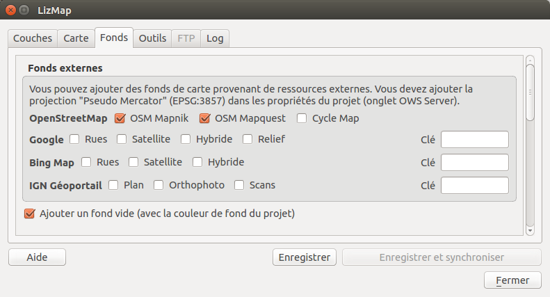

===============================================================
Set up your project for Lizmap
===============================================================

Install the Lizmap plugin
===============================================================

Lizmap is available through the official QGIS project repository:
http://plugins.qgis.org/plugins/lizmap/

To install it, just do it like any QGIS plugin:

* :menuselection:`Menu --> Plugins --> Manage and Install Plugins`
* Search Lizmap
* Install the plugin
* It's available in the menu and toolbar *Web*

.. image:: ../MEDIA/introduction-install-lizmap.png
   :align: center
   :width: 60%

The plugin is organized in 6 tabs:

* *Layers*: the options of each layer
* *Map*: the general options of the map
* *Baselayers*: the baselayers used on the Web
* *Tools* : the Web map tools
* *FTP*: The configuration for synchronization through the plugin
* *Log*: displays information of performed actions

And it has 4 action buttons:
* Help
* Save
* Save and synchronize
* Close

Configure layers and groups
===============================================================

The layer configuration is done in the *Layers* tab.

This tab shows the layers tree of the project with the same organization that is defined in the Layers panel. You can select one of tree elements, a layer or group, and then configure the options for the selected group or layer.

.. image:: ../MEDIA/interface-layers-tab-01.png
   :align: center
   :width: 80%

Information about groups and layers:

* *Title*: It will be used in the Web layers tree instead of the name. For layers, the *Title* Field is linked to that of the *Metadata* tab in the layer properties window.
* *Abstract*: It allows to describe the layer or group. It is displayed in the mouseover. For layers, the *Abstract* Field is linked to that of the *Metadata* tab in the layer properties window.
* *Link*: The web address of a document or a Web page describing the layer or group. An icon (i) appears in the legend if the link has been submitted. You can use the *media* folder, see :ref:`media_in_lizmap`

Layers options:

* *Toggled*: allows you to specify whether a layer is displayed by default.
* *Activate popup*: enables information popups on map's interrogation by clicking. See :ref:`popups_in_lizmap`
* *Hide legend image*: lets not display the legend of the layer in the web interface.
* *Display in legend tree*: lets not display the layer in the layers tree and thus does not allow the user to manage the display of it.
* *Base layer*: Sets the layer as a base map. This will be accessible via the list of basemap.
* *Single Tile*: Selects the layer display mode. It can be displayed as multiple images, tiles, or a single image generated by the server.
* *Image format*:

  * png: full image format, full range of colors with transparency
  * png; mode=16bit: lighter image format, panel color restricted with transparency
  * png; mode=8bit: very light image format, color panel restricts to the maximum with transparency, possible degradation of the image
  * jpeg: light image format without transparency without loss of quality

.. image:: ../MEDIA/interface-layers-tab-02.png
   :align: center
   :width: 80%

If the layer is provided by a WMS service and that it supports the Web map Coordinate Reference System, it is possible to *directly Request images to the WMS server*. This reduces the QGIS-Server load and optimize LizMap. This option is available in the **Third Party WMS layers** group.

The group options:

* Group as layer: 

  * transforms a group in a single layer in the web interface
  * used to group layers with scale dependent  visibility
  * simplifies the interface to the users of the Web map
  * to create a base map from multiple layers

* if the group is a layer other options apply to him

Configure the map
===============================================================

The tab *Map* allows you to enable or disable basic Lizmap tools, choosing scales and the intial extent.

.. image:: ../MEDIA/interface-map-tab.png
   :align: center
   :width: 80%

The generic options:

* hide the project in Lizmap Web Client: 

  * If this option is checked, the project will be hide in the Lizmap home page that shows thumbnails for all directories and project of the application. You can use this option to hide the project.
  * The project will still be accessible for WMS or WFS clients based on directories rights.
  * This feature is interesting  in the case of using this project as an external project for other ones.

The map tools:

* *Print*: enables the use of QGIS compositions for PDF generation map.
* *Measure tools*: enables the measurement tools in the map (length, area, perimeter).
* *Zoom history*: enables the navigation buttons in the history of zoom and move in the map.
* *Automatic geolocation*: enables the functions to use the HTML5 geolocation based on Wifi and/or GPS.
* *Address search*: to add an address search engine that is based on one of these services:

  * Nominatim (OpenStreetMap)
  * Google
  * IGN France (Géoportail)

The scales :

* a list of integer values separated by commas (and optional whitespace), eg: *250000, 100000, 50000*.
* Lizmap also used these scales to restrict the display between the minimum and maximum data scales. This is why **it is mandatory to enter at least 2 scales** in the list.

The initial map extent:

* A list of coordinates in the Reference Coordinate System map in the format: xmin, ymin, xmax, ymax; describing the initial map extent
* The maximal map extent is specified in the *OWS server* tab of *Project Properties* window. The data will not be displayed if they are outside.
* By default, the initial extent is the maximal one.

Configure the base layers
========================================================

It is often useful to separate base layers as a reference and thematic layers in a Web map. In Lizmap, you can use groups or layers as base layers. It is also possible to use external services in the Web map.

The base layers are not part of the legend and are presented as a list.

.. note:: If a single base layer is configured (project layer, external service or empty base layer), then Lizmap Web Client interface does not show the box *Base layers*, but the layer will be however visible below the other layers.

The *Base layers* tab lets you add external services as base layer and an empty base layer. The empty base layer will display thematic layers over the project background color.

The available base layers
-------------------------------

* *OpenStreetMap*, mapping project under free and open licenses:

  * OSM Mapnik: service available on openstreetmap.org
  * OSM Mapquest: service provided by Mapquest company
  * Cycle Map: promotion map of OpenStreetMap cycling data including altitude information

* *Google*, requires compliance to use licence agreement:

  * Streets: the default Google Maps background layer
  * Satellite: the background map incorporating aerial and satellite images
  * Hybrid: the background map mixing streets and satellite
  * Terrain

* *Bing Map*, requires compliance with the Microsoft license agreement and therefore a key:

  * Streets: the default Bing Map background layer
  * Satellite: the background map incorporating aerial and satellite images
  * Hybrid: the background map mixing streets and satellite

* *IGN Géoportail*, requires compliance with the IGN license agreement and therefore a key:

  * Plan: The IGN rendering for the Web
  * Satellite: the background map incorporating IGN aerial and satellite images
  * Scan: the background map mixing the various IGN scan

The licenses are available at the following URLs:

* *OpenStreetMap*: http://wiki.openstreetmap.org/wiki/FR:Tile_usage_policy
* *Mapquest*: http://developer.mapquest.com/web/products/open/map#terms
* *Google*: https://developers.google.com/maps/terms
* *Bing*: https://www.microsoft.com/maps/product/terms.html
* *IGN*: http://api.ign.fr/services#web

.. note:: If you choose an external base layer, the map will be displayed in Google Mercator (EPSG: 3857 or EPSG: 900913), the scales are those of external services and QGIS-Server will perform on the fly transform.

It is therefore necessary to prepare the QGIS project accordingly.

Must be added the *Google Mercator* coordinate reference system in the Web Services CRSs list with the *OWS Server* tab in the *Project Properties* window.
For now, all the proposed base layers use the projection::

    EPSG:3857 ; Pseudo Mercator

Here are the approximate integer scales of the current external base layers::

    0   591659008
    1   295829504
    2   147914752
    3   73957376
    4   36978688
    5   18489344
    6   9244672
    7   4622336
    8   2311168
    9   1155584
    10  577792
    11  288896
    12  144448
    13  72224
    14  36112
    15  18056
    16  9028
    17  4514
    18  2257

External LizMap layers
----------------------------

This feature has been removed. It's replaced by the possibility of using the menu  :menuselection:`Layer > Embed Layers and Groups`, and in the plugin *Layers* tab declare the parent project and the lizmap repository for the embed layers and groups. See :ref:`lizmap_cache_centralized`
