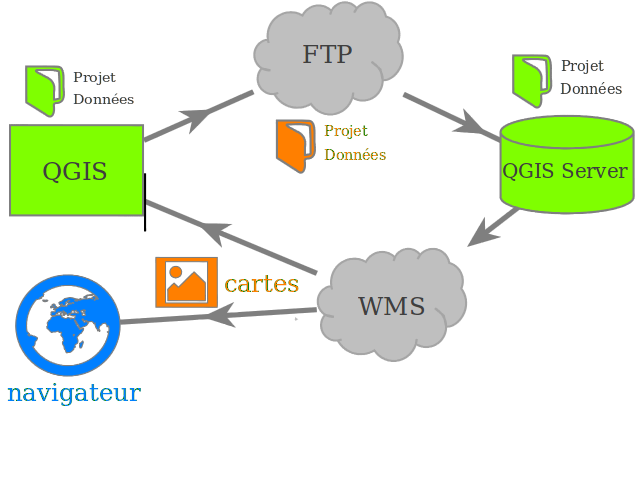

===============================================================
Publish the map by FTP
===============================================================

Reminder of Lizmap architecture
===============================================================

**Lizmap is based on repositories system**. To publish a map in Lizmap, it is sufficient to ensure that the contents of the local directory containing the data and QGIS projects **be reproduced exactly** identical in the corresponding server repository.

For this, it is necessary **to synchronize the local directory with that of the server** each time you update the QGIS project, modify the Lizmap configuration with the plugin, or add files in the local directory.

.. note:: If you are working locally, as Lizmap-Web-Client is installed on the same machine you use for QGIS, you do not need to *synchronize* your files with FTP. This configuration should only exist for testing.

.. note:: You can use any tool and synchronization protocol (FTP, FTPS, SFTP, rsync, unison, etc), if you can master the tool and have access to the Lizmap server configuration.

Use an FTP client
===============================================================

FTP allows you to access files from a server, retrieve it and add documents and/or folders. It can therefore be used to synchronize your local directory with the server one Where Lizmap-Web-Client is on. This protocol is a Web standard that can be exploited through many FTP clients.

You can use the following client or one you usually use:

* *FireFTP*: Firefox add-on
* *Filezilla*: Free cross-platform software (Windows, MacOS, Linux)
* *WinSCP*: Free software for Windows

You can use these tools to make manual changes to the remote directory:

* **made a backup**
* **remove contents**
* **overwrite files manually**: QGIS project (``.qgs``) and Lizmap configuration (``.qgs.cfg``).

Using FTP tab in Lizmap plugin
===============================================================

The FTP tab in Lizmap plugin allows you to configure the use of the FTP protocol directly into QGIS. In order to make a mirrored synchronization directly from the plugin. To integrate FTP synchronization in the plugin, we relied on two free tools that have proven reliable:

* **WinSCP** on Windows: http://winscp.net/
* **lftp** on Linux: http://lftp.yar.ru/
* We have not yet found an equivalent for Mac OS (contributions are welcome)

To use FTP synchronization from the Lizmap plugin, install an FTP client above.

* On Windows: WinSCP

  * Download **portable version**: http://winscp.net/eng/download.php
  * **Unzip to a directory**: for example "C:\\winscp\\"
  * **FTP tab in the plugin**: specify the directory where you unzipped WinSCP with the button "..."
 
* On Linux : LFTP

.. code-block:: bash

   sudo apt-get install lftp # on debian or ubuntu. For others replace with equivalent

In the FTP tab, you configure the following settings:

* **Host**: the FTP host, for the server on which Qgis server and Lizmap-Web-Client are installed (IP address or domain name)
* **Port**: the FTP port, 21 by default
* **User**: the FTP user
* **Password**: the FTP password
* **Remote directory**: directory path in which the Qgis projects are stored on the server, relative to the root of your FTP access. For example: /qgis/public/
* **Local directory**: reminder of the full path to the QGIS project

.. note:: Be careful to check the configuration with the server administrator on which Lizmap-Web-Client is installed before your tests!
