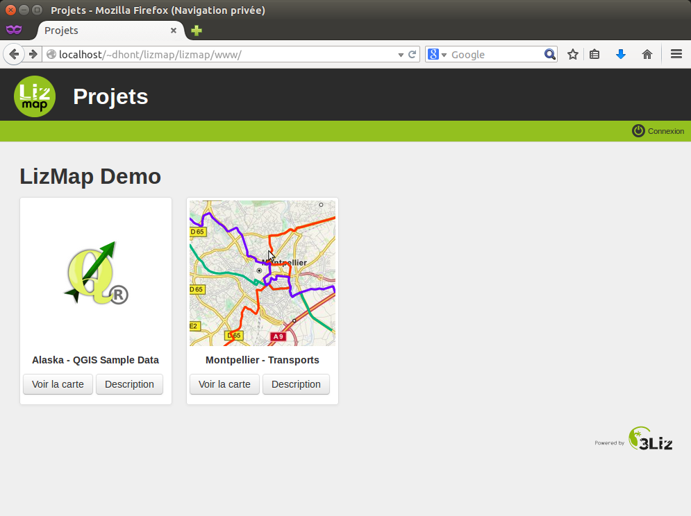
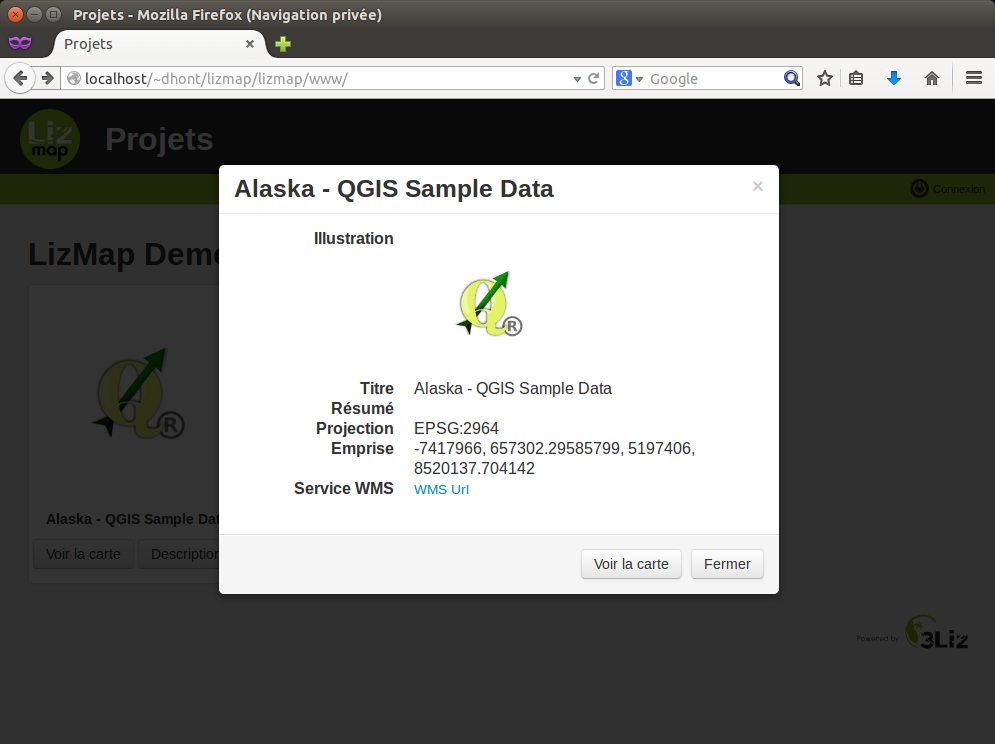
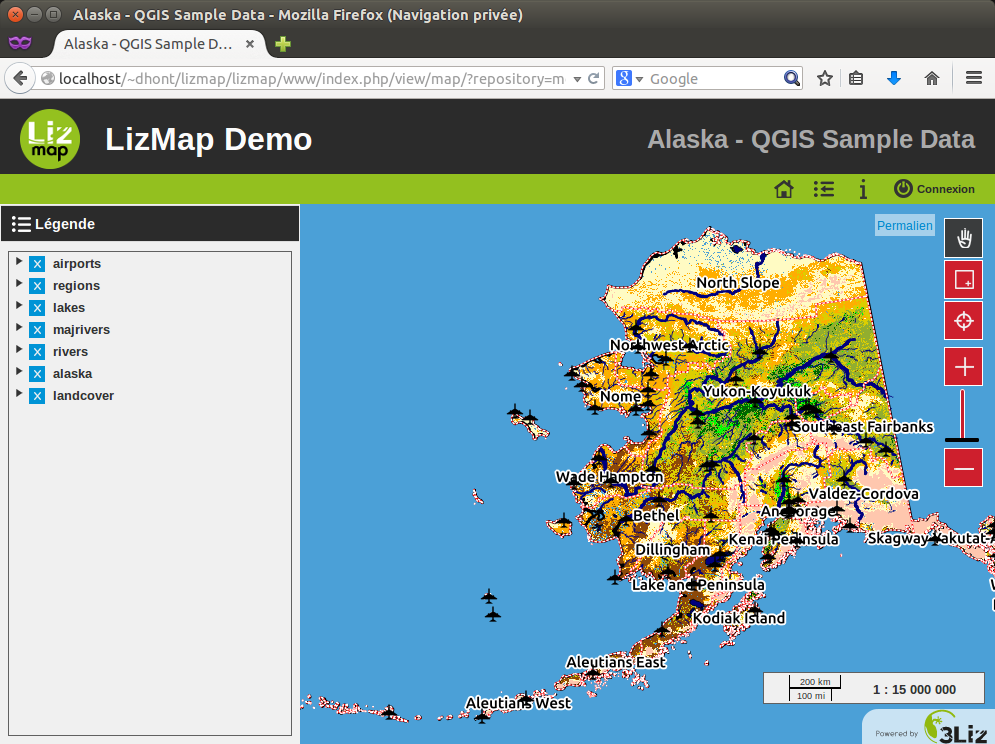
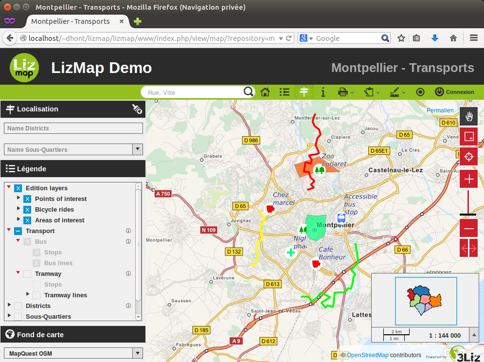
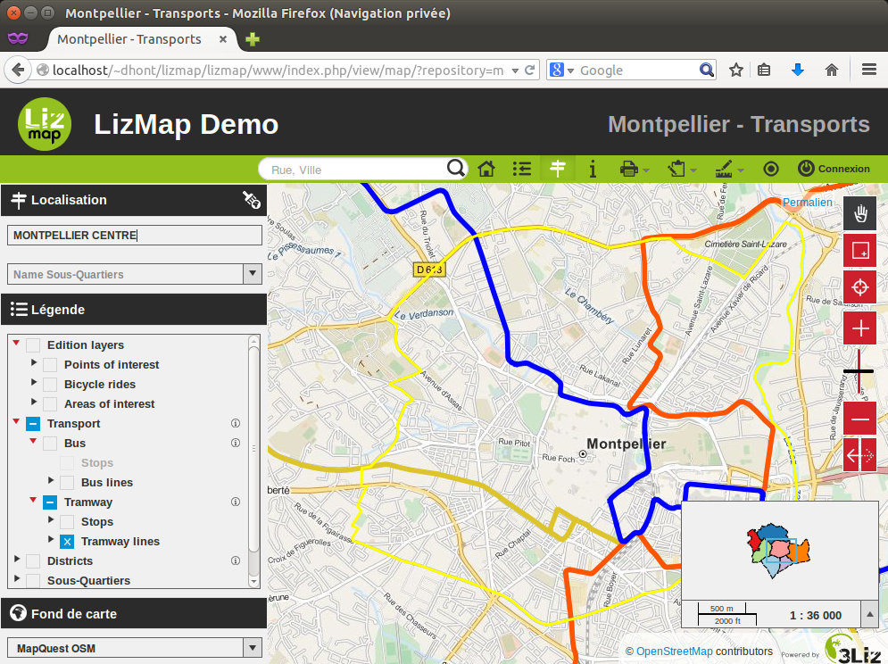
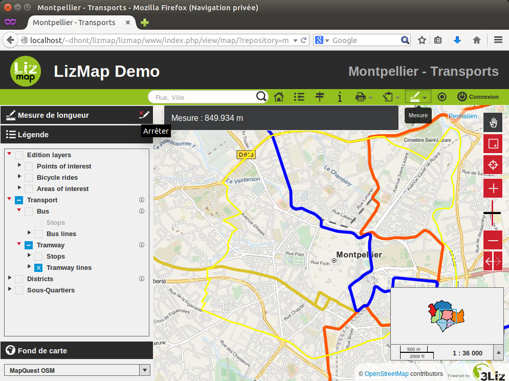
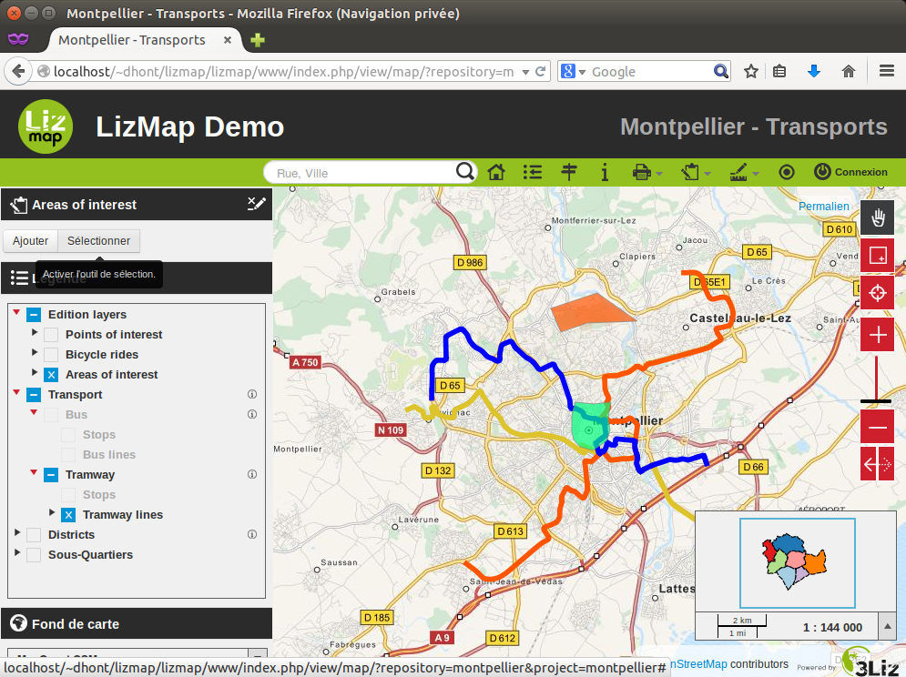

===============================================================
User guide
===============================================================

The projects pages
===============================================================

The default lizmap page offers a list maps organized by folder.

You can access to the map information sheet. This informations come directly from QGIS project.

Access to the map is done either by clicking the **Load the map** buttons or the image that accompanies the project.

A simple map
===============================================================

Lizmap offers default web maps with the following features:

* pan
* zoom on area drawn by the user
* zoom more
* selecting a zoom level with a scale bar
* zoom less
* scale display as a scale bar and numerically

The order and organization of layers in the layers panel management meet those defined in the QGIS by the map publisher.

Zooming and paning are available on the right of the map. To zoom on an area, you need to select the *zoom by rectangle* and drag to draw a rectangle defining the area to reach.

You can using the *triangle*, left the layers title, bring up the legend of the layer.

Selection boxes allow you to hide and display the proposed layers.

To take full advantage of the map, you can hide the panel management layers.

Finally you can:

* go back to the projects page
* display the map information sheet

Authentication
===============================================================

The admin can restrict access to certain map groups. To access these maps, you must authenticate. Authentication is accessible through the button *Connect* at the top left.

Once authentication is enabled, depending on your rights, you should have access to new maps.

.. image:: MEDIA/user-guide-07-authentication-projects.png
   :align: center
   :scale: 80%

You can log out and edit your user information.

Advanced features
===============================================================

The map editor can add some features depending on the desired user experience:

* selecting a basemap
* locate by layer
* distance, area and perimeter measurements
* printing the map
* editing data

Selecting a basemap
-------------------------------

Using the Lizmap plugin, the editor may have added external base maps or an empty base layer to the map. These base maps are available in the layer management panel as a list.

Locate by layer
---------------------------

This feature is displayed by default if it has been activated by the map editor.

It is located above the layer management panel and is in the form of lists. Some lists need to enter a few characters before proposing locations.

Simply select a location from the list to zoom to the item.

Measurement
------------

Measurement feature give you the ability to calculate:

* a distance
* an area
* a perimeter

It is available in the Lizmap menu bar.

The tool is activated by selecting the measurement type. Once activated, a message tells you what to do.

The measurement is displayed in the status bar.

By double-clicking on the map, the measurement is fixed. To start over, you can click on the map and restart the measurement calculation.

In the feature bar, the button on the right allows to stop using it.

It is also possible to change the measurement functionality without having to stop the feature.

Printing
------------

The print feature is available in the Lizmap menu bar. It depends on the number of print compositions published by the map editor.

Once the feature activated, a print area with the form of the composition is displayed on the map. Use this area to define the area to be printed. You can move it.

On the left, above the panel layer management, you can select the scale of printing.

.. image:: MEDIA/user-guide-16-print-scale.png
   :align: center
   :scale: 80%

Depending on the configuration of the printing composition, you can have the possibility to enter your own text.

To begin building the print file, you can click on *Print*. You will get a PDF file with the layout defined by the map editor.

Editing spatial data
-----------------------------------

The map editor can allow users to edit certain data. It also has the ability to limit possible changes:

* adding spatial object
* geometric modification
* fields modification
* deleting spatial object

The feature is available in the Lizmap menu bar. The edit menu allows you to select the data you want to update.

Once the layer selected, the edit pannel appears. This varies depending on the configuration desired by the map editor. If any changes are available you have to choose between *add* a new object or *select* one.

If you have selected *add*, you will be asked to draw a simple form that depends on the selected data layer:

* point
* line
* polygon

In the case of line and polygon, you need to click several times to draw the shape you want.

To finish your line or your polygon you must add the last point by double-clicking the desired location. Once drawing finished, an editing form for fields will be displayed.

If you want to restart drawing the geometry, you should click *Cancel*.

If the geometry is right for you and you have entered the required information, you can *Save*. The new object will be added. You will be able to update it by selecting it.

To select an object to update, you can click on the button *Select*.

Once the selection tool is activated, you must click on the map to identify the object you want to edit.

The list of editable objects below the location of the clicks will appear. You will be able to select exactly the object to modify.

The selected object appears on the map and its geometry may be changed immediatly.

You can undo geometry changes using the "Undo" button.

To validate your geometry modifications or simply access the editing form for fields, you must click *Edit*.

.. image:: MEDIA/user-guide-28-edition-select-draw-validate.png
   :align: center
   :scale: 80%

A dialog box containing the editing form for fields of the object appears.

The *Save* button saves the geometry and attributes changes.

If you want to remove the object you selected, you must click *Del*.

Finally, to disable editing tool, simply click on * Stop *.

