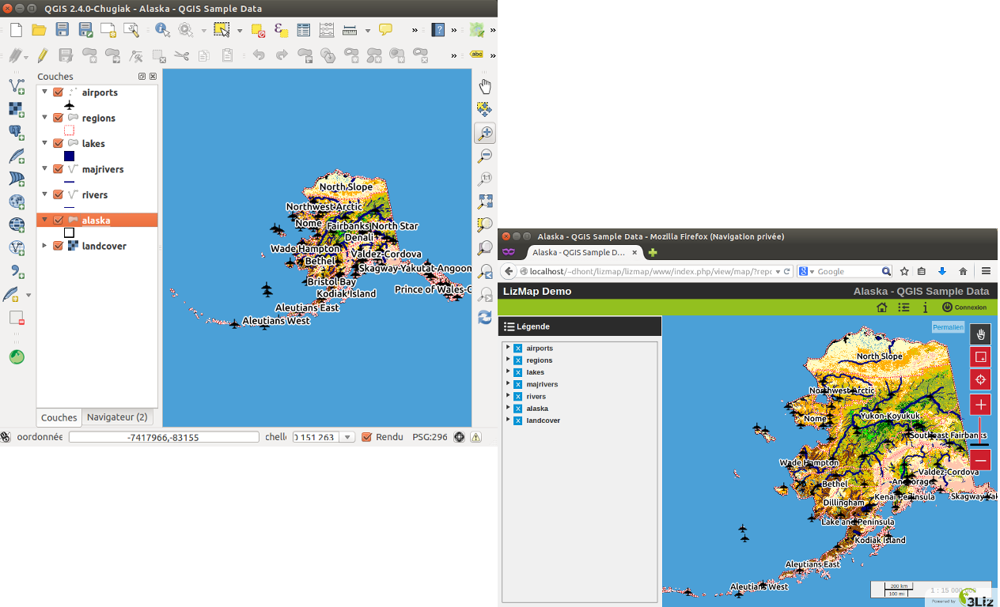

===============================================================
Introduction
===============================================================

Architecture de Lizmap
===============================================================

.. image:: MEDIA/all-schema-client-server.png
   :align: center

**Préparation des données**

Le travail de construction de la carte se mène sur son propre ordinateur avec le **logiciel QGIS** dans sa version bureautique :

* chargement des couches,
* création de la carte,
* organisation et mise en forme des données.

**Configuration & publication de la carte**

Pour pouvoir mettre en ligne sa carte, l'éditeur configure les options de publication (échelles, fonds de carte, metadonnées) avec le **plugin Lizmap** dans son application QGIS. Il réalise ensuite une synchronisation sécurisée de son dossier de travail avec son serveur en intra- ou extranet.

**Visualisation des données**

Lorsque la synchronisation est terminée, la carte QGIS est alors accessible sur Internet à l'identique. Elle est consultable sur l'application **Lizmap Web Client** au travers des navigateurs majeurs (Firefox, Safari, Chrome, Internet Explorer).

QGIS et QGIS Server
===============================================================

* Qgis, un SIG de bureau complet

  * Gestion d'un large panel de format de données raster (GeoTIFF, ASC, NetCDF, etc) et vecteur (SHP, TAB, MIF/MID, GML, GeoJSON, etc)
  * Gestion des principales base de données géographiques (PostgreSQL/PostGIS, Oracle, MSSQL, etc)
  * Gestion des couches raster et vecteur, sémiologie, impression, traitements
  * Performance et richesse fonctionnelle d'un SIG de bureau 

* Les Services Géographiques Web normées :

  * *Open Geospatial Consortium*, OGC, consortium de normalisation des échanges d'information géographique au travers d'Internet
  * *Web Mapping Service*, WMS : norme de publication de carte au format image
  * *Web Feature Service*, WFS : norme de publication de données géographiques vectorielles
  * *Web Coverage Service*, WCS : norme de publication de données géographiques RASTER.

* QGIS Server permet de publier simplement les 3 types de Services Geographiques Web normés :
 
  * Installer Qgis Server sur un serveur
  * Configurer les propriétés des Services Géographiques Web
  * Copier-coller le projet Qgis et les fichiers de données 
  * Qgis Server et Qgis Desktop partage **un même moteur de rendu**

Caractéristique de Lizmap
===============================================================

Par défaut
-----------

Lizmap propose par défaut des cartes web ayant les fonctionnalités suivantes :

* déplacement
* zoom sur une zone dessinée par l'utilisateur
* zoom avant
* sélection d'un niveau de zoom via une barre de niveau
* zoom arrière
* affichage de l'échelle sous forme d'une barre et de façon numérique

La légende affichée respecte l'ordre et l'organisation définie dans QGIS.

L'interface permet à l'utilisateur de cacher cette légende et ainsi profiter de la carte dans toute la largeur de l'écran. Elle permet aussi de consulter les informations sur la carte  (description, emprise, contact).

Enfin Lizmap est un proxy au web services servant à construire les cartes. Il est donc possible d'utiliser des requêtes WMS ou WFS pointant vers Lizmap. Il est ainsi possible de sécuriser l'accès aux web services pour un accès dans QGIS ou ArcGIS. Il est aussi possible de partager ces adresses de web services avec des systèmes de catalogages. 

.. image:: MEDIA/introduction-alaska-map.png
   :align: center
   :scale: 80%

Configuration avec QGIS
------------------------

La configuration des cartes se fait dans QGIS.

Une partie provient directement du **projet QGIS** :

* ordre et structure de la légende
* symbologie des couches
* carte de situation grâce à la présence d'un groupe Overview
* configuration des templates d'impression via les composeurs

Le reste se fait à l'aide du **plugin Lizmap**. Ce plugin permet de :

* préciser le nom des couches et des groupes dans l'interface Web
* regrouper les couches en une seule couche WMS
* définir certaines couches comme couche de fond
* définir le système d'affichage : image seule ou ensemble de tuile
* définir la durée de vie de l'image dans le cache
* définir la durée de vie d'une image sur le réseau
* définir les popups d'interrogation des couches
* définir un lien vers la fiche de métadonnées
* définir les échelles de consultation de la carte
* définir les outils accessibles avec la carte :

  * impressions
  * mesures de longueurs, surfaces et périmètres
  * utilisation de la géolocalisation de l'utilisateur (GPS)
  * recherche d'adresse dans OpenStreetMap, Google ou Géoportail IGN

* définir les fonds de plan externe :

  * Google Maps
  * Bing Maps
  * OpenStreetMap
  * Géoportail IGN

* définir les couches servant de raccourci de navigation :

  * recherche dans le champ d'une couche
  * zoom sur l'élément sélectionné
  * recherche en cascade au sein de la même couche via 2 attributs ou entre couches jointes

.. image:: MEDIA/introduction-montpellier-map.png
   :align: center
   :scale: 80%
   :target: http://demo.3liz.com/lizmap/index.php/view/map?repository=montpellier&project=montpellier

Configuration dans le back-office Web
--------------------------------------

Le back-office de Lizmap permet de définir :

* la liste des répertoires contenant des cartes
* les droits des utilisateurs par répertoire de carte
* l'utilisation de sous-domaine pour améliorer la réactivité de l'interface.

En résumé
----------

* Interface HTML5, compatible mobiles et tablettes
* Regroupement des cartes par répertoire  : application multi-répertoires et multi-projets
* Gestion des droits d'accès par répertoire pour des groupes utilisateurs
* Gestion automatique du cache des cartes
* Interface multilingue : anglais, français, italien, espagnol, portugais, grecque
* Utilisation de fonds référentiels externes : OSM, Google, Bing, Géoportail
* Impression
* Édition en ligne : ajout, modification spatiale et attributaire, suppression
* Zoom par localisation
* Recherche d'adresse : Nominatim (moteur d'OpenStreetMap), Google, Géoportail
* Logs d'accès

