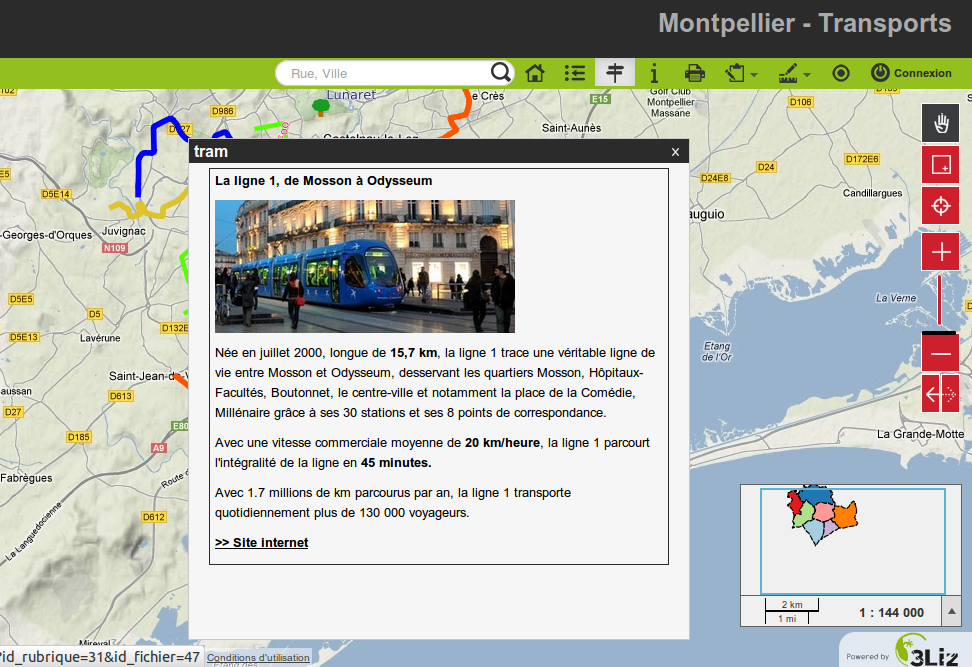
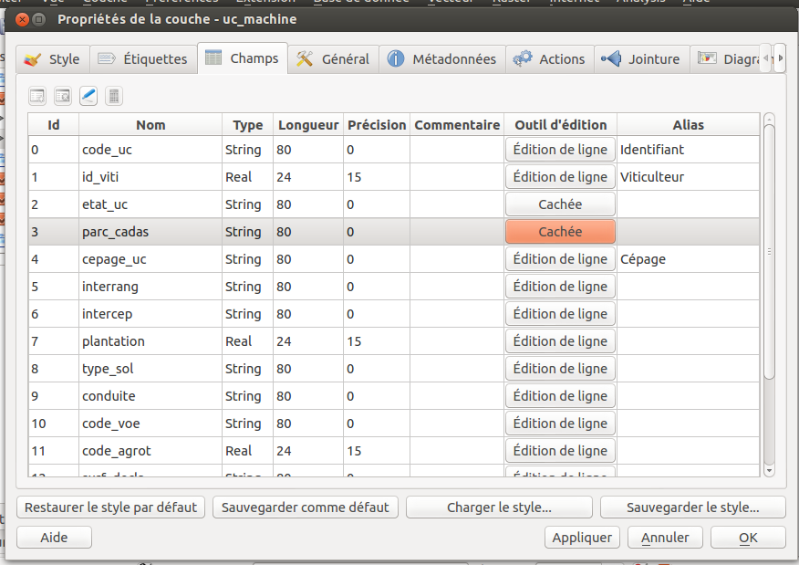

===============================================================
Configuration avancée
===============================================================

.. _overview_map:

Créer une carte de localisation
===============================================================

Pour ajouter une **carte de localisation**, ou carte miniature, dans la carte Lizmap, il suffit de :

* créer un groupe indépendant dans le projet QGIS qui s'appelle **Overview** (avec la majuscule à la 1ère lettre)
* **Y ajouter des couches**, par exemple une couche de communes, un fond relief allégé, etc.

L'ensemble des couches et groupes du groupe *Overview* ne sera **pas affiché dans la légende** de la carte Lizmap, mais seulement dans la carte de localisation.

Il est conseillé d'utiliser

* des couches vectorielles **légères et simplifiées** si nécessaire
* d'utiliser une **sémiologie adaptée** : traits fins et étiquettes cachées ou petites

Voici un exemple d'utilisation:

.. image:: ../MEDIA/features-overview.png
   :align: center
   :width: 60%

.. _locate_by_layer:

Ajouter la fonction de localisation
===============================================================

.. image:: ../MEDIA/interface-tools-tab-locate.png
   :align: center
   :width: 80%

L'idée de cet outil est de présenter à l'utilisateur de Lizmap Web Client une liste déroulante qui permet de zoomer automatiquement sur un ou plusieurs objets spatiaux de la couche.

Cas d'utilisation
------------------

Prenons comme exemple une couche vectorielle spatiale **Quartiers** contenue dans le projet QGIS. On choisit d'ajouter ces quartiers dans l'outil *Localiser par couche*, pour permettre aux utilisateurs de Lizmap Web Client de se positionner rapidement sur un des quartiers.

Une fois cette couche ajoutée dans l'outil *Localiser par couche*, une liste déroulante contenant les quartiers s'affiche sur l'interface web de Lizmap.

Lorsque l'utilisateur de la carte web sélectionne un nom dans cette liste, la carte se recentre automatiquement sur le quartier sélectionné, et la géométrie du quartier s'affiche (en option).

Pré-requis
------------

.. note:: La ou les couches qu'on souhaite utiliser doivent être **publiée(s) comme couche WFS** : cocher la case correspondante dans l'onglet *Serveur OWS* de la partie *Capacités WFS* des propriétés du projet QGIS.

Fonctionnement
---------------

Pour ajouter une couche à cet outil:

* on **choisit la couche** via la première liste déroulante parmi les couches vectorielles du projet,
* puis **la colonne qui contient le libellé** qu'on souhaite afficher dans la liste déroulante.
* Si on souhaite que **la géométrie** liée aux objets soit aussi affichée sur la carte lorsque l'utilisateur sélectionne un élément de la liste, alors on coche l'option *Afficher la géométrie*.
* Enfin on clique sur le bouton **Ajouter la couche** pour l'ajouter dans la liste

Pour supprimer une des couches déjà configurée:

* on sélectionne la ligne en cliquant sur l'une des cases de la couche à supprimer
* on clique sur le bouton **Enlever la couche**

Listes hiérarchiques
-----------------------

Si on reprend l'exemple des quartiers, il peut être intéressant de proposer aussi à l'utilisateur une liste déroulante des *sous-quartiers*. On souhaite que lorsque l'utilisateur choisit un quartier, alors la liste déroulante des sous-quartiers soit automatiquement filtrée pour n'afficher que les sous-quartiers du quartier choisi.

Pour cela, il existe 2 méthodes :

* soit on a **2 couches vectorielles distinctes** : une pour les quartiers, et une pour les sous-quartiers. Alors il faut utiliser une **jointure attributaire** entre les 2 couches pour activer le filtrage automatique des listes dans Lizmap.
* soit on n'a qu'**1 seule couche des sous-quartiers**, et alors on peut spécifier via le plugin l'**attribut de regroupement**. Deux listes déroulantes seront créées au lieu d'une seule dans l'application Web.

.. note:: Au maximum 3 couches du projet peuvent être ajoutées à l'outil Localiser par couches

.. _media_in_lizmap:

Les médias dans Lizmap
===============================================================

Principe d'utilisation
-----------------------

Il est possible de mettre à disposition des documents à travers Lizmap. Pour cela il faut simplement:

* créer un répertoire intitulé **media** (en minuscule et sans accents) *au même niveau que le projet QGIS*
* **y mettre des documents**: des images, des rapports, des pdfs, des vidéos, des fichiers HTML ou texte.
* Les documents contenus dans ce répertoire **media** sont donc **synchronisés comme les autres données** via la synchronisation FTP du plugin.
* On peut utiliser des sous-répertoires par couche ou par thème: l'organisation du contenu du répertoire **media** est libre

Ensuite dans Lizmap Web Client, on peut offrir un accès à ces documents pour 2 choses:

* les **popups** : le contenu d'une ou plusieurs colonne pour chaque géométrie peut préciser le chemin vers le média. Par exemple une colonne *photo*, ou bien une colonne *pdf*
* le **lien** indiqué pour chaque groupe ou couche via l'onglet *Couches* du plugin Lizmap

Le détail de ces utilisation est précisé ci-dessous

Utilisation pour les liens
---------------------------

Il est possible d'utiliser un chemin relatif vers un document pour les liens des couches ou des groupes. Rappel: les liens peuvent être renseigné via l'onglet **Couches** du plugin Lizmap, après avoir sélectionné la couche ou le groupe qu'on souhaite renseigner. Voir :ref:`layers_tab_metadata`

Le chemin doit être écrit:

* en commençant par **media/**
* avec des slashs **/** et non des anti-slashs

Quelques exemples:

* *media/ma_couche/metadonnees_couche.pdf*
* *media/rapports/mon_rapport_sur_la_couche.doc*
* *media/une_image.png*

Sur la carte de Lizmap Web Client, si un lien a été configuré de cette manière pour une des couches, alors une icone (i) sera placée à droite de la couche. Un clic sur cet icône permet d'ouvrir le document lié dans un nouvel onglet du navigateur.

  
Utilisation dans les popups
----------------------------

Principe
_________
Comme décrit dans l'introduction ci-dessus, on peut utiliser **un chemin de media** dans les données de la couche spatiale. 

Par exemple, si on souhaite que les popups liées à une couche affichent une photo qui dépende de chaque objet, il suffit de créer une nouvelle colonne qui contiendra le chemin de media vers la photo pour chaque ligne de la table attributaire de la couche. Et ensuite d'activer les popups pour cette couche.

Exemple
________

Voici pour l'exemple la table attributaire d'une couche *paysage* configurée pour afficher des photos dans la popup. L'utilisateur a créé une colonne *photo* dans laquelle il place le chemin vers les photos, et une colonne *pdf* dans laquelle il met les chemins vers un fichier pdf décrivant l'objet correspondant à chaque ligne

======  ======  ===========  ========================  ========================
id      nom     description  photo                     pdf
======  ======  ===========  ========================  ========================
1       Marais  blabla       media/photos/photo_1.png  media/docs/paysage-1.pdf
2       Plage   blibli       media/photos/photo_2.png  media/docs/paysage-2.pdf
3       Lande   bloblo       media/photos/photo_3.png  media/docs/paysage-3.pdf
======  ======  ===========  ========================  ========================

.. note:: Dans cet exemple, on voit que les noms des fichiers des photos et des PDF sont normés. Nous conseillons de suivre cet exemple, car cela permet d'utiliser la calculatrice de QGIS pour créer ou mettre à jour les données des colonnes de média pour l'ensemble de la couche de manière automatisée.

Résultat
_________

Voici les règles d'affichage dans la popup

* Si le chemin pointe **vers une image, l'image sera affichée** dans la popup. Un clic sur l'image affichera l'image originale dans un nouvel onglet. 
* Si le chemin pointe **vers un fichier texte ou un fichier HTML, le contenu du fichier sera affiché** dans la popup.
* Pour les **autres types de fichiers, la popup affichera un lien vers le document**, que les utilisateurs pourront télécharger en cliquant sur le lien.

Illustration
_____________

Ci-dessous, une illustration d'une popup Lizmap affichant une photo, un texte et un lien dans la popup:

   
.. _popups_in_lizmap:

Configurer les popups dans Lizmap
===============================================================
 
Activer les popups dans Lizmap
-------------------------------

Via le plugin, on peut activer les popups **pour une couche** ou pour **un groupe qui a été configuré comme "Groupe comme une couche"**

Pour cela il suffit de cliquer sur la case à cocher **Activer les popups** de l'onglet *Couches* du plugin Lizmap. Pour les *groupes comme une couche*, il faut activer l'option pour le groupe et pour toutes les couches filles qu'on souhaite voir dans la popup. Dans ce cas, seules les couches filles qui ont aussi l'option *Popup* activée seront visibles.

Dans l'application *Lizmap Web Client*, un clic sur un objet de la carte lancera l'ouverture de la popup si et seulement si :

* la couche est **cochée dans la légende**, et donc visible
* la popup a bien **été activée** via le plugin pour la couche ou le groupe
* l'utilisateur a bien **cliqué sur un endroit de la carte** où on voit de la donnée pour l'une des couches avec les popups actives.

.. note:: Pour les couches de type Point, il faut bien cliquer pile au milieu du point pour que la popup apparaisse.

Informations affichées dans la popup
_____________________________________

Par défaut, la popup de *Lizmap Web Client* affiche un tableau de ce type, qui présente les colonnes de la table attributaire en ligne dans 2 colonnes *Champ* et *Valeur*:

============  ==============
Champ         Valeur
============  ==============
          id  1
         nom  Un nom
 description  Cet objet ...
       photo  :-)
============  ==============

C'est ce qu'on appelle le **mode simple**. On peut modifier un peu les informations affichées via QGIS, et aussi afficher des images ou des liens.

Configuration simple des popups
--------------------------------

Via le plugin, si on clique seulement sur la case à cocher *Activer les popups* sans modifier le contenu via le bouton *Contenu*, alors c'est l'affichage par défaut ou *mode simple* qui est utilisé. 

On peut néanmoins jouer sur plusieurs choses dans QGIS et via le plugin Lizmap pour **paramétrer les champs qu'on veut afficher**, **renommer les champs**, et même **afficher des images, des photos ou des liens vers des documents internes ou externes**.

Masquer une colonne ou modifier son nom
________________________________________
On peut utiliser les outils de **l'onglet Champs** des **propriétés de la couche**:

* Pour **ne pas afficher** une colonne dans la popup: il faut **décocher la case WMS pour les champs à masquer**. Cette colonne se trouve tout à droite

* Pour **modifier le nom** qui sera affiché pour la colonne : *colonne Alias*

   
Utilisation de médias : images, documents, etc.
________________________________________________

Si on utilise des **chemins vers les documents du répertoire media**, on peut

* *afficher l'image* correspondante
* *afficher le contenu texte ou HTML* du fichier correspondant
* *afficher un lien* vers le document

.. note:: Voir le chapitre :ref:`media_in_lizmap` pour plus de détail sur l'utilisation de documents du répertoire media dans les popups.

Utilisation de liens externes
______________________________

Enfin on peut aussi utiliser dans les colonnes **des liens Web complets vers une page ou une image**:

* l'image pointée par le lien sera affichée à la place du lien
* le lien web sera affiché et cliquable

Configuration avancée des popups au format HTML
------------------------------------------------

Introduction
_____________

Si l'affichage tabulaire par défaut des popups ne vous convient pas, vous pouvez écrire **un modèle de popup**. Pour cela, il faut bien connaître le **format HTML**. Voir par exemple: http://fr.html.net/tutorials/html/

.. note:: ATTENTION: lorsque vous utilisez le mode avancé, la configuration précédente ne fonctionne plus pour renommer un champ: c'est vous qui contrôlez via le modèle les affichages. La gestion des médias est encore possible, mais c'est à vous de bien la prévoir.

Mise en oeuvre
_______________

Via le **bouton Configurer** du plugin Lizmap, on peut modifier le modèle de la popup. En cliquant sur ce bouton, une fenêtre s'affiche avec 2 zones de texte :

* une **zone de texte éditable** qui permet d'écrire le contenu
* une **zone de texte en lecture seule** qui montre un aperçu de la mise en forme

.. image:: ../MEDIA/features-popup-configure.png
   :align: center
   :width: 70%

On peut écrire du texte simple, mais il est conseillé d'écrire au format HTML pour le mettre en forme. On peut par exemple utiliser les paragraphes, les titres, etc

.. code-block:: html

   <h3>Un titre</h3>
   
Un exemple de paragraphe

Le comportement est le suivant:

* Si le contenu des 2 champs texte est vide, un tableau sera présenté dans la popup (modèle par défaut)
* Si le contenu n'est pas vide, le modèle écrit dans le contenu sera utilisé à la place pour l'affichage de la popup

*Lizmap Web Client* sait remplacer automatiquement une variable représentant le nom d'un champ de la table attributaire par son contenu. Pour ajouter le contenu d'une colonne dans la popup, on utilise **le nom de la colonne précédé d'un dollard, le tout encadré d'accolades**. Par exemple:

.. code-block:: html

   <h3>Un titre</h3>
   
Un exemple de paragraphe

   
Le nom : <b>{$nom}</b>

   
Description: {$description}

.. note:: Si vous avez configuré un alias pour un champ, il faut utiliser l'alias au lieu du nom entre accolade
  
On peut aussi utiliser les valeurs des colonnes comme paramètres pour styliser le texte. Par exemple ici pour mettre le fond dans la couleur de la ligne de bus:

.. code-block:: html

   

   <b>LINE</b> : {$ref} - {$name}
   

  
Utilisation des médias et des liens externes
_____________________________________________

On peut **utiliser les médias** référencés dans le contenu des champs de la table attributaire, même si on configure un *modèle de template*. Pour cela, il faut utiliser les colonnes de média en anticipant le fait que Lizmap Web Client remplace automatiquement le chemin relatif de type */media/monfichier.jpg* par l'URL complète avec laquelle on peut y accéder depuis l'interface WEB.

On peut aussi utiliser des URL complètes pointant vers les liens ou des images hébergées sur un autre serveur.

Voici un exemple de contenu d'un modèle gérant les médias et utilisant un lien externe: :

.. code-block:: html

   
Un titre

   
Le nom est {$name}

  

     Une petite illustration 
     
   

   
<a href="{$website}" target="_blank">Lien web</a>

   

 

.. note:: Voir le chapitre :ref:`media_in_lizmap` pour plus de détail sur l'utilisation de documents du répertoire media.

.. _lizmap_simples_themes:

Créer des thèmes simples
===============================================================

Depuis la version 2.10 de Lizmap-Web-Client, il possible de créer des thèmes pour toutes les cartes d'un répertoire ou pour chaque carte. Cette fonctionnalité doit être activée par l'administrateur et s'appuie sur le dossier média :ref:`media_in_lizmap`.

Le principe est le suivant :

* le dossier media contient un dossier themes
* le dossier themes contient un dossier default pour le theme de toute les cartes du répertoire
* le dossier themes peut contenir une dossier par projet pour le theme spécifique au projet

.. code-block:: none

   -- media
     |-- themes
       |-- default
       |-- map_project_file_name1
       |-- map_project_file_name2
       |-- etc

Afin de faciliter la création d'un theme pour un répertoire ou une carte, lizmap permet de récupérer le thème par défaut de l'application via la requête : index.php/view/media/getDefaultTheme

Cette requête renvois un fichier zip contenant le theme par défaut avec la structure suivantes :

.. code-block:: none

   -- lizmapWebClient_default_theme.zip
     |-- default
       |-- css
         |-- main.css
         |-- map.css
         |-- media.css
         |-- img
           |-- loading.gif
           |-- etc
         |-- images
           |-- sprite_20.png
           |-- etc

Une fois que vous avez récupéré le contenu du thème par défaut, vous pouvez :

* remplacer les images
* modifier les fichiers CSS

Une fois que votre thème est prêt, il vous suffit de le publier avce le dossier media et les projets.

.. _print_lizmap:

Configurer l'impression
===============================================================

Pour proposer l’impression sur la carte en ligne, il faut avoir activer l'outil d'impression dans l'onglet *Carte* du plugin (:ref:`lizmap_config_map`) et que le projet QGIS possède au moins un composeur d'impression.

Le composeur d'impression doit contenir **au moins une carte**.

Vous pouvez y ajouter :

* une image pour la flèche du nord
* une image pour le logo de votre structure
* une légende qui sera fixe pour toutes les impressions (avant la version 2.6)
* une échelle, de préférence numérique pour l'affichage
* une carte de localisation soit une carte pour laquelle vous aurez activé et configuré la fonction d'*Aperçu*
* des étiquettes

Vous pouvez permettre à l'utilisateur de modifier le contenu de certaines étiquettes (titre, description, commentaire, etc). Pour ce faire il vous suffit d'ajouter un identifiant à vos étiquettes.

Enfin la fonction d'impression s'appuiera sur les échelles de la carte que vous aurez défini dans l'onglet *Carte* du plugin (:ref:`lizmap_config_map`).

.. note:: Il est possible d'exclure des composeurs d'impression de la publication Web. Par exemple, si le projet QGIS contient 4 composeurs, l'administrateur du projet peut en exclure 2 via les *propriétés du projet QGIS*, onglet *Serveur OWS*. Alors ne seront présentés dans Lizmap que les composeurs publiés.

.. _print_external_baselayer:

Permettre l'impression de fond externe
===============================================================

L'onglet *Fonds* du plugin Lizmap permet de sélectionner et d'ajouter des fonds externes (:ref:`lizmap_config_baselayers`). Ces fonds externes ne faisant pas partie du projet QGIS, par défaut la fonction d'impression ne les intègrera pas.

Pour pallier ce manque Lizmap propose un moyen simple d'imprimer un groupe ou une couche à la place du fond externe.

Pour ajouter à l'impression une couche qui remplace un fond externe, il suffit d'ajouter au projet QGIS un groupe ou une couche dont le nom fait partie de la liste suivante :

* *osm-mapnik* pour OpenStreetMap
* *osm-mapquest* pour MapQuest OSM
* *osm-cyclemap* pour OSM CycleMap
* *google-satellite* pour Google Satellite
* *google-hybrid* pour Google Hybrid
* *google-terrain* pour Google Terrain
* *google-street* pour Google Streets
* *bing-road* pour Bing Road
* *bing-aerial* pour Bing Aerial
* *bing-hybrid* pour Bing Hybrid
* *ign-scan* pour IGN Scan
* *ign-plan* pour IGN Plan
* *ign-photo* pour IGN Photos

.. note:: L'utilisation de cette méthode doit se faire dans le respect des licences des fonds externes utilisés (:ref:`lizmap_config_baselayers`).

Pour les fonds OpenStreetMap, il est possible d'utiliser un fichier XML pour GDAL permettant d'exploiter le services de tuiles d'OpenStreetMap. Son utilisation est décrite dans la documentation GDAL http://www.gdal.org/frmt_wms.html ou dans cet article http://www.3liz.com/blog/rldhont/index.php?post/2012/07/17/Les-Tuiles-OpenStreetMap-dans-QGIS

Par contre si cette couche doit remplacer un fond externe, celle-ci doit-être accessible à QGIS-Server mais ne doit pas être accessible à l'utilisateur dans Lizmap-Web-Client. Elle doit donc être masquée. Voir le chapitre :ref:`hide_layers`.

.. _lizmap_cache:

Optimiser Lizmap grâce au cache
===============================================================

L'onglet *Couches* du plugin Lizmap permet d'activer pour chaque couche ou groupe en tant que couche la mise en cache des images générées. Cette fonctionnalité n'est pas compatible avec l'option *image non tuilée*.

Activer le cache côté serveur
------------------------------

Lizmap Web Client sait créer dynamiquement un cache des tuiles sur le serveur. Ce cache représente le stokage sur le serveur des images déjà générées par QGIS-Server. L'application Lizmap Web Client génère automatiquement le cache au fur et à mesure que les tuiles sont demandées. Activer le cache permet d'alléger fortement la charge sur le serveur, puisqu'on ne redemande pas à QGIS-Server les tuiles qui ont déjà été rendues. 

Pour l'activer il faut :

* cocher la case Cache Serveur ?
* préciser le temps d'expiration du cache serveur en secondes : **Expiration (secondes)**

L'option **Metatile** permet de préciser la taille de l'image en plus servant à générer une tuile. Le principe du **Metatile** est de demander au serveur une image plus grande que celle souhaiter, de la découper à la taille de la requête et de la retourner au client Web. Cette méthode évite les étiquettes tronquées au bords et les discontinuités entre tuiles, mais est plus gourmand en ressources. La valeur par défaut est *5,5* soit une image dont la largeur et la hauteur sont égale à 5 fois la largeur et la hauteur demander.

Activer le cache côté client
-----------------------------

L'option **Cache client navigateur** permet de spécifier un temps d'expiration pour les tuiles dans le cache du navigateur Web (Mozilla Firefox, Chrome, Internet Exploreur, Opera, etc) en seconde. Lorsqu'on parcours la carte Lizmap avec le navigateur, celui-ci stocke les tuiles qu'il affiche dans son cache. Activer le cache client permet d'optimiser fortement Lizmap, car le navigateur ne re-demande pas au serveur les tuiles qu'il a déjà en cache et qui ne sont pas expirées. 
  
Nous conseillons de mettre la valeur maximale (1 mois soit 24 x 3600 x 30 = 2592000 secondes), sauf bien sûr pour les couches dont la donnée change souvent.

Remarques
-------------

* **Le cache doit être activé seulement une fois le rendu bien maîtrisé**, lorsqu'on souhaite passer le projet en production.
* **Les 2 modes de cache Serveur et Client sont complètement indépendants** l'un de l'autre. Mais bien sûr, il est intéressant d'utiliser les 2 en même temps pour optimiser l'application et libérer les ressources du serveur.

.. _lizmap_cache_centralized:

Centraliser le cache via l'intégration de groupes et couches d'un projet parent
================================================================================

Dans QGIS, il est possible d'intégrer dans un projet des groupes ou des couches depuis un autre projet (qu'on appellera "parent"). Cette technique est intéressante, car elle permet de définir les propriétés des couches une seule fois dans un projet, par exemple pour les fonds de carte (Dans les projets "fils" qui intègrent ces couches, il n'est pas possible de modifier les propriétés)

Lizmap utilise cette fonctionnalité pour centraliser le cache des tuiles. Pour tous les projets fils qui utilisent des couches intégrées du projet parent, Lizmap demandera à QGIS Server les tuiles du projet parent, et non des projets fils. Le cache sera donc centralisé au niveau du projet parent, et tous les projets fils qui utilisent les couches bénéficieront du cache mis en commun.

Pour pouvoir utiliser cette fonctionnalité, il faut

* **publier le projet QGIS parent avec Lizmap**. 

  - il faut bien **choisir l'emprise annoncée** dans l'onglet *Serveur Ows* des propriétés du projet, car cette **emprise devra être réutilisée à l'identique dans les projets fils.**
  - il faut **configurer le cache** pour les couches à intégrer. De même, bien noter les options choisies ici (format d'image, metatile, expiration) pour les utiliser telles quelles dans les projets fils.
  - Il est possible de **masquer le projet** dans la page d'acceuil de Lizmap via la case à cocher *Masquer le projet dans Lizmap Web Client* de l'onglet *Carte* du plugin.

* **Ouvrir le projet fils**, et *intégrer des couches ou des groupes dans ce projet*, par exemple une orthophotographie. Ensuite il faut :

  - vérifier que l'**emprise annonceé** dans les propriétés du projet QGIS / Serveur OwS est **exactement la même que celle du projet parent**
  - il faut **configurer le cache** pour la couche intégrée **avec exactement les mêmes options que celles choisies dans le projet parent** : format d'image, expiration, metatile
  - il faut renseigner l'identifiant Lizmap du **Répertoire source** du projet parent (celui configuré dans l'interface d'administration de Lizmap Web Client)
  - le code du **Projet source** (le nom du projet QGIS parent sans l'extension .qgs) est renseigné automatiquement pour les couches et les groupes intégrés.

* **Publier le projet fils** vers l'application Lizmap Web Client, comme d'habitude.

.. _hide_layers:

Masquer certaines couches
===============================================================

Vous pouvez exclure des couches de votre publication via l'onglet *Serveur OWS* des *propriétés du projet QGIS*. Dans ce cas là les couches ne seront plus accessible dans Lizmap. Avec cette méthode vous ne pouvez pas utiliser une couche dans la fonction de localisation et ne pas l'afficher dans la carte.

Pour pallier ce manque Lizmap propose un moyen simple pour ne pas afficher certaines couches.

Pour ne pas afficher une ou plusieurs couches du projet QGIS dans la légende de la carte en ligne, il suffit de **mettre ces couches dans un groupe nommé "hidden"**. Toutes les couches présentes dans ce groupe ne seront pas visibles dans l'application Web.

Cette fonctionnalité peut servir pour :

* masquer une couche utiliser dans la localisation (:ref:`locate_by_layer`)
* masquer une couche simple d'ajout de données rendu à l'aide d'une vue
* masquer une couche pour l'impression de plan (:ref:`print_external_baselayer`)

.. _lizmap_config_edition:

L'édition de données dans Lizmap
===============================================================

Principe
---------

Depuis la version 2.8, il est possible de permettre aux utilisateurs d'**éditer des données spatiales et attributaires** depuis l'interface Lizmap Web Client, pour les couches **Spatialite ou PostGreSQL** du projet QGIS. Le plugin Lizmap permet d'ajouter une ou plusieurs couches et de choisir pour chacune quelles actions seront possible dans l'interface web:

* création d'élements
* modification des attributs
* modification de la géométrie
* suppresion d'éléments

Le **formulaire web** présenté à l'utilisateur pour renseigner la **table attributaire** prend en charge les **Outils d'éditions** proposés dans l'onglet *Champs* des *propriétés de la couche* vectorielle QGIS. On peut donc configurer une liste déroulante, masquer une colonne, la rendre non-éditable, utiliser une case à cocher, un champ texte, etc. Toute la configuration se fait à la souris, dans QGIS et dans le plugin Lizmap.

De plus, Lizmap Web Client détecte automatiquement le type de colonne (entier, réel, chaîne de caractère, etc.) et ajoute les vérifications et les contrôles nécessaires sur les champs.

Exemples d'utilisation
-----------------------

* **Une commune** souhaite permettre aux citoyens de recenser les problèmes visibles sur la voirie: poubelles non ramassées, lampadaires en panne, épaves à enlever. L'administrateur du projet QGIS crée une couche dédiée à ce recueil de données et affiche à tous la donnée.

* **Un bureau d'étude** souhaite permettre aux partenaires d'un projet de remonter des remarques sur des zones du projet. Il permet l'ajout de polygones dans une couche dédiée.

Configurer l'outil d'édition
-----------------------------

Pour permettre l'édition de données dans *Lizmap Web Client*, il faut

* **Au moins une couche vectorielle de type PostGis ou Spatialite** dans le projet QGIS
* **Configurer les outils d'éditions pour cette couche** dans l'onglet *Champs* des propriétés de la couche. Ce n'est pas obligatoire mais recommandé pour contrôler les données saisies par les utilisateurs.
* **Ajouter la couche dans l'outil via le plugin**

Voici le détail des étapes:

1. Si nécessaire, **créer une couche** dans votre base de données, du type de géométrie souhaité (point, ligne, polygone, etc.)

  - pensez à ajouter une **clé primaire** : c'est indispensable !
  - cette colonne de clé primaire doit être de type **"auto-incrémenté"**. Par exemple *serial* pour PostGresql.
  - pensez à ajouter un **index spatial** : c'est important pour les performances
  - *créer autant de champs dont vous avez besoin pour les attributs* : utiliser si possible des noms de champ simples !

  Veuillez vous référer à la documentation de QGIS pour voir comment créer une couche spatiale dans une base de données PostGIS ou Spatialite: http://docs.qgis.org/html/fr/docs/user_manual/index.html

2. **Configurer les outils d'édition** pour les champs de votre couche

  - *Ouvrir les propriétés de la couche* en double-cliquant sur le nom de la couche dans la légende
  - Aller à l'onglet *Champs*
  - Choisir l'*Outil d'édition* via la liste déroulante pour chacun des champs de la couche

    + Pour masquer un champ, choisir *Cachée*. L'utilisateur ne verra pas ce champ dans le formulaire. Aucun contenu n'y sera écrit. *Utilisez-le pour la clé primaire*
    + Pour afficher un champ en lecture seule, choisir *Immuable*
    + Cas particulier de l'option *Valeur relationnelle*. Vous pouvez utiliser cette option pour une carte Lizmap. Pour que les utilisateurs aient accès aux informations de la couche externe qui contient les données, il faut activer la publication de la couche en WFS dans l'onglet *Serveur OWS* de la boîte de dialogue *Propriétés du projet* dans QGIS.
    + etc.

  - **Evolutions de QGIS 2** :

    + Pour masquer des colonnes dans la popup de Lizmap, il faut maintenant décocher la case dans la colonne *WMS* pour chaque champs à cacher (cette colonne est juste après *Alias* )
    + Lizmap Web Client ne sait pas encore utiliser le mode *Conception par glisser/déposer* pour la génération des formulaires. Il faut donc seulement utiliser le mode *Autogénérer* pour les couches d'édition.

.. note:: Tous les outils d'édition ne sont pas encore gérés par Lizmap Web Client. Seuls les outils suivants le sont: Edition de ligne, Classification, Plage, Liste de valeurs, Immuable, Cachée, Boite à cocher, Edition de texte, Calendrier, Valeur relationnelle. Si l'outil n'est pas gérée, le formulaire web affichera un champ texte libre.

4. Ajouter la couche dans le tableau **Édition de couches** situé dans l'onglet *Outils* du plugin Lizmap:

  - *Sélectionner la couche* dans la liste déroulante
  - Cocher les actions que vous souhaitez activer parmi: *Créer, Modifier les attributs, Modifier la géométrie, Supprimer*
  - Ajouter la couche dans la liste via le bouton *Ajouter la couche*

.. image:: ../MEDIA/features-edition-table.png
   :align: center
   :width: 80%

Réutiliser les données des couches d'édition
---------------------------------------------

Les couches que vous avez sélectionnées pour l'outil d'édition sont des **couches comme les autres**, ce qui implique:

* **Les styles et les étiquettes de QGIS s'appliquent sur ces couches.** On peut donc créer des styles et des étiquettes qui dépendent d'une valeur d'une des colonnes de la couche.

* Si on souhaite proposer l'outil d'édition, mais ne pas permettre aux utilisateurs de voir les données de la couche en ligne ( et donc les ajouts des autres utilisateurs) : **on peut simplement masquer la ou les couches d'édition** en les mettant dans un répertoire *hidden*. Voir :ref:`hide_layers`

* **Les couches sont imprimables** si elles ne sont pas masquées.

* **Les données sont enregistrées dans une couche du projet**. L'administrateur peut donc récupérer ces données et les utiliser par la suite.

.. note:: Pour bien centraliser les choses, nous conseillons d'utiliser une base de données PostGis pour stocker les données. Pour les couches Spatialite, il faut faire attention à ne pas écraser le fichier Spatialite stocké dans le répertoire Lizmap sur le serveur par celui que vous avez en local: pensez à toujours faire une sauvegarde du fichier du serveur avant une nouvelle synchronisation de votre répertoire local.

Utilisation du cache
---------------------

.. note:: Si vous souhaitez utiliser le cache serveur ou client pour les couches d'édition, faites-le en toute connaissance de cause : les données ne seront pas visibles par les utilisateurs tant que le cache ne sera pas expiré. Nous conseillons de ne pas activer le cache pour les couches d'édition

.. _lizmap_config_filtered_layer:

Couches filtrées - Filtrer les données en fonction des utilisateurs
===================================================================

Présentation de la fonctionnalité
----------------------------------

Habituellement, la gestion des droits d'accès aux projets Lizmap se fait par répertoire. La configuration se fait dans ce cas via l'interface d'administration de Lizmap Web Client. Voir :ref:`hide_layers`. Cela permet de masquer complètement certains projets en fonction des groupes d'utilisateurs, mais oblige une gestion par répertoire et projet.

Au contraire, la fonctionnalité de filtrage présentée ici permet de publier un seul projet QGIS, et de filtrer les données affichées sur la carte en fonction de l'utilisateur connecté. Il est possible de filtrer uniquement les couches vectorielles, car Lizmap se base sur une colonne de la table attributaire.

Le filtrage se base sur l'identifiant du groupe de l'utilisateur actuellement connecté à l'application Web. Il est actif pour toutes les requêtes vers le serveur QGIS, et concerne donc :

* les images des couches vectorielles affichées sur la carte
* les popups
* les listes de la fonction *Localiser par couche*. Voir :ref:`locate_by_layer`
* les listes déroulantes des *formulaires d'édition* issues de *Valeur relationnelle*. Voir :ref:`lizmap_config_edition:`
* les fonctionnalités à venir (affichage de la table attributaire, fonctions de recherche, etc.)

Un tutoriel vidéo est disponible à cette adresse : https://vimeo.com/83966790

Configurer l'outil de filtrage des données
-------------------------------------------

Pour utiliser l'outil de filtrage des données dans *Lizmap Web Client*, il faut

* utiliser **QGIS 2 et supérieur** sur le serveur
* avoir **accès à l'interface d'administration** de Lizmap

Voici le détail des étapes pour configurer cette fonctionnalité:

1. **Connaître les identifiants des groupes d'utilisateurs** configurés dans l'interface d'administration de Lizmap Web Client. Pour cela, il faut aller dans l'interface d'administration, menu *SYSTÈME > Groupes d'utilisateurs* : l'identifiant apparaît entre parenthèse derrière le nom de chaque groupe (sous le titre "Groupes des nouveaux utilisateurs")

2. Pour toutes les couches vectorielles dont on souhaite filtrer les données, il suffit d'**ajouter une colonne textuelle qui contiendra pour chaque ligne l'identifiant du groupe (et pas le nom !!) qui a le droit de visualiser cette ligne**.

  - *Remplir cette colonne* pour chaque ligne de la table attributaire avec l'identifiant du groupe qui a le droit de voir la ligne (via la calculatrice par exemple)
  - Il est possible de mettre **all** comme valeur dans certaines lignes pour désactiver le filtre : tous les utilisateurs verront les données de ces lignes.
  - Si la valeur contenue dans cette colonne pour une ligne ne correspond pas à un des groupes d'utilisateurs, alors la donnée ne sera affichée pour aucun utilisateur

3. Ajouter la couche dans le tableau **Filtrer les données par utilisateur** situé dans l'onglet *Outils* du plugin Lizmap:

  - *Sélectionner la couche* dans la liste déroulante
  - Sélectionner le champ qui contient l'*identifiant du groupe* pour la couche
  - Ajouter la couche dans la liste via le bouton *Ajouter la couche*
  - Pour enlever une couche du tableau, cliquer dessus et cliquer sur le bouton *Enlever la couche*

4. **Désactiver le cache client ET le cache Serveur** pour toutes les couches filtrées. Sinon, les données affichées ne seront pas mises à jour entre chaque connexion ou déconnexion d'utilisateur !

Débrider le filtrage pour certains groupes d'utilisateurs
----------------------------------------------------------

Voir :ref:`define_group_rights`

.. _lizmap_config_timemanager:

Time Manager - Animer des couches vectorielles temporelles
===========================================================

Documentation à venir...

Un tutoriel vidéo est disponible ici : https://vimeo.com/83845949 . Il présente l'ensemble des étapes pour utiliser la fonctionalité.

Site de démonstration : http://demo.lizmap.3liz.com/index.php/view/?repository=rep6

