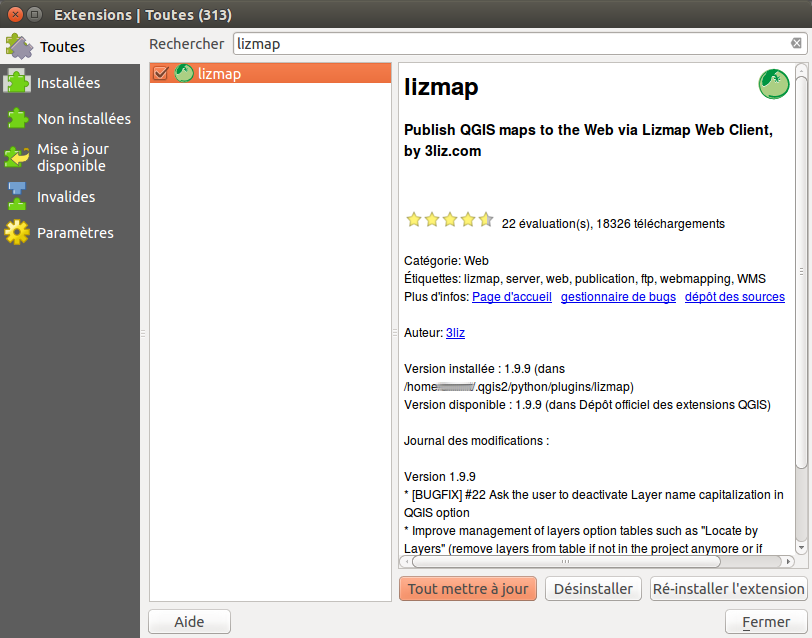
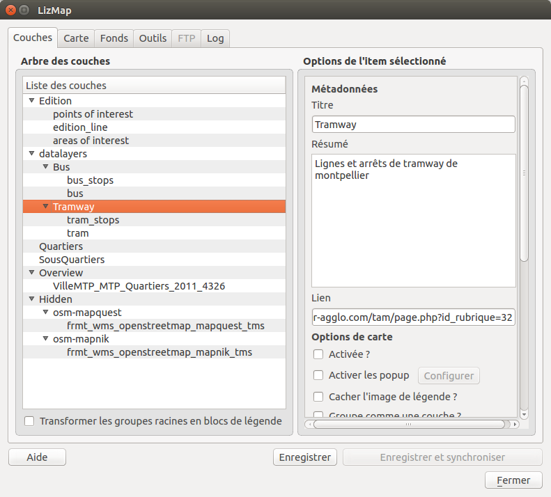
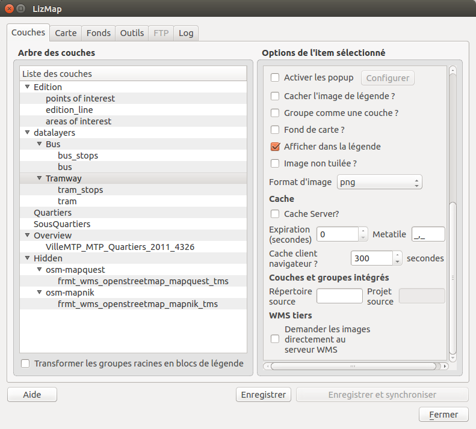
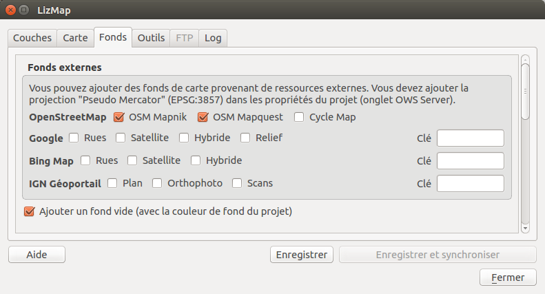

===============================================================
Configurer un projet pour Lizmap
===============================================================

.. _lizmap_install_plugin:

Installer le plugin Lizmap
===============================================================

Lizmap est dans les dépôts officiels du projet QGIS : 
http://plugins.qgis.org/plugins/lizmap/

Pour l'installer, il suffit de faire comme tout plugin QGIS :

* Menu > Extensions > Installateur d'extensions python
* Rechercher Lizmap avec le filtre
* Installer le plugin
* Il se trouve ensuite dans le menu *Internet* et la barre de menu *Site internet*

Le plugin est organisé en 6 onglets

* *Couches* : les options de chaque couche
* *Carte* : les options générales de la carte
* *Fonds* : les fonds de cartes utilisées sur le Web
* *Outils* : les outils de la carte Web
* *FTP* : la configuration de la synchronisation via la plugin
* *Log* : affiche les informations des actions effectuées

Et il possède 4 boutons d'actions : 
* aide, 
* sauvegarder, 
* sauvegarder et synchroniser
* fermer

.. _lizmap_config_layers_groups:

Configurer les couches et les groupes
===============================================================

La configuration des couches se fait dans l'onglet *Couches*.

Cet onglet montre l'arbre des couches identique à celui présenté dans le panneau légende de QGIS. On peut sélectionner l'un des éléments de l'abre, une couche ou un groupe, puis configurer les options pour le groupe ou la couche sélectionnée.

Les informations sur les groupes et les couches :

* *Titre* : Il sera utilisé pour l'affichage de la légende à la place du nom (name). Dans le cas des couches le champ *Titre* est lié à celui de l'onglet *Métadonnées* de la fenêtre des propriétés de la couche.
* *Résumé* : Il permet de décrire la couche ou le groupe. Il est affiché au survol de la souris. Dans le cas des couches le champ *Résumé* est lié à celui de l'onglet *Métadonnées* de la fenêtre des propriétés de la couche.
* *Lien* : L'adresse Web d'un document ou une page Web décrivant la couche ou le groupe. Une icone (i) s'affiche dans la légende si le lien a été renseigné. Il est possible d'utiliser le dossier *media*, voir :ref:`media_in_lizmap`

Les options de couches :

* Activée : permet de préciser si une couche est affichée par défaut.
* Activer les popups : permet d'activer les fenêtres d'information sur interrogation de la carte par clic. Voir :ref:`popups_in_lizmap`
* Cacher l'image de légende : permet de ne pas afficher la légende de la couche dans l'interface Web.
* Afficher dans la légende : permet de ne pas afficher la couche dans la légende et donc de ne pas permettre à l'utilisateur de gérer l'affichage de celle-ci.
* Fond de carte : permet de définir la couche comme un fond de carte. Celle-ci sera accessible via la liste des fond de plan.
* image non tuilée : permet de sélectionner le mode d'affichage de la couche. Celle peut-être afficher sous forme de plusieurs images, tuiles, ou d'une seule image générée par le serveur.
* Format d'image :

 * png : format d'image complet, panel complet de couleurs, avec transparence
 * png; mode=16bit : format d'image plus léger, panel de couleurs restreint, avec transparence
 * png; mode=8bit : format d'image très léger, panel de couleurs restreint au maximum, avec transparence, dégradation possible de l'image
 * jpeg : format d'image léger sans transparence sans perte de qualité

Si la couche est fourni par un service WMS et que celui-ci supporte le Système de Coordonées de Référence de la carte Web, il est possible de *Demander les images directement au serveur WMS*. Cela permet de réduire la charge de QGIS-Server et d'optimiser LizMap. Cette option est disponible dans le groupe **WMS tiers**

Les options de groupes :

* Groupe comme couche : 

  * permet de transformer un groupe en une seule couche dans l'interface web
  * permet de regrouper des couches avec un affichage lié à la résolution
  * permet de simplifier l'interface pour l'utilisateurs de l'interface Web
  * permet de créer un fond de plan à partir de plusieurs couches

* si le groupe est un couche les autres options s'appliquent à lui

.. _lizmap_config_map:

Configurer la carte
===============================================================

L'onglet *Carte* permet d'activer ou désactiver des outils élémentaires de Lizmap, de choisir les échelles et l'emprise initiale.

.. image:: ../MEDIA/interface-map-tab.png
   :align: center
   :width: 80%

Les options générales :

* Masquer le projet dans Lizmap Web Client : 

  * Si cette case est cochée, le projet ne sera pas visible dans la page d'accueil de Lizmap qui montre les vignettes pour tous les répertoires et projets de l'application. Vous pouvez donc utiliser cette option pour masquer le projet. 
  * Le projet sera toujours accessible pour les clients WMS ou WFS en fonction des droits du répertoires
  * Cette fonctionnalité est intéressante dans le cas où on utilise ces couches dans d'autres projets QGIS pour Lizmap.

Les outils de la carte :

* Impression : permet d'activer l'utilisation des compositions QGIS pour la génération de fichier PDF de la carte
* Outils de mesure : permet d'activer les outils de mesures dans la carte (longueur, surface, périmètre)
* Zoom précédent/suivant : permet d'activer les boutons de navigation dans l'historique de zoom/déplacement
* Positionnement automatique : permet d'activer les fonctions d'utilisation de la géolocalisation par Wifi/GPS.
* Recherche d'adresse : permet d'ajouter un moteur de recherche d'adresse qui s'appuit au choix sur le service :

  * Nominatim (OpenStreetMap)
  * Google
  * IGN France (Géoportail)

Les échelles :

* une liste d'échelles entières séparées par une virgule (et optionnellement un espace), par exemple: *250000, 100000, 50000*.
* Lizmap utilise aussi ces échelles pour restreindre l'affichage entre les échelles minimum et maximum données. C'est pourquoi **il est obligatoire de renseigner au moins 2 échelles** dans la liste.

L'emprise initiale :

* Une liste de coordonnées dans le Système de Coordonnées de Références de la carte de la forme : xmin, ymin, xmax, ymax ; décrivant l'emprise initiale de la carte
* L'emprise maximale de la carte est précisé dans l'onglet *Serveur OWS* des *propriétés du projet QGIS*. les données ne seront pas affichées si elles sont en dehors.
* Par défaut, l'emprise initiale est l'emprise maximale.

.. _lizmap_config_baselayers:

Configurer les fonds cartographiques
========================================================

Il est souvent intéressant de séparer dans une carte publiée sur internet les couches de fonds référentiels et les couches thématiques. Dans Lizmap, on peut utiliser des groupes ou des couches du projet comme fond référentiel. Il est aussi possible d'utiliser des services externes à la carte.

Les fonds de cartes ne font pas partie de la légende et sont présentés sous forme d'une liste.

.. note:: Si une seule couche de fond est configurée (couche du projet, couche web externe ou couche d'un autre projet Lizmap), alors l'interface Lizmap Web Client ne montrera pas la boîte *Fonds de carte*, mais la couche sera néanmoins visible sous les autres couches.

L'onglet *Fonds* permet d'ajouter un fond vide. Celui-ci permet d'afficher les données thématiques au dessus de la couleur de fond du projet. Il permet aussi de sélectionner des fonds externes.

Les fonds externes disponibles
-------------------------------

* OpenStreetMap, projet cartographique sous licence libre et ouvert :

  * OSM Mapnik : service disponible sur openstreetmap.org
  * OSM Mapquest : service mis à disposition par la société Mapquest
  * Cycle Map : carte de valorisation des données vélos d'OpenStreetMap intégrant l'information d'altitude

* Google, nécessite de respecter la licence d'utilisation :

  * Rues : l'affichage par défaut de Google Maps
  * Satellite : le fond de carte intégrant photos satellites et photos aériennes
  * Hybride : le fond de carte mixant données routières et photos
  * Relief

* Bing Map, nécessite de respecter le licence d'utilisation de Microsoft et donc une clef :

  * Rues : l'affichage par défaut de Bing Map
  * Satellite : le fond de carte intégrant photos satellites et photos aériennes
  * Hybride : le fond de carte mixant données routières et photos

* IGN Géoportail, nécessite de respecter le licence d'utilisation de IGN et donc une clef :

  * Plan : l'affichage IGN réalisée pour le Web
  * Orthophoto : le fond de carte intégrant photos satellites et photos aériennes de l'IGN
  * Scan : le fond de carte mixant les différants scan de l'IGN

Les licences d'utilisation sont disponibles aux adresses suivantes :

* *OpenStreetMap*: http://wiki.openstreetmap.org/wiki/FR:Tile_usage_policy
* *Mapquest*: http://developer.mapquest.com/web/products/open/map#terms
* *Google*: https://developers.google.com/maps/terms
* *Bing*: https://www.microsoft.com/maps/product/terms.html
* *IGN*: http://api.ign.fr/services#web

.. note:: Si vous choisissez un fond de plan externes la carte sera affichée en Google Mercator (EPSG:3857 ou EPSG:900913), les échelles seront celles des fonds externes et QGIS-Server devra réaliser des reprojections à la volée.

Il est donc nécessaire de préparer le projet QGIS en conséquence.

Il faut ajouter le système de coordonnées de référence *Google Mercator* dans la liste des CRSs des Web Services via l'onglet *Serveur OWS* des *propriétés du projet QGIS*. Pour l'instant, l'ensemble des fonds proposés utilise la projection::

    EPSG:3857 ; Pseudo Mercator

Voici les échelles entières approximatives des fonds externes courants::

    0   591659008
    1   295829504
    2   147914752
    3   73957376
    4   36978688
    5   18489344
    6   9244672
    7   4622336
    8   2311168
    9   1155584
    10  577792
    11  288896
    12  144448
    13  72224
    14  36112
    15  18056
    16  9028
    17  4514
    18  2257

Les couches Lizmap externes
----------------------------

Cette fonctionnalité a été supprimée. Elle est remplacée par la possibilité d'utiliser le menu  **Couches > Intégrer des couches et des groupes**, et de déclarer dans l'onglet *Couches* du plugin le projet parent et le répertoire Lizmap pour ces couches ou groupes intégrés. Voir :ref:`lizmap_cache_centralized`
