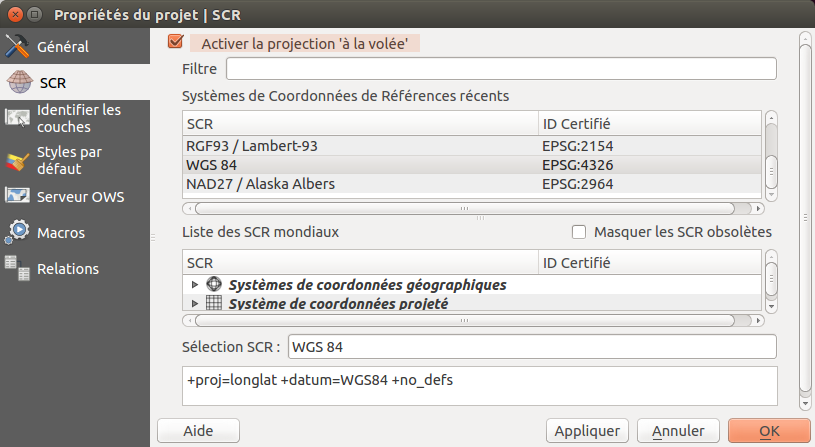
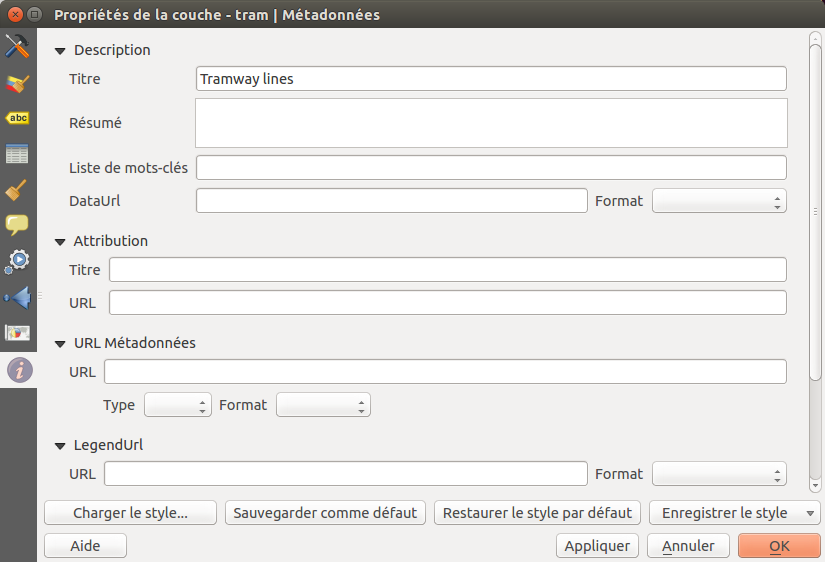

===============================================================
Préparer un projet QGIS pour le Web
===============================================================

Créer votre projet
===============================================================

Ajouter vos données :

* fichiers de données géographiques vectorielles

  * ESRI Shapefile
  * MapInfo TAB et MIF/MID
  * GeoJSON
  * etc

* fichiers de données géographiqes RASTER

  * GeoTIFF
  * Arc/Info ASCII Grid
  * netCDF
  * etc

* base de données géographiques

  * PostgreSQL / PostGIS
  * MSSQL spatial
  * Oracle locator / spatial

.. image:: ../MEDIA/qgis-montpellier-project.png
   :align: center
   :width: 60%

Organiser et manipuler les couches dans la légende :

* *Ajouter des groupes* à l'aide d'un clic droit dans la zone blanche de la légende: *Ajouter un nouveau groupe*
* *Déplacer* les couches et les groupes via *glisser-déplacer*
* *Renommer* couches et groupes avec la touche F2 ou la fenêtre de propriétés de la couche
* Manipuler l'ordre de rendu :

  * via *l'ordre de la légende* : les couches du dessus sont rendues au dessus des autres
  * en spécifiant *un ordre des couches* à l'aide du menu *Vue > Panneaux > Ordre des couches*

Ajouter un titre à votre projet et enregistrer le projet dans votre répertoire de travail.

Configurer votre projet pour le Web
===============================================================

Configurer le système de coordonnées de référence, SCR, de votre projet :

* Sélectionner de préférence le SCR de votre carte Web :

  * EPSG:3857 pour Google Mercator
  * EPSG:2154 pour Lambert 93
  * etc

* Activer *la reprojection à la volée*. QGIS sait reprojeter les raster et les vecteurs.

Configurer les paramètres des Services Géographiques Web grâce à l'onglet *Serveur OWS* :

* Donner un titre à vos Services Géographiques Web
* Ajouter des informations comme votre organisation, le responsable de la publication, une description via le champs résumé, etc
* Définisser l'emprise maximale de votre service WMS
* Restreindre la liste des SCRs de votre service WMS :

  * sélectionner au moins celui de votre carte
  * vous pouvez utiliser le bouton utilisé pour récupérer tous les SCR de vos couches ainsi que celui de la carte

* Exclure des compositions et des couches si certaines données ne doivent pas être publiées en WMS
* Activer les couches que vous souhaitez publier en WFS et WCS

.. image:: ../MEDIA/qgis-montpellier-project-ows.png
   :align: center
   :width: 60%

Vérifier dans les paramètres du projet, menu *Préférences > Propriétés du projet* ou raccourci CTRL+MAJ+P, que les chemins sont bien enregistrés en relatif.

Configurer vos couches pour le Web
===============================================================

Dans la fenêtre des *Propriétés de la couche*, l'onglet Métadonnées permet de configurer de nombreuses informations pour les Services Géographiques Web :

* Fournir un titre qui pourra être réutilisé ainsi qu'une description et des mots clés
* Préciser l'attribution pour respecter la licence des données
* Ajouter l'URL de la fiche de métadonnées si celle-ci est accessible

