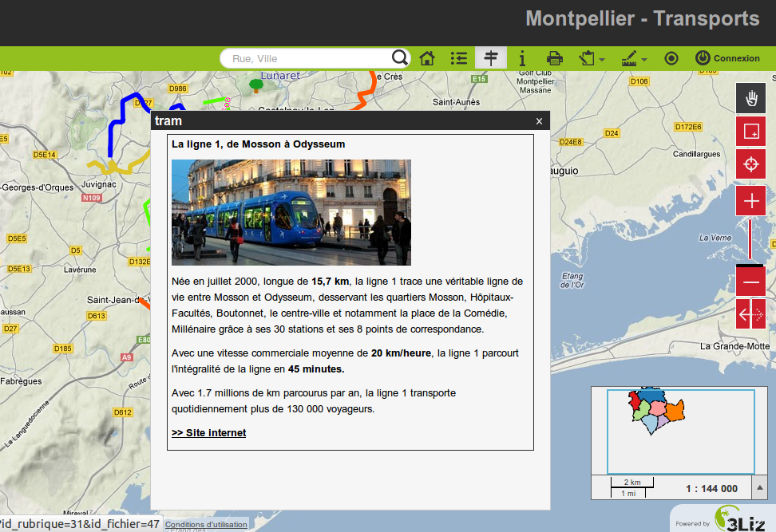

.. _media_in_lizmap:

===============================================================
Les médias dans Lizmap
===============================================================

Principe d'utilisation
===============================================================

Il est possible de mettre à disposition des documents à travers Lizmap. Pour cela il faut simplement:

* créer un répertoire intitulé **media** (en minuscule et sans accents) *au même niveau que le projet QGIS*
* **y mettre des documents**: des images, des rapports, des pdfs, des vidéos, des fichiers HTML ou texte.
* Les documents contenus dans ce répertoire **media** sont donc **synchronisés comme les autres données** via la synchronisation FTP du plugin.
* On peut utiliser des sous-répertoires par couche ou par thème: l'organisation du contenu du répertoire **media** est libre

Ensuite dans Lizmap Web Client, on peut offrir un accès à ces documents pour 2 choses:

* les **popups** : le contenu d'une ou plusieurs colonne pour chaque géométrie peut préciser le chemin vers le média. Par exemple une colonne *photo*, ou bien une colonne *pdf*
* le **lien** indiqué pour chaque groupe ou couche via l'onglet *Couches* du plugin Lizmap

Le détail de ces utilisation est précisé ci-dessous

Utilisation pour les liens
===============================================================

Il est possible d'utiliser un chemin relatif vers un document pour les liens des couches ou des groupes. Rappel: les liens peuvent être renseigné via l'onglet **Couches** du plugin Lizmap, après avoir sélectionné la couche ou le groupe qu'on souhaite renseigner. Voir :ref:`layers_tab_metadata`

Le chemin doit être écrit:

* en commençant par **media/**
* avec des slashs **/** et non des anti-slashs

Quelques exemples:

* *media/ma_couche/metadonnees_couche.pdf*
* *media/rapports/mon_rapport_sur_la_couche.doc*
* *media/une_image.png*

Sur la carte de Lizmap Web Client, si un lien a été configuré de cette manière pour une des couches, alors une icone (i) sera placée à droite de la couche. Un clic sur cet icône permet d'ouvrir le document lié dans un nouvel onglet du navigateur.

  
Utilisation dans les popups
===============================================================

Principe
----------
Comme décrit dans l'introduction ci-dessus, on peut utiliser **un chemin de media** dans les données de la couche spatiale. 

Par exemple, si on souhaite que les popups liées à une couche affichent une photo qui dépende de chaque objet, il suffit de créer une nouvelle colonne qui contiendra le chemin de media vers la photo pour chaque ligne de la table attributaire de la couche. Et ensuite d'activer les popups pour cette couche.

Exemple
---------

Voici pour l'exemple la table attributaire d'une couche *paysage* configurée pour afficher des photos dans la popup. L'utilisateur a créé une colonne *photo* dans laquelle il place le chemin vers les photos, et une colonne *pdf* dans laquelle il met les chemins vers un fichier pdf décrivant l'objet correspondant à chaque ligne

======  ======  ===========  ========================  ========================
id      nom     description  photo                     pdf
======  ======  ===========  ========================  ========================
1       Marais  blabla       media/photos/photo_1.png  media/docs/paysage-1.pdf
2       Plage   blibli       media/photos/photo_2.png  media/docs/paysage-2.pdf
3       Lande   bloblo       media/photos/photo_3.png  media/docs/paysage-3.pdf
======  ======  ===========  ========================  ========================

.. note:: Dans cet exemple, on voit que les noms des fichiers des photos et des PDF sont normés. Nous conseillons de suivre cet exemple, car cela permet d'utiliser la calculatrice de QGIS pour créer ou mettre à jour les données des colonnes de média pour l'ensemble de la couche de manière automatisée.

Résultat
----------

Voici les règles d'affichage dans la popup

* Si le chemin pointe **vers une image, l'image sera affichée** dans la popup. Un clic sur l'image affichera l'image originale dans un nouvel onglet. 
* Si le chemin pointe **vers un fichier texte ou un fichier HTML, le contenu du fichier sera affiché** dans la popup.
* Pour les **autres types de fichiers, la popup affichera un lien vers le document**, que les utilisateurs pourront télécharger en cliquant sur le lien.

Illustration
-------------

Ci-dessous, une illustration d'une popup Lizmap affichant une photo, un texte et un lien dans la popup:

   
.. seealso:: Documentation complète sur les popups : :ref:`popups_in_lizmap`
