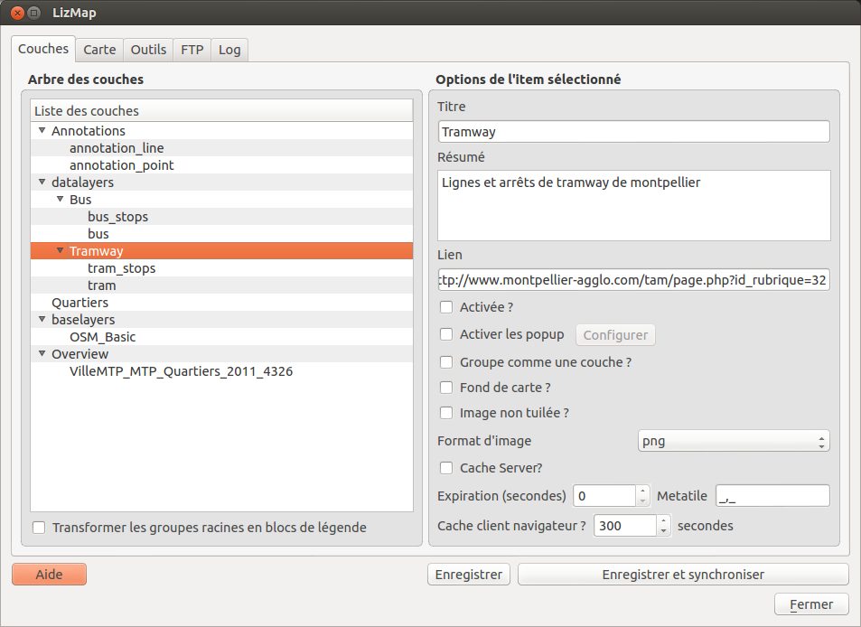

.. _layers_tab:

===============================================================
Couches - Configurer les couches avec le plugin
===============================================================

Lizmap plugin - l'onglet Couches
===============================================================

Cet onglet montre l'arbre des couches identique à celui présenté dans le panneau légende de QGIS. On peut sélectionner l'un des éléments de l'abre, une couche ou un groupe, puis configurer les options pour le groupe ou la couche sélectionnée.

   
Transformer les groupes racines en blocs de légende
--------------------------------------------------------------

Si votre projet contient des groupes de premier niveau, comme ici

.. code-block:: none

   -- groupe_a
     |-- une couche
     |-- un sous-groupe
       |-- une autre couche
   -- groupe_b
     |-- une couche
   etc.

Vous pouvez alors cocher cette option et alors :

* la légende de Lizmap Web Client sera séparée en autant de blocs de légende que de groupes parent
* le nom des groupes parents ne sera pas visible.
* L'application Web ajoute automatiquement des classes aux objets HTML générés, ce qui rend possible aux utilisateurs avancés de modifier le style pour chacun des groupes obtenus.

Dans notre exemple, on obtiendrai alors la légende suivante dans la légende de Lizmap Web Client

.. code-block:: none

   [x] une couche
   [x] un sous-groupe
      [x] une autre couche

   [x] une couche
   etc.

.. _layers_tab_metadata:

Les métadonnées
===============================================================

Titre
---------------------------------------------------------------

le titre du groupe/de la couche. 

* Ce titre sera affiché dans l'application web Lizmap au lieu du nom réel.

Résumé
---------------------------------------------------------------

une courte description du groupe/de la couche. 

* Cette description sera affichée au survol du nom de la couche.

Lien
---------------------------------------------------------------

un lien html, comme par exemple "http://qgis.org" ou un document du répertoire **media**

* Une icone (i) s'affiche à droite du groupe ou de la couche et permet d'ouvrir le lien ou le document
* Pour savoir comment utiliser les documents stockés dans le répertoire *media* situé au même niveau que le projet QGIS, voir :ref:`media_in_lizmap`

Options liées à la carte
===============================================================

.. _layers_tab_popups:

Activer les popups
---------------------------------------------------------------

* permet d'activer les fenêtres d'information sur interrogation de la carte par clic. Voir :ref:`popups_in_lizmap`

Groupe comme une couche ?
---------------------------------------------------------------

* Vous pouvez transformer un groupe Qgis en une couche unique dans la légende de l'application Lizmap Web Client. Les fils de ce groupe ne seront pas visibles dans l'arbre, mais le seront sur la carte. La légende montrera la légende de tous les fils.
* **Attention** : lorsque vous utiliser cette option, il est inutile de configurer les options pour les couches et les groupes fils de ce groupe. Ces options seront ignorées par Lizmap Web Client. Sauf pour les popups ou il faut bien cocher les couches filles à faire figurer dans la popup du groupe.

Fond de carte ?
---------------------------------------------------------------

* permet de basculer le groupe/la couche dans la liste des fonds de carte. Une seule couche de fond peut être affichée à la fois
 

Options d'optimisation
===============================================================

Image non tuilée ?
---------------------------------------------------------------

une seule image est crée pour toute la largeur et la hauteur de la carte visible sur l'application Web.

* Cette option peut être cochée pour éviter les problèmes d'étiquettes tronquées ou de trames hachurées décalées.
* **Attention** Cette option n'est pas compatible avec l'activation du Cache**

Format d'image
---------------------------------------------------------------

3 formats

* *Png* est souvent le meilleur choix, car ce format respecte la transparence. 
* *Png 8bit* produit des images moins lourdes (donc plus rapides à télécharger), mais gère une palette limitée de couleur et ne gère pas la transparence. 
* *jpeg* créée des images opaques, légères mais avec une dégradation visible
 
**Nous conseillons vivement d'utiliser le format jpeg pour les fonds de carte, puisqu'ils la transparence est alors inutile**
 

Utiliser le cache
===============================================================

Lizmap Web Client sait créer dynamiquement un cache des tuiles sur le serveur, et permet aussi d'utiliser le cache du navigateur. Cela permet d'améliorer les performances de consultation. L'activation des caches se fait via le plugin, couche par couche.

Cache Serveur ?
---------------------------------------------------------------

A cocher pour activer le cache automatique pour la couche ou le groupe. Ce cache représente le stokage sur le serveur des images déjà générées par le serveur QGIS. L'application Lizmap Web Client génère automatiquement le cache au fur et à mesure que les tuiles sont demandées. Activer le cache permet d'alléger fortement la charge sur le serveur, puisqu'on ne redemande pas à QGIS les tuiles qui ont déjà été rendues. 
  
2 options permettent de configurer le cache Serveur :

* **Expiration (secondes)** : permet de préciser le temps d'expiration du cache serveur en secondes. 
* **Metatile** : demande une image plus grande au serveur en fonction du paramètre passé puis redécoupe. Cela évite les étiquettes tronquées au bords et les discontinuités entre tuiles, mais est plus gourmand en ressources. Valeur par défaut : 5,5.

Cache client navigateur
---------------------------------------------------------------

Cette option permet de spécifier un temps d'expiration pour les tuiles en seconde. Lorsqu'on parcours la carte Lizmap avec le navigateur, celui-ci stocke les tuiles qu'il affiche dans son cache. Activer le cache client permet d'optimiser fortement Lizmap, car le navigateur ne re-demande pas au serveur les tuiles qu'il a déjà en cache et qui ne sont pas expirées. 
  
Nous conseillons de mettre la valeur maximale (1 mois soit 24 x 3600 x 30 = 2592000 secondes), sauf bien sûr pour les couches dont la donnée change souvent.

Remarques
-------------

* **Le cache doit être activé seulement une fois le rendu bien maîtrisé**, lorsqu'on souhaite passer le projet en production.
* **Les 2 modes de cache Serveur et Client sont complètement indépendants** l'un de l'autre. Mais bien sûr, il est intéressant d'utiliser les 2 en même temps pour optimiser l'application et libérer les ressources du serveur.

