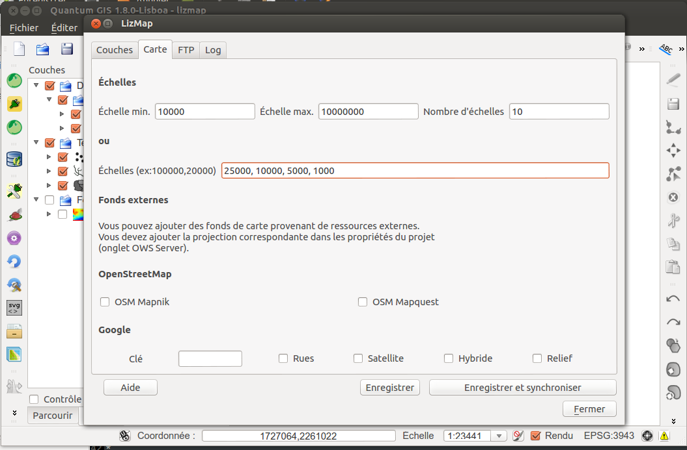

===============================================================
Carte - Configurer la carte avec le plugin
===============================================================

 
Lizmap plugin - l'onglet Carte
===============================================================

Choix des échelles
===============================================================

2 méthodes sont utilisables pour configurer les échelles de la carte:

* Donner un nombre de niveaux d'échelles, une échelle minimum et maximum

 * Lizmap calcule automatiquement les échelles intermédiaires

* Donner une liste d'échelles : une liste de nombres entiers.

 * Ces échelles seront utilisées telles quelles, par ex: 25000, 10000, 5000

*Nous préconisons l'utilisation de la 2ème méthode car elle permet de mieux contrôler la visibilité des couches, de la symbologie et les étiquettes.*
  
  
Ajout de fonds de carte externes
===============================================================

Lizmap permet d'ajouter des fonds externes à la liste des fonds de carte 

* *OpenStreetMap* : fond officiel et fond Mapquest
* *Google* : Rues, Satellite, Hybride, Relief

A savoir

* Les échelles précisées plus haut ne seront pas utilisées : attentions aux seuils d'échelles !
* La projection utilisée est Google Mercator : QGIS reprojetera les données à la volée
* Il faut ajouter cette projection dans l'onglet OWS des propriétés du projet
