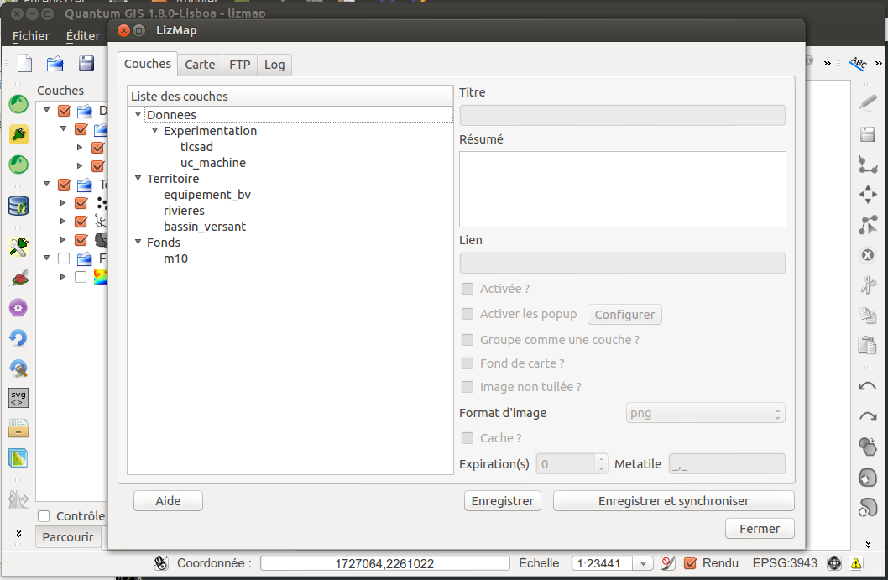

===============================================================
Couches - Configurer les couches avec le plugin
===============================================================

Lizmap plugin - l'onglet Couches
===============================================================

Les métadonnées
===============================================================

* *Titre* : le titre du groupe/de la couche. 

 * Ce titre sera affiché dans l'application web Lizmap au lieu du nom réel.

* *Résumé* : une courte description du groupe/de la couche. 

 * Cette description sera affichée au survol du nom de la couche.

* *Lien* : un lien html, comme par exemple "http://qgis.org" ou un document du répertoire *media*

 * Une icone (i) s'affiche à droite du groupe ou de la couche et permet d'ouvrir le lien ou le document

Application:  *Renseigner des informations pour quelques couches du projet*

Options liées à la carte
===============================================================

* *Popups* : 

 * permet d'activer les fenêtres d'information sur interrogation de la carte par clic.

* *Groupe comme une couche ?* : 

 * Vous pouvez transformer un groupe Qgis en une couche unique dans l'arbre de Lizmap. Les fils de ce groupe ne seront pas visibles dans l'arbre, mais le seront sur la carte. La légende montrera la légende de tous les fils.

* *Fond de carte ?* : 

 * permet de basculer le groupe/la couche dans la liste des fonds de carte. Une seule couche de fond peut être affichée à la fois
 

Options d'optimisation
===============================================================

* *Image non tuilée ?* : une seule image est crée pour toute la largeur de la carte visible.
 
 * Cette option peut être cochée pour éviter les problèmes d'étiquettes tronquées ou de trames hachurées décalées.

* *Format d'image* : 3 formats

 * *Png* est souvent le meilleur choix, car ce format respecte la transparence. 
 * *Png 8bit* produit des images moins lourdes (donc plus rapides à télécharger), mais gère une palette limitée de couleur et ne gère pas la transparence. 
 * *jpeg* créée des images opaques, légères mais avec une dégradation visible
 

Utiliser le cache
===============================================================

Lizmap Web Client sait créer dynamiquement un cache des tuiles sur le serveur. Cela permet d'améliorer les performances de consultation.

* *Cache ?* : à cocher pour activer le cache automatique pour la couche ou le groupe
* *Expiration (s)* : permet de préciser le temps d'expiration du cache en secondes. 
* *Metatile* : demande une image plus grande puis redécoupe. Cela évite les étiquettes tronquées au bords et les discontinuités entre tuiles, mais est plus gourmand en ressources. Valeur par défaut : 5,5 

Lizmap
  *Le cache doit être activé seulement une fois le rendu bien maîtrisé.*

