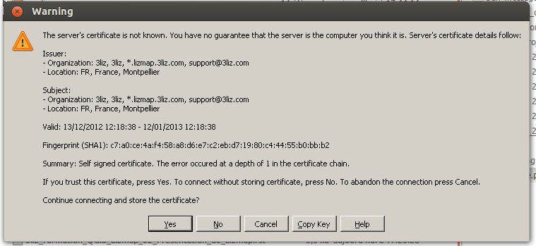

===============================================================
FTP - Publier la carte par FTP
===============================================================
 
Rappel de l'architecture de Lizmap
===============================================================

.. image:: media/schema_1.png
   :align: center

Plugin Lizmap : onglet FTP
===============================================================

.. image:: media/lizmap_onglet_ftp.png
   :align: center
   :width: 70%

   
Préambule : installer le client FTP
===============================================================

Le plugin utilise un client FTP externe pour réaliser la synchronisation.

* *Sous Windows : WinSCP*

 * Télécharger la version portable: http://winscp.net/eng/download.php
 * Décompresser dans un répertoire: par exemple "C:\winscp\"
 * Onglet FTP du plugin : indiquer ce répertoire via le bouton "..."
 
* *Sous linux : LFTP*

 * Installer lftp : sudo apt-get install lftp
 

Onglet FTP : Les informations de connexion
===============================================================

* *Hôte* : l'hôte FTP, correspondant au serveur sur lequel Qgis server et Lizmap Web sont installés (adresse IP ou nom de domaine)

* *Port* : le port FTP, 21 par défaut

* *Utilisateur* = l'utilisateur FTP

* *Mot de passe* = le mot de passe FTP

* *Répertoire distant* = chemin du répertoire dans lequel les projets Qgis sont stockés sur le serveur

  * Pour les utilisateurs windows, il faut donner un chemin absolu, par exemple /home/utilisateur/qgis/public/ 
  * Pour les utilisateurs linux, simplement donner le chemin relatif à la racine de votre répertoire FTP. Par exemple : /qgis/public/

* *Répertoire local* : rappel du chemin complet vers le projet QGIS

Onglet FTP : utilisation sous Windows
===============================================================

Préalable
------------------------------------

* Le logiciel Winscp doit être installé et son chemin ajouté dans le plugin.

* *Connexion FTP sécurisée* : WinSCP doit être lancé une première fois pour se connecter au serveur

 * Lancer WinSCP.exe et entrer les informations de connexion. Choisir *TLS Explicit Encryption*
 * Accepter le certificat via la fenêtre suivante en cliquant sur "YES" (ou "OUI)
 * Vérifier qu'un fichier WinSCP.ini a bien été créé dans le répertoire d'installation de WinSCP
 
* Lancer le plugin Lizmap

WinSCP.exe : paramètres de connexion
-------------------------------------

WinSCP.exe : accepter le certificat
-----------------------------------

Onglet FTP : lancer la synchronisation
===============================================================

Principe : *la synchronisation se faire en mode mirroir pour que le serveur soit une copie exacte du répertoire local*

* les fichiers qui n'existent pas sur le serveur sont créés
* les fichiers qui ont été supprimés en local sont supprimés sur le serveur
* les fichiers qui ont une date plus récente en local sont ré-envoyés sur le serveur

Vérifier bien les informations, puis cliquer sur *Sauvegarder et Synchroniser*. Une fenêtre rappelle les répertoires concernés.

*Attention*  *Si vous changez de projet et voulez changer de répertoire Lizmap sur le serveur, pensez à modifier le répertoire distant*

Onglet Log : suivi de la synchronisation
===============================================================

Le log contient 

* un rappel des informations principales entrées via le plugin Lizmap
* la liste des étapes de synchronisation en temps réel
* les erreurs éventuelles lors du lancement ou du déroulement de la synchronisation

*Annuler la synchro* : Il est possible d'arrêter une synchronisation en cours de travail en cliquant sur ce bouton
*Effacer le log* Ce bouton permet de supprimer le contenu du log 

Lizmap : *il peut être intéressant de copier le contenu du log si des erreurs ont été rencontrées pour diffusion*

Utilisation de clients FTP externes
===============================================================

Il est tout à fait possible d'utiliser d'autres clients FTP pour synchroniser le répertoire de travail avec le répertoire Lizmap du serveur.

* *Filezilla* : mode Chiffrement = Connexion FTP explicite sur TLS
* *FireFTP* : onglet Connexion, Sécurité = Auth TLS (Best)

Vous pouvez aussi utiliser ces outils pour faire des modifications manuelles sur le répertoire distant:

* faire un backup
* supprimer du contenu
* écraser les fichiers manuellement : projet QGIS et configuration Lizmap

