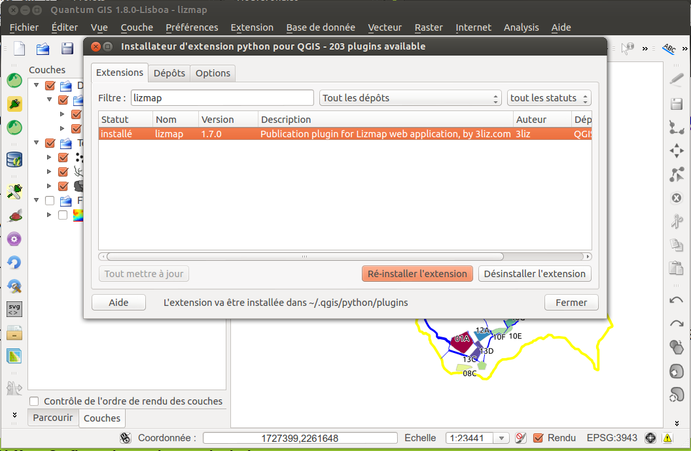

===============================================================
Installation du plugin Lizmap
===============================================================

Récupération via les dépôts officiels
===============================================================

Lizmap est dans les dépôts officiels du projet QGIS : 
http://plugins.qgis.org/plugins/lizmap/

Pour l'installer :

* Menu > Extensions > Installateur d'extensions python
* Rechercher Lizmap avec le filtre
* Installer le plugin
* Il se trouve ensuite dans le menu *Internet* et la barre de menu *Site internet*

Installation du plugin Lizmap
----------------------------------------------------

   

Présentation générale du plugin
---------------------------------

Organisé en 4 onglets

* *Couches* : pour configurer les options avancées de chaque couche
* *Carte* : les options générales de la carte
* *FTP* : configurer la connexion FTP et ajouter le client pour Windows
* *Log* : affiche les informations des actions effectuées

... Et des boutons d'actions : aide, sauvegarder, sauvegarder et synchroniser, etc.
