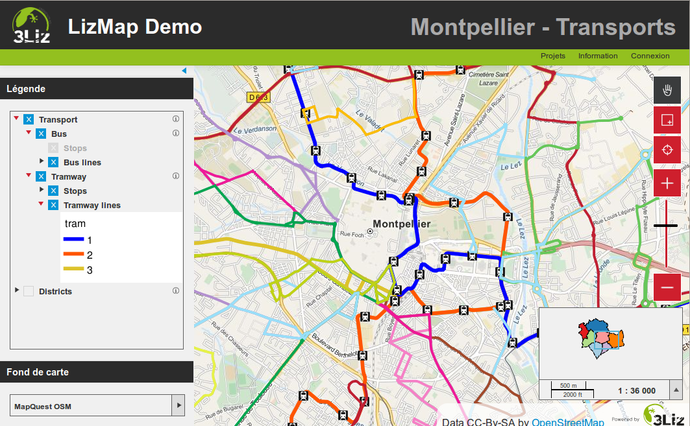

===============================================================
Présentation de Lizmap
===============================================================

QGIS Server, un serveur cartographique
===============================================================

* *Qgis, un SIG de bureau complet*

 * Gestion des couches raster et vecteur, sémiologie, impression, traitements
 * Performance et richesse fonctionnelle d'un SIG de bureau 

* *WMS : Web Mapping Service*: une requête avec des paramètres > une carte au format image

* *Créer un service WMS avec Qgis Server* :
 
 * Installer Qgis Server sur un serveur
 * Copier-coller le projet Qgis et les fichiers de données 
 * Qgis Server et Qgis Desktop : *un même moteur de rendu* 
 

Visualisation de l'architecture client-serveur
----------------------------------------------

.. image:: media/schema_1.png
   :align: center

Un rendu équivalent entre QGIS et le Web
-------------------------------------------------

Lizmap : publier facilement ses cartes QGIS sur internet
===============================================================

.. image:: media/lizmap_etapes.png
   :align: center

Lizmap plugin - le plugin QGIS
---------------------------------

Pour configurer sa carte et la publier

* Caractéristiques générales : *fournies par Qgis*

 - *Données du projet* : nom, description, étendue, projection, etc..
 - *Données des couches* : organisation hiérarchique, nom, seuils de visibilité, symbologie, étiquettes
 
* Configuration additionnelle : *le plugin Lizmap*

 - *Métadonnées* : titre, résumé, lien
 - *Couches* : popup, fonds de carte, regroupement de couches, tuilage, mise en cache
 - *Carte* : échelles, fonds externes 
 

Lizmap Web Client - une carte par projet QGIS
---------------------------------------------

* *Légende*

 - Reprise de l'arbre du projet
 - Séparation entre couches informatives et fonds de carte
 - Couches renommées, visibilité/échelles, résumé, lien
 - Légende intégrée sous chaque couche

* *Barre de navigation* : zoom et déplacement
* *Carte miniature* : un groupe de couches dans le projet
* *Échelles* : graduée et numérique
* *Popups* : information sur clic d'un objet de la carte
* *Information* : une page avec les informations sur le projet QGIS

Lizmap Web Client - une carte par projet QGIS
---------------------------------------------  

    
Lizmap - les fonctionnalités principales
===============================================================

* Interface HTML5, compatible mobiles et tablettes
* Regroupement des cartes par répertoire  : application multi-répertoires et multi-projets
* Gestion des droits accès par répertoire pour des groupes utilisateurs
* Gestion automatique du cache des cartes
* Interface multilingue : anglais, français, italien
* Utilisation de fonds référentiels externes : OSM, Google
* Impression
* Annotations
* Zoom par localisation
* Recherche d'adresse
