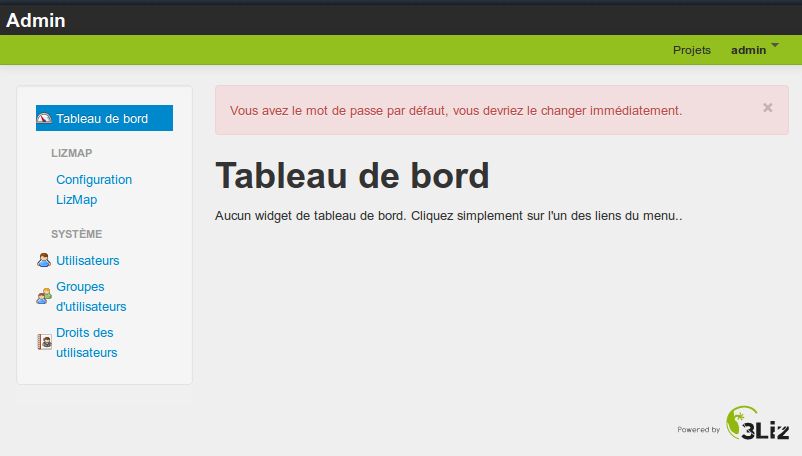

===============================================================
Présentation générale de l'interface d'administration
===============================================================

Accéder à l'interface d'administration
===============================================================

Par souci de sécurité, aucun lien ne mène vers l'interface d'administration. L'adresse est la suivante

http://mondomaine.lizmap.3liz.com/admin.php

Identifiants temporaires

* login = admin
* mot de passe = admin
  
Application
  *Se connecter à votre interface*

  
Modifier son mot de passe
===============================================================

Une fois connecté, on peut modifier son mot de passe 

* Cliquer sur votre login dans le menu en haut à droite puis *Votre compte*
* Cliquer sur le bouton *Changer votre mot de passe*
* Donner le nouveau mot de passe, confirmer et enregistrer

Attention
  *Il est impératif de modifier votre mot de passe. Utilisez un mot de passe complexe qui mélange chiffres, lettres et ponctuation*
  
  
Rappel sur les répertoires Lizmap
===============================================================

Lizmap Web Client peut utiliser les cartes QGIS enregistrées dans différents répertoires sur le serveur.

* Un *répertoire Lizmap* est un dossier sur le serveur où sont stockés un ou plusieurs projet QGIS et les données liées.
* On peut utiliser les répertoires pour *regrouper des projets liés par une thématique*
* On peut utiliser les répertoires pour *gérer les droits d'accès sur les cartes*
