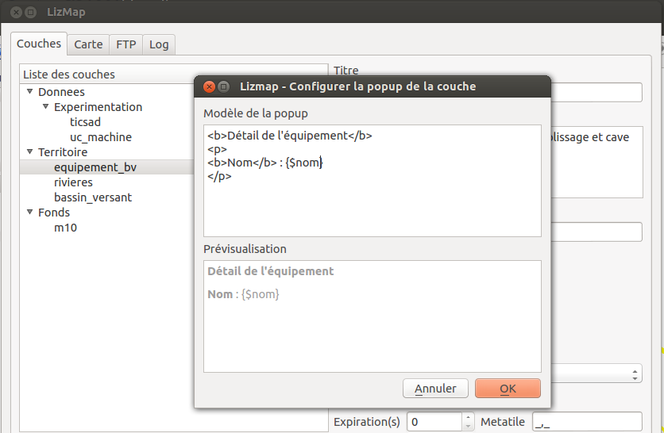

.. _popups_in_lizmap:

===============================================================
Configurer les popups dans Lizmap
===============================================================
 
Activer les popups dans Lizmap
===============================================================

Via le plugin, on peut activer les popups **pour une couche** ou pour **un groupe qui a été configuré comme "Groupe comme une couche"**

Pour cela il suffit de cocher sur la case à cocher **Activer les popups** de l'onglet *Couches* du plugin Lizmap. Pour les *groupes comme une couche*, il faut activer l'option pour le groupe et pour toutes les couches filles qu'on souhaite voir dans la popup. Dans ce cas, seules les couches filles qui ont aussi l'option *Popup* activée seront visibles.

Dans l'application *Lizmap Web Client*, un clic sur un objet de la carte lancera l'ouverture de la popup si et seulement si :

* la couche est **cochée dans la légende**, et donc visible
* la popup a bien **été activée** via le plugin pour la couche ou le groupe
* l'utilisateur a bien **cliqué sur un endroit de la carte** où on voit de la donnée pour l'une des couches avec les popups actives.

.. note:: Pour les couches de type Point, il faut bien cliquer pile au milieu du point pour que la popup apparaisse.

Informations affichées dans la popup
-------------------------------------

Par défaut, la popup de *Lizmap Web Client* affiche un tableau de ce type, qui présente les colonnes de la table attributaire en ligne dans 2 colonnes *Champ* et *Valeur*:

============  ==============
Champ         Valeur
============  ==============
          id  1
         nom  Un nom
 description  Cet objet ...
       photo  :-)
============  ==============

C'est ce qu'on appelle le **mode simple**. On peut modifier un peu les informations affichées via QGIS, et aussi afficher des images ou des liens.

Si on souhaite modifier complètement l'affichage des données dans la popup, alors on peut utiliser le **mode avancé** et utiliser des modèles.

Configuration simple des popups
===============================================================

Via le plugin, si on clique seulement sur la case à cocher *Activer les popups* sans modifier le contenu via le bouton *Contenu*, alors c'est l'affichage par défaut ou *mode simple* qui est utilisé. 

On peut néanmoins jouer sur plusieurs choses dans QGIS et via le plugin Lizmap pour **paramétrer les champs qu'on veut afficher**, **renommer les champs**, et même **afficher des images, des photos ou des liens vers des documents internes ou externes**.

Masquer une colonne ou modifier son nom
-----------------------------------------
On peut utiliser les outils de **l'onglet Champs** des **propriétés de la couche**:

* Pour **ne pas afficher** une colonne dans la popup: *Outil d'édition : Cachée*

.. note:: Attention, depuis QGIS 2.0, pour **masquer une colonne** dans la popup, il faut maintenant **décocher la case WMS pour les champs à masquer**. Cette colonne se trouve dans l'onglet champ, tout à droite

* Pour **modifier le nom** qui sera affiché pour la colonne : *colonne Alias*

.. image:: ../MEDIA/features-popup-fields.png
   :align: center
   :width: 70%
   
Utilisation de médias : images, documents, etc.
--------------------------------------------------

Si on utilise des **chemins vers les documents du répertoire media**, on peut

* *afficher l'image* correspondante
* *afficher le contenu texte ou HTML* du fichier correspondant
* *afficher un lien* vers le document

.. note:: Voir le chapitre :ref:`media_in_lizmap` pour plus de détail sur l'utilisation de documents du répertoire media dans les popups.

Utilisation de liens externes
------------------------------

Enfin on peut aussi utiliser dans les colonnes **des liens WEB complets vers une page ou une image**:

* l'image pointée par le lien sera affichée à la place du lien
* le lien web sera affiché et cliquable

Configuration avancée des popups au format HTML
===============================================================

Introduction
-------------

Si l'affichage tabulaire par défaut des popups ne vous convient pas, vous pouvez écrire **un modèle de popup**. Pour cela, il faut bien connaître le format HTML. Voir par exemple: http://fr.html.net/tutorials/html/

.. note:: ATTENTION: lorsque vous utilisez le mode avancé, la configuration précédente ne fonctionne plus pour masquer ou renommer un champ: c'est vous qui contrôlez via le modèle les affichages. La gestion des médias est encore possible, mais c'est à vous de bien la prévoir.

Mise en oeuvre
---------------

Via le **bouton Configurer** du plugin Lizmap, on peut modifier le modèle de la popup. En cliquant sur ce bouton, une fenêtre s'affiche avec 2 zones de texte :

* une **zone de texte éditable** qui permet d'écrire le contenu
* une **zone de texte en lecture seule** qui montre un aperçu de la mise en forme

On peut écrire du texte simple, mais il est conseillé d'écrire au format HTML pour le mettre en forme. On peut par exemple utiliser les paragraphes, les titres, etc

.. code-block:: html

   <h3>Un titre</h3>
   
Un exemple de paragraphe

Le comportement est le suivant:

* Si le contenu des 2 champs texte est vide, un tableau sera présenté dans la popup (modèle par défaut)
* Si le contenu n'est pas vide, le modèle écrit dans le contenu sera utilisé à la place pour l'affichage de la popup

*Lizmap Web Client* sait remplacer automatiquement une variable représentant le nom d'un champ de la table attributaire par son contenu. Pour ajouter le contenu d'une colonne dans la popup, on utilise **le nom de la colonne précédé d'un dollard, le tout encadré d'accolades**. Par exemple:

.. code-block:: html

   <h3>Un titre</h3>
   
Un exemple de paragraphe

   
Le nom : <b>{$nom}</b>

   
Description: {$description}

.. note:: Si vous avez configuré un alias pour un champ, il faut utiliser l'alias au lieu du nom entre accolade
  
On peut aussi utiliser les valeurs des colonnes comme paramètres pour styliser le texte. Par exemple ici pour mettre le fond dans la couleur de la ligne de bus:

.. code-block:: html

   

   <b>LINE</b> : {$ref} - {$name}
   

  
Utilisation des médias et des liens externes
---------------------------------------------

On peut **utiliser les médias** référencés dans le contenu des champs de la table attributaire, même si on configure un *modèle de template*. Pour cela, il faut utiliser les colonnes de média en anticipant le fait que Lizmap Web Client remplace automatiquement le chemin relatif de type */media/monfichier.jpg* par l'URL complète avec laquelle on peut y accéder depuis l'interface WEB.

On peut aussi utiliser des URL complètes pointant vers les liens ou des images hébergées sur un autre serveur.

Voici un exemple de contenu d'un modèle gérant les médias et utilisant un lien externe: :

.. code-block:: html

   
Un titre

   
Le nom est {$name}

  

     Une petite illustration 
     
   

   
<a href="{$website}" target="_blank">Lien web</a>

   

 

.. note:: Voir le chapitre :ref:`media_in_lizmap` pour plus de détail sur l'utilisation de documents du répertoire media.
