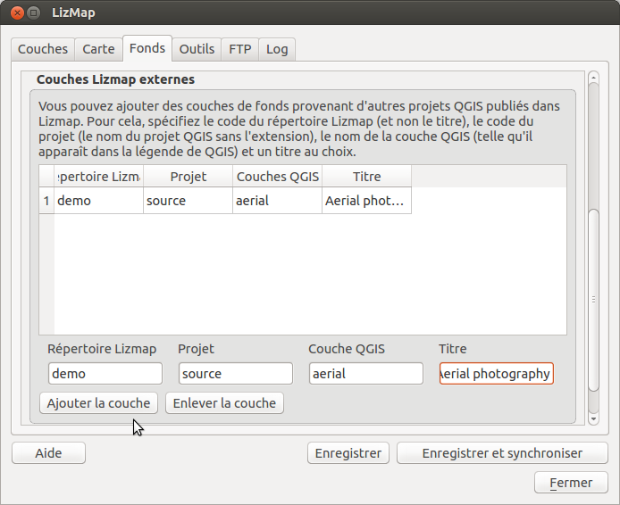

========================================================
Fonds - configurer les fonds cartographiques
========================================================

Principe
==========

Il est souvent intéressant de séparer dans une carte publiée sur internet les couches de fonds référentiels et les couches thématiques. Dans Lizmap, on peut utiliser des groupes ou des couches du projet comme fond référentiel. Ces couches seront présentées à part des autres couches, dans une fenêtre *Fonds de carte*. La configuration se fait via l'*onglet Carte*. Voir :ref:`layers_tab`

En plus de cette possibilité, l'administrateur du projet QGIS peut aussi :

* ajouter des fonds externes (OpenStreetMap, Google, IGN, Bing)
* ajouter des couches provenant d'autres projets Lizmap

.. note:: Si une seule couche de fond est configurée (couche du projet, couche web externe ou couche d'un autre projet Lizmap), alors l'interface Lizmap Web Client ne montrera pas la boîte *Fonds de carte*, mais la couche sera néanmoins visible sous les autres couches.

Fonds externes
=====================

Lizmap permet d'ajouter des fonds externes à la liste des fonds de carte. Ces fonds proviennent des services WEB de plusieurs prestataires :

* **OpenStreetMap** : fond officiel, fond Mapquest, fond cyclable (OpenCycleMap)
* **Google** : Rues, Satellite, Hybride, Relief
* **Bing Map** : Rues, Satellite, Hybride
* **IGN** (Institut National de l'Information Géographique et Forestière) : Plan, Orthophotos, Scans

Pour certains des fonds, vous devez donner votre **clé d'identification** pour pouvoir visualiser les couches dans l'application web.

L'ajout d'un ou de plusieurs fond(s) externe(s) à votre carte Lizmap a plusieurs conséquences, qu'il faut bien connaître pour anticiper le rendu :

* **c'est ce fond externe qui imposera les échelles de la carte**. Les échelles configurées dans l'onglet Carte ne seront donc pas utilisées, sauf les échelles min et max pour restreindre la carte entre ces 2 échelles.

  Il faut donc faire attention dans le projet QGIS à adapter les seuils de visibilités des couches en fonction des échelles du fond externe. Voici les échelles entières approximatives des fonds externes courants::

    0   591659008
    1   295829504
    2   147914752
    3   73957376
    4   36978688
    5   18489344
    6   9244672
    7   4622336
    8   2311168
    9   1155584
    10  577792
    11  288896
    12  144448
    13  72224
    14  36112
    15  18056
    16  9028
    17  4514
    18  2257

* L'affichage des données du projet QGIS se faisant sur un fond externe, **QGIS doit donc reprojeter à la volée les données dans le système spatial de référence du fond** Il faut donc ajouter cette projection dans l'onglet OWS des propriétés du projet. Pour l'instant, l'ensemble des fonds proposés utilise la projection::

    EPSG:3857 ; Pseudo Mercator

* **Les fonds externes ne peuvent pas être imprimés par QGIS**

  En effet, ils ne sont pas dans le projet QGIS, et sont ajoutés dynamiquement par Lizmap Web Client. Ils ne sont donc pas accessibles aux composeurs de QGIS

* **Respecter la licence des données et les conditions d'utilisation**

  + *Google*: https://developers.google.com/maps/terms
  + *OpenStreetMap*: http://wiki.openstreetmap.org/wiki/FR:Tile_usage_policy
  + *Mapquest*: http://developer.mapquest.com/web/products/open/map#terms
  + *IGN*: http://api.ign.fr/services#web
  + *Bing*: https://www.microsoft.com/maps/product/terms.html

.. _lizmap_external_baselayers:

Couches Lizmap externes
========================

Présentation
--------------

Lorsque plusieurs projets QGIS utlisent les mêmes fonds, comme par exemple les orthophotographies, il peut être intéressant de centraliser toutes les configurations liées aux couches de données de ces fonds référentiels dans un seul projet QGIS. De cette manière, le cache serveur de Lizmap est centralisé et non répété pour chaque projet.

L'idée est d'avoir un projet **source** qui contient les couches que d'autres projets utiliseront comme couches de fond. Dans ces autres projets, les couches du projet source ne seront pas ajoutées via QGIS, mais configurée avec le plugin Lizmap comme fond de carte.

Mise en oeuvre
----------------

L'administrateur des projets QGIS:

* crée un projet **source** qui contiendra toutes les couches de fonds à partager avec d'autres projets
* Il ajouter les couches, et leur donne un nom simple dans QGIS, sans espace, accents, parenthèses, etc.
* il publie ce projet source via Lizmap
* Il créé d'autres projets, et ajoute via le plugin Lizmap une référence aux couches du projet source.

Cette configuration des couches externes pour chacun des projets se fait via l'onglet **Fonds**, dans le groupe **Couches Lizmap externes**

L'administrateur du projet doit renseigner pour chaque couche externe les paramètres suivants :

* **Répertoire Lizmap** : l'identifiant (et nom le titre) du répertoire Lizmap
* **Projet** : le nom du fichier QGIS du projet source (sans le point et l'extention). Par exemple "monprojet" si le fichier QGIS est "monprojet.qgs"
* **Couche QGIS** : le nom de la couche (ou du groupe de couche) tel qu'affiché dans la légende de QGIS du projet source. **Pas d'espace ni de caractères complexes dans ce nom**
* **Titre** : le titre qui sera affiché dans la liste déroulante des fonds de carte.

Dans l'application Web Lizmap, les couches (ou groupes de couches) ainsi définies sont appelées et ajoutées à la carte comme des couches de fonds.

Parfois, on ne souhaite pas que les utilisateur puissent voir la carte du projet source dans Lizmap. On peut alors utiliser la fonctionnalité de masquage du projet Lizmap. Voir :ref:`map_tab`

La vidéo suivante montre un exemple d'utilisation : https://vimeo.com/83768906
