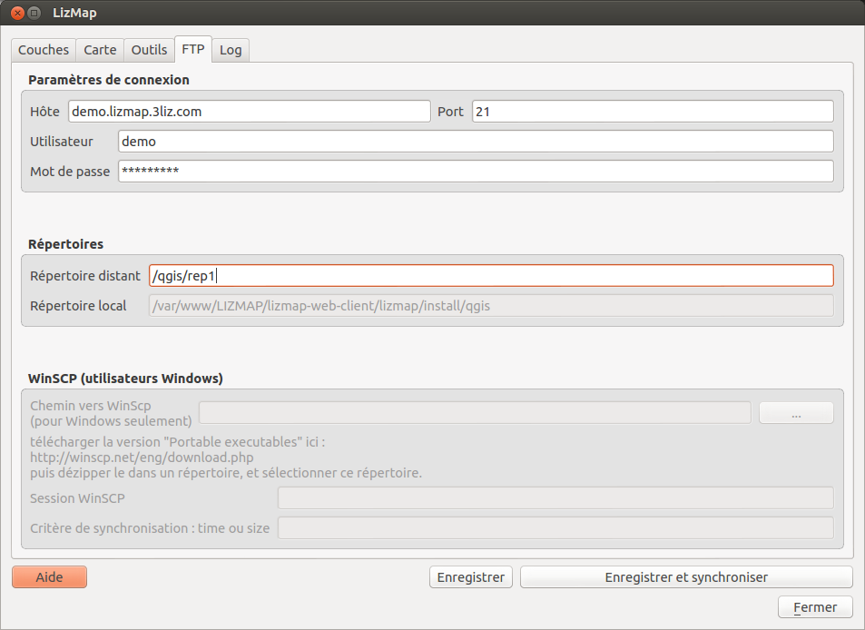
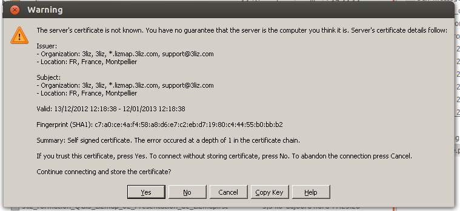

===============================================================
FTP - Publier la carte par FTP
===============================================================

L'onglet FTP
===============================================================

Voici comment se présente l'onglet FTP du plugin Lizmap:

Rappel de l'architecture de Lizmap
===============================================================

.. image:: ../MEDIA/all-schema-client-server.png
   :align: center

Rappels sur les répertoires Lizmap
------------------------------------

**Lizmap repose sur le système de répertoires**. Pour publier une carte dans Lizmap, il suffit de s'assurer que le contenu du répertoire local contenant les données et les projets QGIS soit **reproduit exactement à l'identique** dans le répertoire du serveur correspondant. 

Pour cela, il faut donc **synchroniser le répertoire local avec celui du serveur** à chaque fois qu'on a mis à jour le projet QGIS, modifié la configuration Lizmap via le plugin, ou encore ajouté des fichiers dans le répertoire local.

Outils utilisés
-----------------

**Pour réaliser cette synchronisation** dite *en mode mirroir*, on pourrait utiliser n'importe lequel des sytèmes de synchronisation existant et tous les protocoles existants : FTP, FTPS, SFTP, rsync, unison, etc. Par souci de facilité, nous avons choisir d'utiliser le FTP dans Lizmap (optionnellement sécurisé par SSL). 

.. note:: Les utilisateurs qui maîtrisent bien les technologies client-serveur, les outils de synchronisation, et qui ont accès au serveur sur lequel Lizmap Web Client est installé, peuvent très bien utiliser l'outil qu'ils préfèrent.

Dans Lizmap, pour intégrer la synchronisation FTP directement dans le plugin, nous nous sommes appuyés sur 2 outils libres qui ont fait leur preuve :

* **WinSCP** pour Windows: http://winscp.net/
* **lftp** pour Linux: http://lftp.yar.ru/ (anglais) et http://fr.wikipedia.org/wiki/Lftp
* Nous n'avons pas encore trouvé d'équivalent pour Mac OS (contributions bienvenues)

   
Préambule : installer le client FTP
===============================================================

Sous Windows : WinSCP
------------------------

* Télécharger la **version portable**: http://winscp.net/eng/download.php
* **Décompresser dans un répertoire**: par exemple "C:\\winscp\\"
* **Onglet FTP du plugin** : indiquer le répertoire dans lequel vous avez décompressé le ZIP via le bouton "..."
 
Sous linux : LFTP
-------------------

* Installer lftp: 

.. code-block:: bash

   sudo apt-get install lftp # sous debian ou ubuntu. Remplacer par l'équivalent
 

Onglet FTP : Les informations de connexion
===============================================================

* **Hôte** : l'hôte FTP, correspondant au serveur sur lequel Qgis server et Lizmap Web sont installés (adresse IP ou nom de domaine)

* **Port** : le port FTP, 21 par défaut

* **Utilisateur** = l'utilisateur FTP

* **Mot de passe** = le mot de passe FTP

* **Répertoire distant** = chemin du répertoire dans lequel les projets Qgis sont stockés sur le serveur, relativement à la racine de votre accès FTP. Par exemple : /qgis/public/

* **Répertoire local** : rappel du chemin complet vers le projet QGIS

.. note:: Attention à bien vérifier avec l'administrateur du serveur sur lequel est installé Lizmap avant de faire vos tests !

Onglet FTP : utilisation sous Windows
===============================================================

Préalable
------------------------------------

* Le logiciel Winscp doit être installé et son chemin ajouté dans le plugin.

* **Connexion FTP sécurisée** : WinSCP doit être lancé une première fois pour se connecter au serveur

 * Lancer WinSCP.exe et entrer les informations de connexion. Choisir *TLS Explicit Encryption*
 * Accepter le certificat via la fenêtre suivante en cliquant sur "YES" (ou "OUI)
 * Vérifier qu'un fichier WinSCP.ini a bien été créé dans le répertoire d'installation de WinSCP
 
* Lancer le plugin Lizmap

.. note:: Voir avec l'administrateur du serveur Lizmap pour savoir s'il faut utiliser une connexion sécurisée ou non pour se connecter à l'espace FTP qui vous a été aloué sur le serveur.

WinSCP.exe : paramètres de connexion
-------------------------------------

Voici la fenêtre de configuration de la connexion à un serveur FTP

.. image:: ../MEDIA/interface-winscp-exe.png
   :align: center

WinSCP.exe : accepter le certificat
-----------------------------------

Voici le message qui apparaît lorsqu'on se connecte la première fois à un serveur sécurisé via SSL. Il faut accepter en cliquant sur Yes

Options Windows liées à WinSCP
-------------------------------

* **Session WinSCP** Si vous avez ouvert l'outil WinSCP.exe et enregistré une configuration avec un nom de session, vous pouvez utiliser ici directement le nom de session. Dans ce cas, vous n'avez pas besoin de rentrer les informations : *hôte, port, utilisateur et mot de passe*. Par contre il faut toujours renseigner le *répertoire distant*

* **Critère de synchronisation** WinSCP peut utiliser soit la date d'enregistrement des fichiers, soit leur taille pour savoir quels fichiers doivent être synchronisés sur le serveur. Vous pouvez choisir entre:

  - *size* : les fichiers sont comparés par rapport à leur taille. Si la taille a changé entre 2 synchronisations, alors le fichier sur le serveur sera écrasé.
  - *time* : si le fichier est plus récent en local que sur le serveur, alors le fichier du serveur sera écrasé par la version locale.

Onglet FTP : lancer la synchronisation
===============================================================

Principe : **la synchronisation se faire en mode mirroir pour que le serveur soit une copie exacte du répertoire local**:

* les fichiers qui n'existent pas sur le serveur sont **créés**
* les fichiers qui ont été supprimés en local sont **supprimés sur le serveur**
* les fichiers qui ont une date plus récente en local sont **ré-envoyés sur le serveur**

**BIEN VÉRIFIER LES INFORMATIONS !!!**, puis cliquer sur **Sauvegarder et Synchroniser**. Une fenêtre rappelle les répertoires concernés.

.. note:: ATTENTION : Si vous changez de projet et voulez changer de répertoire Lizmap sur le serveur, pensez à modifier le répertoire distant

Onglet Log : suivi de la synchronisation
===============================================================

Contenu du log
-----------------
* un *rappel des informations principales* entrées via le plugin Lizmap
* la *liste des étapes* de synchronisation en temps réel
* les *erreurs éventuelles* lors du lancement ou du déroulement de la synchronisation

.. note:: Il peut être intéressant d'envoyer le contenu du log à l'administrateur du serveur Lizmap si vous en cas de problème. Cela peut aider au débogage.

Les boutons d'action
----------------------

* **Annuler la synchro** : Il est possible d'arrêter une synchronisation en cours de travail en cliquant sur ce bouton
* **Effacer le log** Ce bouton permet de supprimer le contenu du log 

Utilisation de clients FTP externes
===============================================================

Il est tout à fait possible d'utiliser d'autres clients FTP pour synchroniser le répertoire de travail avec le répertoire Lizmap du serveur.

* *Filezilla* : mode Chiffrement = Connexion FTP explicite sur TLS
* *FireFTP* : onglet Connexion, Sécurité = Auth TLS (Best)

Vous pouvez aussi utiliser ces outils pour faire des modifications manuelles sur le répertoire distant:

* **faire un backup**
* **supprimer du contenu**
* **écraser les fichiers manuellement** : projet QGIS (.qgs) et configuration Lizmap (.qgs.cfg)

Enfin, comme expliqué au début de ce chapitre, n'importe quel outil de synchronisation peut être utilisé, mais il faut alors bien maîtriser les choses et avoir un accès à la configuration du serveur Lizmap

