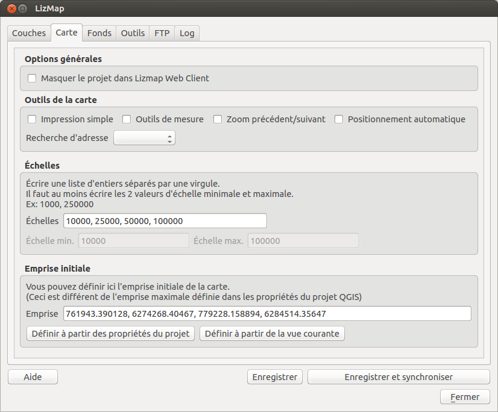

===============================================================
Carte - Configurer la carte web avec le plugin
===============================================================

 
L'onglet Carte
===============================================================

Cet onglet vous permet d'activer ou désactiver des outils, de choisir les échelles et les fonds externes.

Outils de la carte
===============================================================

Impression simple
------------------------

Pour proposer l'impression sur la carte en ligne, il faut que le projet QGIS ait au moins un composeur d'impression. 

Si cette case est cochée, Lizmap Web Client utilisera le premier composeur d'impression trouvé dans la liste des composeurs du projet QGIS.

Lorsque l'impression simple est activée, et que l'utilisateur clique sur l'outil dans Lizmap Web Client, un rectangle est dessiné sur la carte en ligne. Ce rectangle représente le premier cadre de carte du composeur d'impression. Les proportions sont équivalentes, ce qui permet d'assurer que la zone imprimée dans le pdf correspond exactement à ce que l'utilisateur choisit.

L'utilisateur peut déplacer ce rectangle puis cliquer sur le bouton imprimer.

Outils de mesure
-------------------------

Lorsque cette option est activée, l'utilisateur de la carte en ligne voit le menu **Mesure** apparaître dans l'interface. 

Lorsqu'il clique sur ce menu, une liste déroulante propose de mesurer

* une aire
* une longueur
* un périmètre

Pour réaliser la mesure, l'utilisateur clique sur la carte les points successifs de mesure. Un message affiche le résultat de la mesure au fil de l'ajout de points. Un double clic sur la carte permet de finaliser la mesure.

Zoom précédent/suivant
-------------------------

Cette option permet d'ajouter 2 boutons sous la barre de navigation (celle qui contient les boutons de zoom et la barre de sélection de l'échelle). 

Tout déplacement sur la carte est enregistré : glisser-déplacer, zoom avant, zoom arrière. Ces 2 boutons permettent à l'utilisateur de revenir d'un ou plusieurs emprises en arrière ou en avant. 

Positionnement automatique
--------------------------

Cette option ajoute dans l'interface un menu **Géolocalisation** . 

Lorsque l'utilisateur active cet outil, une demande de positionnement est faite via le navigateur. En fonction de l'appareil utilisé et de la connexion internet, le navigateur peut:

* soit utiliser l'api de géolocalisation 
* soit les données du GPS s'il existe et est activé.

*La carte est automatiquement re-centrée sur la localisation récupérée par le navigateur.*

Cet outil peut donc être intéressant si on souhaite consulter la carte Lizmap en ligne depuis son matériel mobile (smartphone, tablette durcie, etc.). Il faut une connection internet active et activer le GPS de l'appareil.

Recherche d'adresse
--------------------------

Il est possible de choisir un moteur externe de recherche d'adresses ou de lieux. Les moteurs disponibles sont les suivants:

* **Nominatim** 

  C'est le moteur officiel du projet OpenStreetMap (http://osm.org et http://nominatim.openstreetmap.org/ ). Il permet de faire des recherches d'adresse, du type "Rue Foch, Montpellier" ou de points d'intérêts, du type "Tour eiffel" ou encore "Au panier gourmand, montpellier".
  
Important:  **La recherche d'adresse est limitée à l'emprise du projet QGIs spécifiée dans l'onglet "Serveur OWS" des propriétés du projet QGIS.**

Échelles
===============================================================

Lizmap vous permet de choisir les échelles d'affichage que vous souhaitez utiliser dans l'application Web. Vous pouvez donc renseigner une liste d'échelles via cette option.

Pour configurer les échelles, il suffit d'écrire une liste d'échelles entières séparées par une virgule (et optionnellement un espace), par exemple: *250000, 100000, 50000*.

Lizmap utilise aussi ces échelles pour restreindre l'affichage entre les échelles minimum et maximum données. C'est pourquoi **il est obligatoire de renseigner au moins 2 échelles** dans la liste

Les 2 échelles minimum et maximum sont automatiquement extraites et affichées pour rappel dans les champs situés sous le champ texte.

  
Fonds externes
===============================================================

Lizmap permet d'ajouter des fonds externes à la liste des fonds de carte

* *OpenStreetMap* : fond officiel et fond Mapquest
* *Google* : Rues, Satellite, Hybride, Relief

L'ajout d'un ou de plusieurs fond(s) externe(s) à votre carte Lizmap a plusieurs conséquences, qu'il faut bien connaître pour anticiper le rendu :

* **c'est ce fond externe qui imposera les échelles de la carte**. Les échelles configurées ci-dessus ne seront donc pas utilisées, sauf les échelles min et max pour restreindre la carte entre ces 2 échelles. 

  Il faut donc faire attention dans le projet QGIS à adapter les seuils de visibilités des couches en fonction des échelles du fond externe. Voici les échelles entières approximatives des fonds externes courants::
  
    0	591659008
    1	295829504
    2	147914752
    3	73957376
    4	36978688
    5	18489344
    6	9244672
    7	4622336
    8	2311168
    9	1155584
    10	577792
    11	288896
    12	144448
    13	72224
    14	36112
    15	18056
    16	9028
    17	4514
    18	2257  

* L'affichage des données du projet QGIS se faisant sur un fond externe, **QGIS doit donc reprojeter à la volée les données dans le système spatial de référence du fond** Il faut donc ajouter cette projection dans l'onglet OWS des propriétés du projet. Pour l'instant, l'ensemble des fonds proposés utilise la projection::

    EPSG:3857 ; Pseudo Mercator
    
* **Les fonds externes ne peuvent pas être imprimés par QGIS** 

  En effet, ils ne sont pas dans le projet QGIS, et sont ajoutés dynamiquement par Lizmap Web Client.
  
* **Respecter la licence des données et les conditions d'utilisation**

  + *Google*: https://developers.google.com/maps/terms
  + *OpenStreetMap*: http://wiki.openstreetmap.org/wiki/FR:Tile_usage_policy
  + *Mapquest*: http://developer.mapquest.com/web/products/open/map#terms

