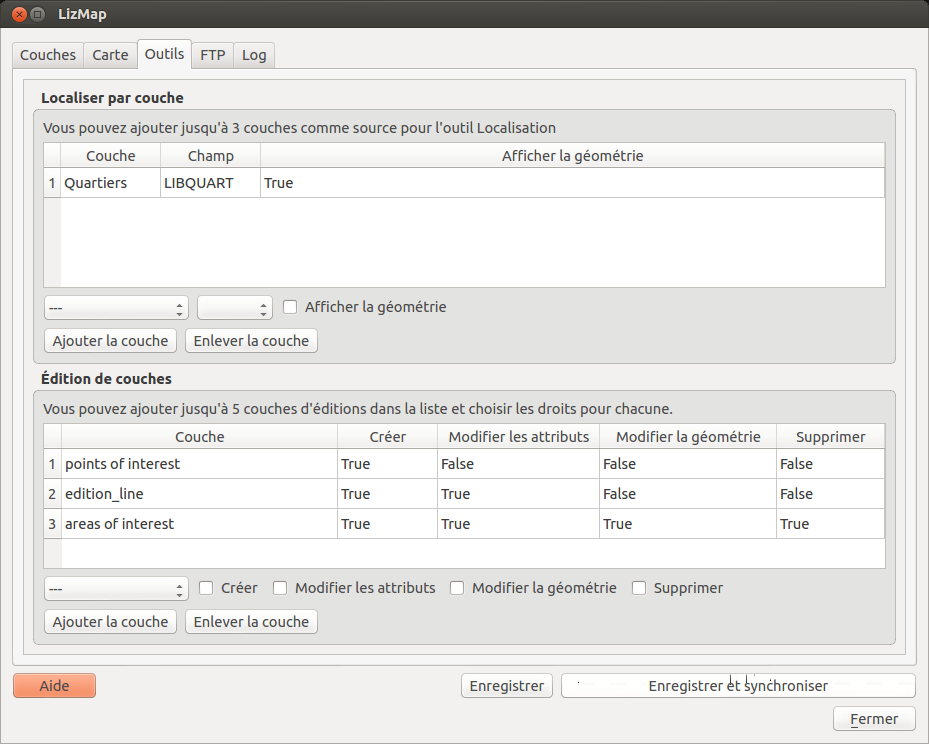

===============================================================
Outils - Configurer les outils à afficher dans le client WEB
===============================================================
 
L'onglet Outils
===============================================================

Présentation
-------------

Cet onglet permet de configurer des outils avancés de Lizmap

   

Localiser par couche
===============================================================

L'idée de cet outil est de présenter à l'utilisateur de Lizmap Web Client une liste déroulante qui permet de zoomer automatiquement sur un ou plusieurs objets spatiaux de la couche. 

Cas d'utilisation
------------------

Prenons comme exemple une couche vectorielle spatiale **Communes** contenue dans le projet QGIS. On choisit d'ajouter ces communes dans l'outil *Localiser par couche*, pour permettre aux utilisateurs de Lizmap Web Client de se positionner rapidement sur une des communes. 

Une fois cette couche ajoutée dans l'outil *Localiser par couche*, une liste déroulante contenant les communes s'affiche sur l'interface web de Lizmap. Le responsable de la publication du projet Lizmap a choisi d'afficher le nom de la commune dans cette liste. Lorsque l'utilisateur de la carte web sélectionne un nom dans cette liste, la carte se recentre automatiquement sur la commune sélectionnée, et la géométrie de la commune s'affiche. L'utilisateur peut masquer la géométrie en cliquant sur un petit bouton représentant un pinceau.

Pré-requis
------------

.. note:: La ou les couches qu'on souhaite utiliser doivent être **publiée(s) comme couche WFS** : cocher la case correspondante dans l'onglet *Serveur OWS* de la partie *Capacités WFS* des propriétés du projet QGIS.

Fonctionnement
---------------

Pour ajouter une couche à cet outil:

* on choisit la couche via la première liste déroulante parmi les couches vectorielles du projet, 
* puis la colonne qui contient le libellé qu'on souhaite afficher dans la liste déroulante. 
* Si on souhaite que la géométrie liée aux objets soit aussi affichée sur la carte lorsque l'utilisateur sélectionne un élément de la liste, alors on coche l'option *Afficher la géométrie*.
* Enfin on clique sur le bouton *Ajouter la couche* pour l'ajouter dans la liste

Pour supprimer une des couches déjà configurée:

* on sélectionne la ligne en cliquant sur l'une des cases de la couche à supprimer
* on clique sur le bouton *Enlever la couche*

.. note:: Au maximum 3 couches du projet peuvent être ajoutées à l'outil Localiser par couches

.. _lizmap_edition:

Édition de couches
===============================================================

Cette fonctionnalité offre la possibilité aux utilisateurs en ligne d'éditer des données spatiales pour des couches PostGIS ou Spatialite. Voir :ref:`edition_in_lizmap` pour le détail de cette fonctionnalité.

