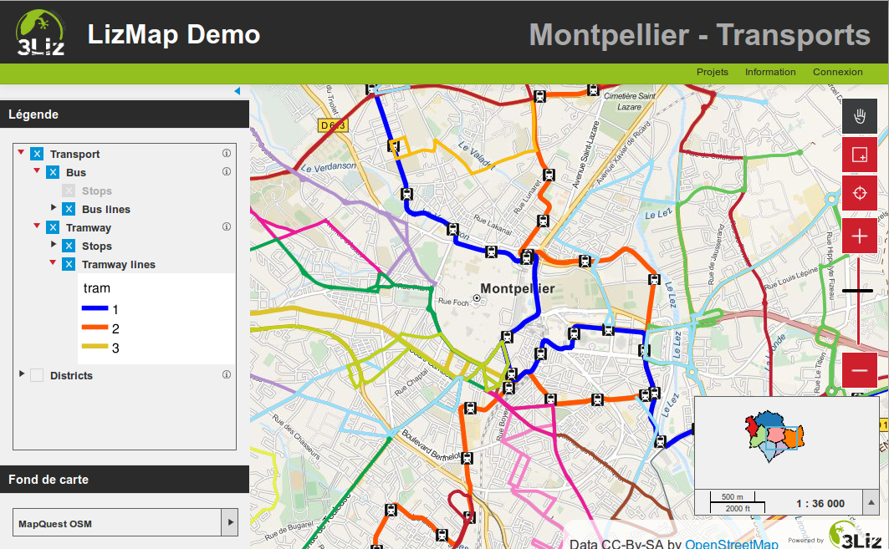

===============================================================
Présentation de Lizmap
===============================================================

QGIS Server, un serveur cartographique
===============================================================

* *Qgis, un SIG de bureau complet*

 * Gestion des couches raster et vecteur, sémiologie, impression, traitements
 * Performance et richesse fonctionnelle d'un SIG de bureau 

* *WMS : Web Mapping Service*: une requête avec des paramètres > une carte au format image

* *Créer un service WMS avec Qgis Server* :
 
 * Installer Qgis Server sur un serveur
 * Copier-coller le projet Qgis et les fichiers de données 
 * Qgis Server et Qgis Desktop : *un même moteur de rendu* 
 

Visualisation de l'architecture client-serveur
----------------------------------------------

.. image:: ../MEDIA/all-schema-client-server.png
   :align: center

Un rendu équivalent entre QGIS et le Web
-------------------------------------------------

.. image:: ../MEDIA/introduction-comparison-qgis-web.png
   :align: center
   :width: 90%

Lizmap : publier facilement ses cartes QGIS sur internet
===============================================================

Créez
---------------------------------------------------------------

*Préparation des données*

Le travail de construction de la carte se mène sur son propre ordinateur avec le logiciel QGIS dans sa version bureautique : chargement des couches, création de la carte, organisation et mise en forme des données.

Publiez
---------------------------------------------------------------

*Configuration & publication de la carte*

Pour pouvoir mettre en ligne sa carte, l'utilisateur configure les options de publication (échelles, fonds de carte, metadonnées) du plugin LizMap dans son application QGIS. Il réalise ensuite une synchronisation sécurisée de son dossier de travail avec son serveur en intra- ou extranet.

Partagez
---------------------------------------------------------------

*Visualisation des données*

Lorsque la synchronisation est terminée, la carte QGIS est alors accessible sur Internet à l'identique. Elle est consultable sur l'application LizMap Web Client au travers des navigateurs majeurs (Firefox, Safari, Chrome, Internet Explorer).

Lizmap plugin - le plugin QGIS
===============================================================

Pour configurer sa carte et la publier

* Caractéristiques générales : *fournies par Qgis*

 - *Données du projet* : nom, description, étendue, projection, etc..
 - *Données des couches* : organisation hiérarchique, nom, seuils de visibilité, symbologie, étiquettes
 
* Configuration additionnelle : *le plugin Lizmap*

 - *Métadonnées* : titre, résumé, lien
 - *Couches* : popup, fonds de carte, regroupement de couches, tuilage, mise en cache
 - *Carte* : échelles, fonds externes 
 

Lizmap Web Client - une carte par projet QGIS
===============================================================

* *Légende*

 - Reprise de l'arbre du projet
 - Séparation entre couches informatives et fonds de carte
 - Couches renommées, visibilité/échelles, résumé, lien
 - Légende intégrée sous chaque couche

* *Barre de navigation* : zoom et déplacement
* *Carte miniature* : un groupe de couches dans le projet
* *Échelles* : graduée et numérique
* *Popups* : information sur clic d'un objet de la carte
* *Information* : une page avec les informations sur le projet QGIS

    
Lizmap - les fonctionnalités principales
===============================================================

* Interface HTML5, compatible mobiles et tablettes
* Regroupement des cartes par répertoire  : application multi-répertoires et multi-projets
* Gestion des droits accès par répertoire pour des groupes utilisateurs
* Gestion automatique du cache des cartes
* Interface multilingue : anglais, français, italien
* Utilisation de fonds référentiels externes : OSM, Google
* Impression
* Édition en ligne : ajout, modification spatiale et attributaire, suppression
* Zoom par localisation
* Recherche d'adresse : Nominatim (moteur d'OpenStreetMap)
* Logs

