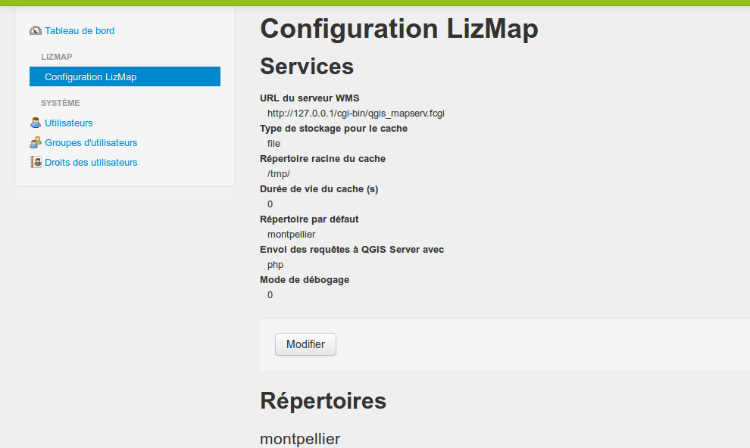
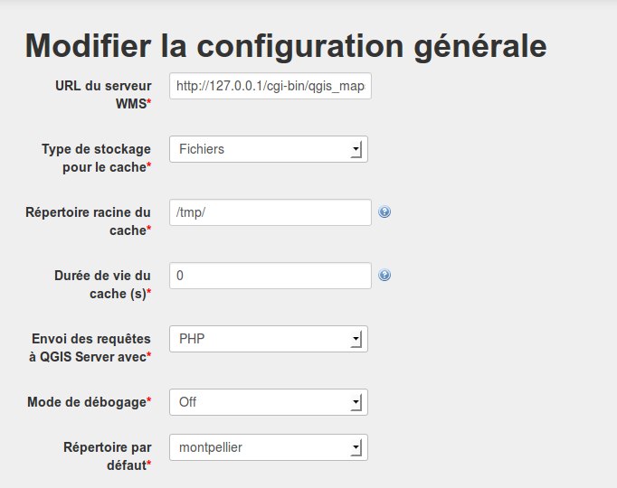

===============================================================
Configuration de Lizmap
===============================================================

Introduction
===============================================================

Le menu *Configuration Lizmap* est divisée en 2 parties

* Les **Services** : la configuration générale de Lizmap Web Client - serveur, cache, etc.
* Les **Répertoires** : créer et configurer les répertoires Lizmap

Les services
===============================================================

Pour configurer les services, cliquer sur le bouton *Modifier* situé sous le récapitulatif

* **URL du serveur WMS** : QGIS Server doit être installé sur le même ordinateur que Lizmap Web Client
* **Type de stockage pour le cache**

 - *file*: Les tuiles mises en cache sont stockées dans un répertoire du serveur par couche
 - *sqlite*: Les tuiles sont enregistrées dans une base de données sqlite par couche
 
* **Répertoire racine du cache** : le dossier dans lequel est stocké le cache. Il doit être accessible en écriture par le serveur Apache

* **Durée de vie du cache** : le temps en seconde pendant lequel chaque tuile est conservée. C'est une valeur par défaut pour les couches dont le temps n'a pas été configuré via le plugin

 - Les tuiles du cache plus vieilles que ce temps sont automatiquement raffraîchies.
 - La valeur 0 signigie que les tuiles n'expirent jamais
 - Le temps d'expiration doit être adapté à l'évolution des données
 
* **Envoi des requêtes à QGIS Server avec** : 2 méthodes. *Php ou Curl* . Utiliser la première si curl n'est pas installé sur le serveur
* *Mode de débogage* : enregistre certaines requêtes dans un fichier de log : *lizmap/var/log/messages.log*

* **Autoriser les visiteurs à demander un compte** : Si cette option est activée, un nouveau lien **Inscription** sera ajouté dans le menu des cartes Lizmap. En cliquant sur ce lien, le visiteur affiche un formulaire qui lui permet de demander un compte à l'administrateur. Il doit remplir certains champs (nom, prénom, adresse, raison de la demande) puis valide le formulaire pour envoyer sa demande.

* **Couriel de l'administrateur** Si une adresse e-mail valide est donnée, alors les notifications de Lizmap pourront y être envoyées. Par exemple, chaque demande de création de compte via le formulaire d'inscription génrère l'envoi d'un courriel à cette adresse.

   
   

Les répertoires
===============================================================

Pour chaque répertoire Lizmap sont listés

* **Les informations principales** : nom (label) et chemin (path)
* **La liste des droits** avec les groupes concernés
* **Des boutons d'action** : 
 
  - *voir* : affiche la page qui liste les cartes de ce répertoire
  - *Modifier*: affiche le formulaire de modification du répertoire
  - *Supprimer* : permet de supprimer le répertoire
  - *Vider le cache* : permet de supprimer tout le cache de toutes les couches des projets de ce répertoire

.. image:: ../MEDIA/administration-repository-detail.png
   :align: center

On peut créer un nouveau répertoire avec le bouton **Ajouter un répertoire** situé tout en bas de la page

Ajouter un répertoire
---------------------------------------------

Pour créer un répertoire, il faut donner

* **un identifiant**: un mot sans espaces, accents ni caractères spéciaux
* **un label** : le nom qui sera affiché pour ce répertoire, accents et espaces autorisés
* **un chemin (path)** : le chemin complet vers le dossier qui contient les projets QGIS et les données

Définir les droits pour chaque groupe
---------------------------------------------

Une fois le répertoire créé, le formulaire de modification du répertoire est automatiquement affiché et permet de définir les droits suivants pour chacun des groupes:

* **Voir les répertoires** : 

  - tous les utilisateurs des groupes cochés pourront accéder aux cartes de ce répertoire
  - le groupe *anonymous* représente les utilisateurs non enregistrés et permet de rendre les cartes publiques

* **Utiliser l'outil d'Édition**

  Lorsque cette option est cochée, les utilisateurs du groupe ont accès à l'outil d'édition pour l'ensemble des cartes du répertoire Lizmap pour lesquelles l'édition a été configurée.

.. image:: ../MEDIA/administration-modify-repository.png
   :align: center

