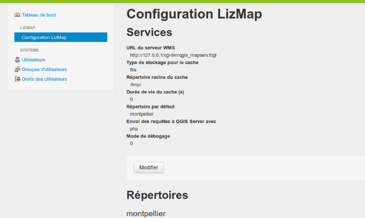
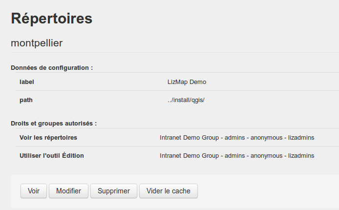

===============================================================
Lizmap Web Client configuration
===============================================================

Introduction
===============================================================

The *Lizmap configuration* menu is divided into 2 parts:

* **Services**: the general configuration of Lizmap Web client - server, cache, etc.
* **Repositories**: create and configure Lizmap repositories

Services
===============================================================

To configure **Services**, click the *Modify* button under the summary.

* **WMS server URL**: The full QGIS Server URL, such as http://localhost/cgi-bin/qgis_mapserv.fcgi or http://localhost/cgi-bin/qgis_mapserv.fcgi.exe.

.. warning:: QGIS Server must be installed on the same computer as Lizmap Web Client

* **WMS subdomain URLs list (optionnal))**: The use of multiple domain names is one of the classic optimizations when a web application uses OpenLayers (as Lizmap Web Client). You can enter a list of subdomains separated by comma.

  + You must use a **list of subdomains** relative to the domain with which is used Lizmap Web Client. For example, if your main domain name is **maps.example.com**, then you can use **a.maps.example.com, b.maps.example.com, c.maps.example.com, d.maps.example.com**.

  + Of course you must have configured the Apache server *virtual host* to take into account these subdomains, for example with the variable:
  
    .. code:: bash

       ServerAlias \*.maps.example.com

* **Server cache storage type**

 - *file*: Tiles cached are stored in a server directory by layer
 - *sqlite*: The tiles are stored in a sqlite database by layer

* **Cache root directory**: the folder where the cache is stored. It must be writable by the Apache server.

* **Server cache expiration time (s)**: the time in seconds during which each tile is retained. This is a default value for layers whose time has not been configured with the plugin.

 - The cached tiles older than that time are automatically refreshed.
 - A value of 0 means that the tiles do not expire.
 - The expiration time must be adapted to changing data.

* **Send request to QGIS Server with**: 2 methods *php or curl*. Use first if curl is not installed on the server.

* **Debug mode**: saves some queries to a log file: *lizmap/var/log/messages.log*

* **Allow visitors to request an account**: If this option is enabled, a new link 'Registration' will be added in the public menu. By clicking on this link, the visitor displays a form that allows it to request an account to administrator. He must complete some fields (name, email, due to demand) then validates the form to send the request.

* **Administrator e-mail** If a valid e-mail address is given, then the Lizmap Web Client notifications will be sent. For example, each account creation request via the registration form generates an email sent to this address.

Repositories
===============================================================

For each Lizmap repository, are listed:

* **The main informations**: label and path
* **The list of rights** with the groups concerned
* **Action buttons**:

  - *View*: displays a page that lists the maps in this repository
  - *Modify*: displays the repository modification form
  - *Remove*: delete the repository from the Lizmap Web Client configuration
  - *Empty cache*: deletes the entire cache of all layers of the repository projects

You can create a new repository using the button **Create a repository** located at the top and bottom of the section *Repositories*.

Add a repository
---------------------------------------------

To create a repository, you must give:

* **an id**: a word without spaces, accents or special characters
* **a label**: the name that will be displayed for this repository, accents and spaces allowed
* **a local folder path**: the full path on the server to the folder that contains the QGIS projects and data
* **Allow repository themes**: This option enables the possibility for the publisher to set a theme for the repository and themes for each map. See :ref:`lizmap-simples-themes`.

.. _define-group-rights:

Define the rights for each group
---------------------------------------------

After creating the directory, the repository modification form is displayed automatically and defines the following rights for each group:

* **View repository** :

  - all users of checked groups can access maps of this repository
  - the group *anonymous* is unregistered users and allows to make public maps

* **Use the Edition tool**

  When this option is checked, the group users have access to the editing tool for all of Lizmap repository maps for which the edition was configured.

* **Always see complete layers data, even if filtered by login**

  This option is in connection with the filtering feature data layers per group. See :ref:`filter-layer-data-by-group`. Check the box for deciding which groups can see all the time all the data, even when a filter is active on some layers.

