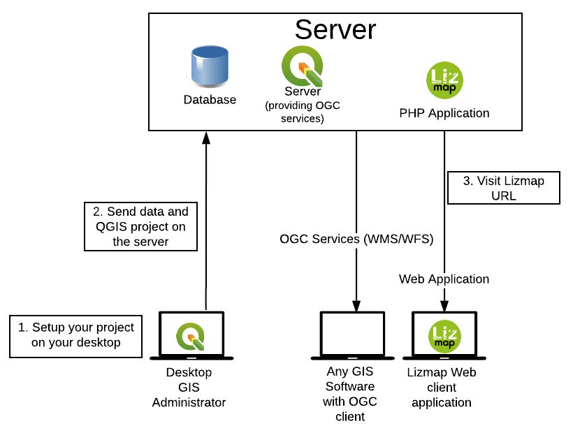
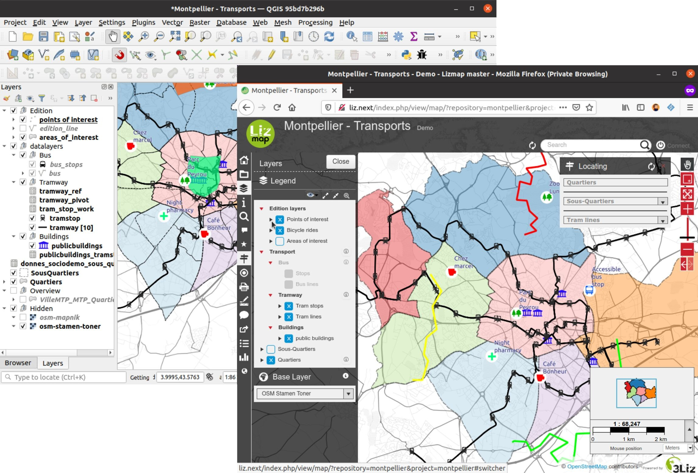
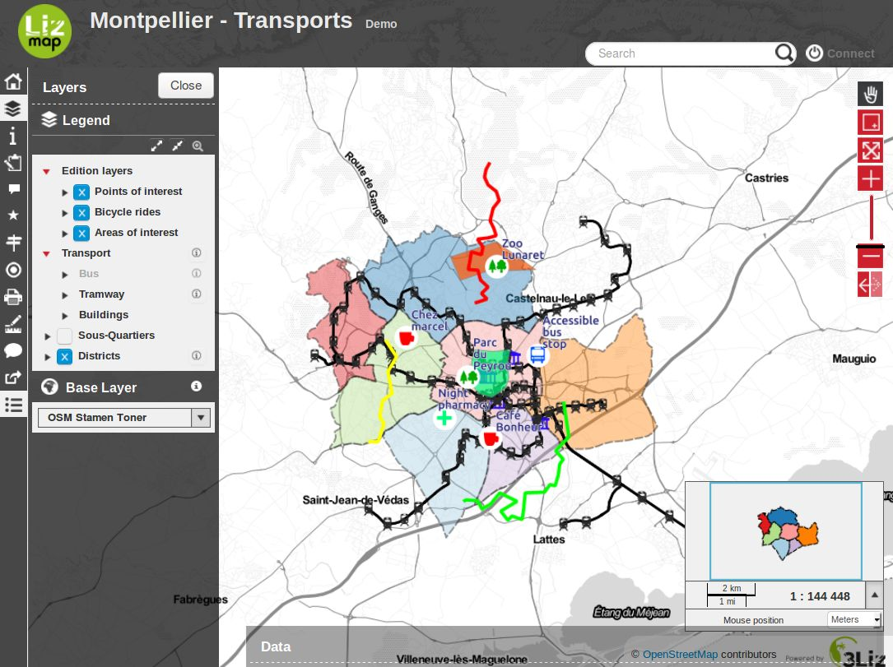
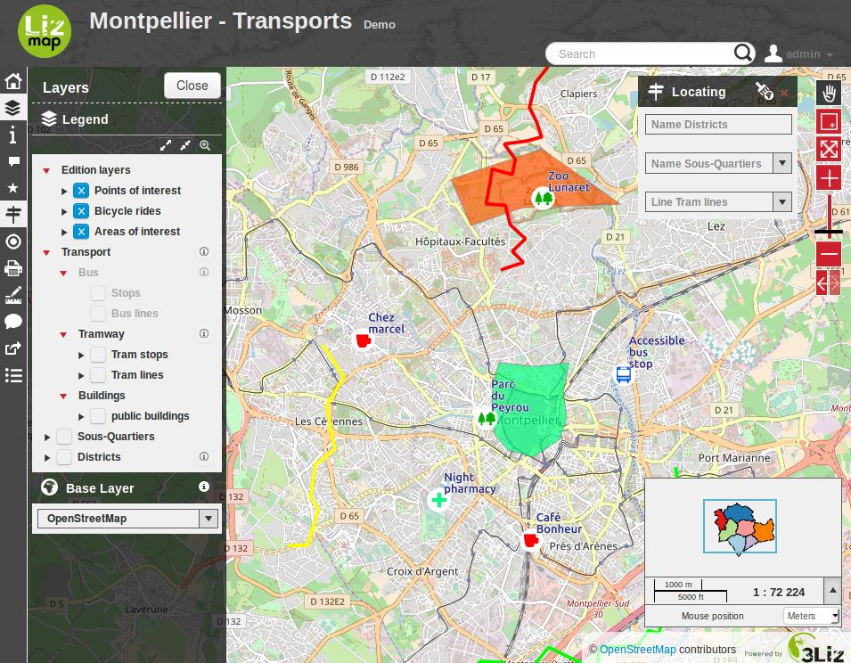

============
Introduction
============

Lizmap architecture
===================

**Data preparation**

The map's construction work is carried on his own computer with **QGIS Desktop**:

* loading layers,
* map creation,
* organising and preparing data.

**Map configuration & publication**

To be able to put the map online, the publisher configures publishing options (scales, base layers, metadata) with **Lizmap plugin** in QGIS Desktop. Then he synchronizes his working folder with his server in intra- or extranet.

**Data vizualisation**

When synchronization is complete, The QGIS map can then be accessed on the Internet at the same. It is available on the application **Lizmap Web Client** with a Web browser (Firefox, Safari, Chrome, Internet Explorer).

.. include:: shared/about_versions.rst

QGIS and QGIS Server
====================

* QGIS, a complete Desktop GIS software

  * Management of a wide range of data format for raster (GeoTIFF, ASC, NetCDF, etc.) and vector (SHP, TAB, MIF/MID, GML, GeoJSON, etc)
  * Management of key geographic database (PostgreSQL/PostGIS, Oracle, MSSQL, etc.)
  * Management of raster and vector layers, symbology, printing, processing
  * Performance and functional richness of a desktop GIS Software

* Geographical standardized Web Services:

  * *Open Geospatial Consortium*, OGC, consortium for standardization of geographic information exchange through Internet
  * *Web Mapping Service*, WMS: standard for publishing map as image
  * *Web Feature Service*, WFS: standard for publishing geographic vector data
  * *Web Coverage Service*, WCS: standard for publishing geographic raster data

* QGIS Server allows you to easily publish 3 types of standardized Web Services Geographic:
 
  * Install QGIS Server on a server
  * Configure properties of Geographic Web Services
  * Copy and paste the QGIS project and data files
  * QGIS Server and QGIS Desktop share **the same rendering engine**

Lizmap features
===============

Open Source
-----------

Lizmap and the modules are opensource projects edited and managed by https://3liz.com

The source code is currently available on https://github.com/3liz/
Help is available through :

* https://gis.stackexchange.com/
* Github tickets
* Our mailing-list : https://lists.osgeo.org/pipermail/lizmap/
* On IRC on the #lizmap channel of https://libera.chat
* Commercial support through 3Liz, contact
mailto:info@3liz.com?subject=CommercialSupportRequest 

Default features
----------------

By default, Lizmap offers web maps with the following features:

* pan
* zoom on area drawn by the user
* zoom more
* selecting a zoom level with a level bar
* zoom less
* displaying the scale as a scale bar and digitally

The displayed legend respects the order and organization defined in QGIS.

The interface allows the user to hide the legend and take advantage of the map in the entire width of the screen. It also lets you view the information on the map (description, extent, contact).

Finally Lizmap is a proxy to the web services used to construct maps. It is therefore possible to use WMS or WFS requests through Lizmap. It is possible to secure access to web services for access in QGIS or ArcGIS. It is also possible to share these addresses with web services systems cataloging.

.. _additional_lizmap_modules:

Additional Lizmap modules
-------------------------

Some modules can be added to Lizmap :

* AltiProfil
    Display a profil with altitude according to a line and a DEM (Digital Elevation Model)

    https://github.com/arno974/lizmap-altiProfil

* Map builder
    To combine many Lizmap projects into a single map viewer

    https://github.com/3liz/lizmap-mapbuilder-module

* PgMetadata
    For displaying metadata stored with the QGIS PgMetadata plugin. It is also providing a DCAT XML catalog, to be harvested by external services

    https://github.com/3liz/lizmap-pgmetadata-module

* PgRouting
   For displaying itinerary between two points using the `PgRouting <https://pgrouting.org/>`_ extension for PostGIS.

    https://github.com/3liz/lizmap-pgrouting-module

* Web Processing Service
    To execute QGIS Processing algorithms or models on a server and view the results within Lizmap

    https://github.com/3liz/lizmap-wps-web-client-module

Specific to France use-case :

* French adresse
    For managing addresses

    https://github.com/3liz/lizmap-adresse-module

* French cadastre
    For managing cadastre data

    https://github.com/3liz/lizmap-cadastre-module

* Naturaliz
    For managing species and observation data

    https://github.com/3liz/lizmap-naturaliz-module

Configuration with QGIS
-----------------------

Map's configuration is done in QGIS.

One part comes directly from the **QGIS project**:

* legend order and structure
* layer symbology
* location map with a group Overview in the legend
* configure print templates via composers

The rest is done with the **Lizmap plugin**. This plugin allows to:

* specify the layers and groups name in the Web interface
* group the layers into a single WMS layer
* set some layers as baselayer
* set the display layer system: alone image or tiles
* set the lifetime of the images in the cache
* set the lifetime of the images in the network
* set the popups for querying layer
* set a link to the metadata
* set the map scales
* set the tools available with the map:

  * printing
  * measuring length, area and perimeter
  * using user geolocation (GPS)
  * address search in OpenStreetMap or Google

* set external baselayers:

  * Google Maps
  * Bing Maps
  * OpenStreetMap
  * Géoportail IGN

* set layers for navigation shortcut:

  * search in a layer field
  * zoom to the selected item
  * cascaded search within 2 fields of the same layer or between joined layers

Configuring with the Web back-office
------------------------------------

The Lizmap back-office defines:

* the directory list containing maps
* users' rights by map directory
* using subdomain to improve the responsiveness of the interface.

In a nutshell
-------------

* HTML5 interface compatible mobiles and tablets
* Grouping maps by directory: application multi-directories and multi-projects
* Management of access rights per directory for user groups
* Automatic map cache management
* Multilingual interface: English, French, Italian, Spanish, Portuguese, Greek
* Using external baselayers: OSM, Google, Bing
* Printing
* Online edition: adding, spatial and filed changing, deleting
* Zoom with localisation
* Address search: Nominatim (OpenStreetMap engine), Google
* Access logs

Requirements
------------

Version of Lizmap Web Client requires:

* Firefox ≥ 63
* Edge ≥ 79
* Chromium ≥ 54
