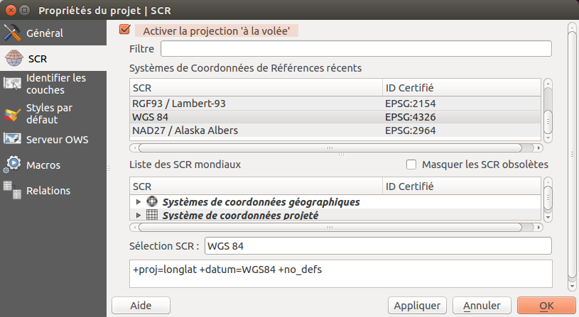
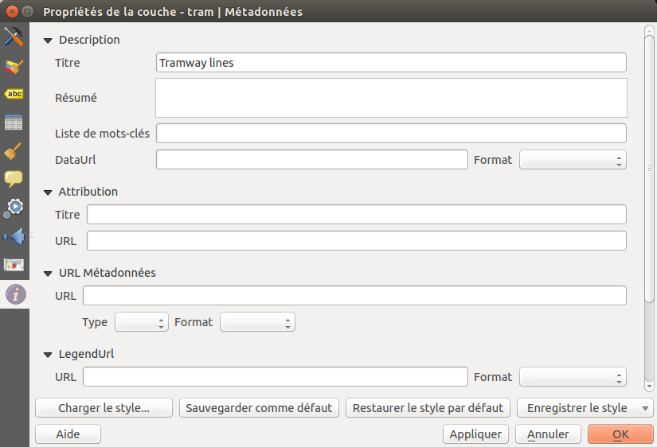

===============================================================
Prepare a QGIS project for Web
===============================================================

Create your project
===============================================================

Add your data:

* Vector geographic data files

  * ESRI Shapefile
  * MapInfo TAB and MIF/MID
  * GeoJSON
  * etc

* RASTER geographic data files

  * GeoTIFF
  * Arc/Info ASCII Grid
  * netCDF
  * etc

* Geographic data base

  * PostgreSQL / PostGIS
  * MSSQL spatial
  * Oracle locator / spatial

Organize and manipulate the layes in the legend:

* *Add groups* with a right click in the empty part of the legend: *Add a new group*
* *Move* layers and groups with *drag-and-drop*
* *Rename* layers and groups with the F2 key or the layer properties window
* Manipulate the rendering order:

  * with the *legend layer order*: the upper layers are rendered above the others.
  * by specifying *layer order* with the menu *View > Panels > Layer order*

Add a title to your project and save it in your working directory.

.. note:: **New in Lizmap 3**: if your layer has more than one style, the user will be able to switch between them through the button *Change layer style* at the top of the legend.

Set up your project for Web
===============================================================

Configure the coordinates reference system, CRS, of your project:

* Select the CRS of your Web map:

  * EPSG:3857 for Google Mercator
  * EPSG:2154 for Lambert 93
  * etc

* Enable *on the fly CRS transformation*. QGIS can reproject raster and vector data.

Configure the Web Geographics Services parameters with the *OWS Server* tab:

* Set the title of your Web Geographics Services
* Add informations like your organization, the owner of the publication, the abstract, etc
* Set the maximum extent of your WMS service
* Restrict the CRSs list of your WMS service:

  * at least select the one used in your project
  * you can use the button *Used* to get all the layer CRS and the project one

* Exclude compositions and layers if data cannot be published in WMS
* Enable the layers you want to publish WFS and WCS

Check that the paths are saved *relative* in the general tab of the project properties window, access it with the menu :menuselection:`Project --> Project Properties` or `CTRL+SHIFT+P`.

.. _layers-tab-metadata:

Configure your layers for the Web
===============================================================

In the window *Layer properties*, the *Metadata* tab allows you to configure a lot of information for Web Geographic Services:

* Provide a title, a description and keywords
* Specify the attribution to respect the data license
* Add the metadata record URL if it's available

