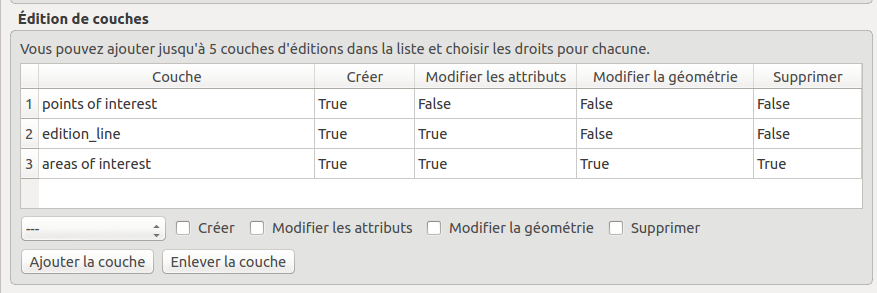

===============================================================
Advanced Configuration
===============================================================

Create an overview map
===============================================================

To add an **overview map**, or location map, in the Lizmap's map, you must:

* Create an independent group in the QGIS project called **Overview** (with the 1st letter capitalized)
* **Add layers**, for example a layer of municipalities, a lighter terrain base layer, etc.

All layers and groups in the *Overview* group will **not be shown in the lizmap's map legend**. They are drawn only in the Overview map.

It is advisable to use:

* **light and simplified** (if necessary) vector layers
* use a **suitable symbology**: small strokes and simple or hidden labels

Here is an example of use:

.. image:: ../MEDIA/features-overview.png
   :align: center
   :width: 60%

.. _locate-by-layer:

Add the localization function
===============================================================

.. image:: ../MEDIA/interface-tools-tab-locate.png
   :align: center
   :width: 80%

The idea of this tool is to present to the Lizmap Web Client user a drop down list that gives the ability to zoom on one or more spatial objects of the layer.

Use case
------------------

Consider a spatial vector layer **districts** contained in the QGIS project. We choose to add these districts in the tool *Locate by layer*, to allow Lizmap Web Client users to quickly position on one of the districts.

Once this layer added in the tool *Locate by layer*, a drop down list of the districts appears on the Lizmap Web interface.

When the Web map user selects one name in this list, the map will automatically refocuses on the selected district and the district's geometry is displayed (optional).

Prerequisites
--------------

.. note:: The layer(s) you want to use must be **published as WFS layer**: check the corresponding box of the *WFS capabilities* in the *OWS Server* tab of the *Project Properties* window.

How to
---------------

To add a layer to this tool:

* **choose the layer** with the first dropdown from the list of the project vector layers
* then **the column that contains the label** you want to display in the dropdown list
* if you want the geometry of the related objects is also displayed on the map when the user selects an item from the list, then check the option *Display the geometry*
* finally click the button **Add layer** to add it to the list.

To remove a layer already configured:

* select the line of the layer you want to remote by clicking on it
* click on the button **Remove layer**.

Hierarchical Lists
-----------------------

If we take the example of districts, it may be interesting to also provide to the user a *sub-districts* dropdown. We wish that when the user chooses a district, the dropdown of sub-districts is automatically filtered to display only the sub-districts of the chosen district.

For this, there are 2 methods:

* you either have **2 separate vector layers**: one for districts and for sub-districts. So you have to use a **field join** between the two layers to enable automatic filtering lists in Lizmap
* either we have **only 1 layer for sub-districts**, and then you can specify with the plugin a **group field**. Two dropdowns will be created instead of one in the Web application.

.. note:: Up to 3 project layers can be added to the *Locate by layer* tool.

.. _media-in-lizmap:

Media in Lizmap
===============================================================

Use principle
-----------------------

It is possible to provide documents through Lizmap. To do this, you simply:

* create a directory called **media** (in lower case and without accents) *at the same level as the QGIS project*
* **place documents in it**: pictures, reports, pdfs, videos, HTML or text files
* the documents contained in this **media** directory are **synchronized as other data** with the plugin FTP synchronisation
* you can use subdirectories per layer or theme: the organization of **media** directory content is free.

Then in Lizmap Web Client you can provide access to these documents for 2 things:

* the **popups**: the content of one or more field for each geometry can specify the path to the media. For example a *photo* or *pdf* field
* the **link** provided for each group or layer in the Lizmap plugin *Layers* tab.

Details of these uses is specified below.

Use for links
---------------------------

It is possible to use a relative path to a document for layers or groups link.

.. note:: Links can be filled with the Lizmap plugin **Layers** tab after selecting the layer or group. See :ref:`layers-tab-metadata`

The path should be written:

* starting with **media/**
* with slashes **/** and not backslashes

Some examples:

* *media/my_layer/metadata_layer.pdf*
* *media/reports/my_report_on_the_layer.doc*
* *media/a_picture.png*

On the Lizmap Web Client map, if a link has been set up this way for one of the layers, then an icon (i) will be placed to the right of the layer. Clicking this icon opens the linked document in a new browser tab.
  
Use in popups
----------------------------

Principle
_________

As described in the introduction above, you can use **a media path** in the spatial data layer.

For example, if you want that the popups associated with a layer displayed a picture that depends on each object, just create a new field that will contain the media path to the picture in each row of the layer attribute table, then activate popups for this layer.

Example
________

Here for example the attribute table of a layer *landscape* configured to display pictures in the popup. The user has created a *picture* field in which he places the path to the pictures, and a *pdf* field in which he puts the paths to a pdf file describing the object corresponding to each line.

======  ======  ===========  ========================  ========================
id      name    description  picture                   pdf
======  ======  ===========  ========================  ========================
1       Marsh   blabla       media/photos/photo_1.png  media/docs/paysage-1.pdf
2       Beach   blibli       media/photos/photo_2.png  media/docs/paysage-2.pdf
3       Moor    bloblo       media/photos/photo_3.png  media/docs/paysage-3.pdf
======  ======  ===========  ========================  ========================

.. note:: In this example, we see that the pictures and pdf file names are normalized. Please follow this example because it allows using the QGIS Field Calculator to create or update  automatically the media column data for the entire layer.

Result
_________

Here are the display rules in the popup:

* if the path points **to a picture, the image will be displayed** in the popup. Clicking on the picture will display the original image in a new tab
* if the path points **to a text file or HTML file, the file contents will be displayed** in the popup
* for **other file types, the popup will display a link to the document** that users can download by clicking on the link.

Illustration
_____________

Below is an illustration of a Lizmap popup displaying a picture, a text and a link in the popup:

.. image:: ../MEDIA/features-popup-photo-example.png
   :align: center
   :width: 90%

.. _popups-in-lizmap:

How to configure popups
===============================================================
 
Activate popups
-------------------------------

With the plugin, you can activate popups **for a single layer** or for **a group configured with the "Group as layer" option**.

Just click on the checkbox **Activate popups** of the tab *Layers* on the Lizmap plugin interface. For the *Group as layer* option you must select the option for the group and for all the layers included you want to show in the popup: in this case, only the layers with the option *Popup* checked will be shown.

In the web application Lizmap Web Client, a click on a map object will trigger the popup if (and only if):

* the layer is **active in the legend**, so that it is shown on the canvas
* the popup **has been activated** through the plugin for the layer or the group
* the user has clicked on an **area of the canvas** where data for the layer with active popups are displayed.

.. note:: For point layers you need to click in the middle of the point to display the popup.

Informations displayed in the popup
_____________________________________

By default the Lizmap Web Client popup displays a table showing the columns of the attribute table in two columns *Field* and *Value*, as shown below:

============  ==============
Field         Value
============  ==============
          id  1
        name  A name
 description  This object ...
       photo  :-)
============  ==============

This is called **simple mode**. You can modify the info displayed through QGIS, and also display pictures or links.

Simple popup configuration
--------------------------------

With the plugin, if you click on the checkbox **Activate popups** without modifying its content through the button *Configure* the default table is shown.

Nevertheless, you can tune several things in QGIS and with the help of Lizmap plugin to **parametrize the fields displayed**, **rename fields**, and even **display images, photos, or links to internal or external documents**.

Mask or rename a column
________________________________________

You can use the tools available in the **Fields** tab of the **Layer properties**, in QGIS:

* to **avoid displaying** a column in the popup, **uncheck the relative WMS checkbox**. The WMS column is on the right

* to **change the name** displayed for that column, type a different name in the *Alias* column

.. image:: ../MEDIA/features-popup-fields.png
   :align: center
   :width: 70%
   
Usage of media: images, documents, etc.
________________________________________________

If you use **paths to documents of the media directory**, you can:

* *display the image* found at that link
* *display the content (text or HTML)* of the file
* *display a link* to a document

.. seealso:: Chapter :ref:`media-in-lizmap` for more details on the usage of documents of the directory media in the popups.

Usage of external links
______________________________

You can also use, in a field, **full web links to a specific page or image**:

* the image referred to will be displayed, instead of the links
* the web link will be displayed and clickable

Advanced popup configuration - HTML format
------------------------------------------------

Introduction
_____________

If the simple table display does not suit your needs, you can write a **popup template**. To do so, you should know well the **HTML format**. See e.g.: http://html.net/tutorials/html/

.. warning:: When you use the advanced mode, the previous configuration to rename a field does not work anymore: you have to configure what is displayed and how through the template. Managing media is also possible, but you have to configure it as well.

Deploying
_______________

You can edit the popup template with the button *Configure* in the Lizmap plugin. Clicking on it you'll get a window with two text areas:

* an **area where you can type your text**
* a **read-only area**, showing a preview of your template

.. image:: ../MEDIA/features-popup-configure.png
   :align: center
   :width: 70%

You can type simple text, but we suggest to write in HTML format to give proper formatting. For instance, you can add paragraphs, headings, etc.:

.. code-block:: html

   <h3>A Title</h3>
   
An example of paragraph

The behaviour is as follows:

* if the content of the two areas is empty, a simple table will be shown in the popup (default template)
* if the content is not empty, its content will be used as a template for the popup

Lizmap Web Client will replace automatically a variable, identified by the name of a field, with its content. To add the content of a column to a popup, you should use the name of the column precede by a dollar sign (`$`), all surrounded by curly brackets (`{}`). For instance:

.. code-block:: html

   <h3>A Title</h3>
   
An example of paragraph

   
A name: <b>{$name}</b>

   
Description: {$description}

.. note:: If you have configured an alias for a field, you have to use the alias instead of the name, between the brackets

You can also use the values of the columns as parameters to give styling to the text. An example here, to use the colour of a bus line as a background colour:

.. code-block:: html

   

   <b>LINE</b> : {$ref} - {$name}
   

Usage of media and external links
_____________________________________________

You can **use the media** referred to in the table content, even if you use a *template model*. To do this, you should use the media column, taking into account the fact that Lizmap Web Client automatically replaces the relative path of the type ``/media/myfile.jpg`` with the full URL to the file, accessible through the web interface.

You can also use full URLs pointing to the pages or images on another server.

Here an example of a template handling media and an external link:

.. code-block:: html

   
A Title

   
The name is {$name}

  

     A sample image 
     
   

   
<a href="{$website}" target="_blank">Web link</a>

   

 

.. seealso:: Chapter :ref:`media-in-lizmap` for more details on the use of documents in the directory media.

.. _lizmap-simples-themes:

Creating simple themes
===============================================================

Starting from Lizmap Web Client version 2.10, it is possible to create themes for all maps of a repository or for a single map. This function needs to be activated by the administrator and uses the directory ``media`` :ref:`media-in-lizmap`.

The principle is:

* the directory ``media`` contains a directory named ``themes``
* the directory ``themes`` contains a default directory for the theme of all the maps of the repository
* the directory ``themes`` may contain a directory per project, for the themes specific for each project

.. code-block:: none

   -- media
     |-- themes
       |-- default
       |-- map_project_file_name1
       |-- map_project_file_name2
       |-- etc

In order to simplify the creation of a theme for a repository or a map, Lizmap allows you to obtain the default theme fro the application, through the request: ``index.php/view/media/getDefaultTheme``.

The request returns a zipfile containing the default theme, with the following structure:

.. code-block:: none

   -- lizmapWebClient_default_theme.zip
     |-- default
       |-- css
         |-- main.css
         |-- map.css
         |-- media.css
         |-- img
           |-- loading.gif
           |-- etc
         |-- images
           |-- sprite_20.png
           |-- etc

Once downloaded the zipfile, you can:

* replace the images
* edit the CSS files

Once your theme is ready, you can just publish it copying it in the directory ``media``.

Adding your own JavaScript
===============================================================

This is useful for a variety of advanced usage. For instance, you can avoid people being able to download elements of the page by right clicking on them, and of course much more.

.. note:: This is available starting with Lizmap 2.11. For earlier versions, you must add your code directly to file ``lizmap/www/js/map.js``

* In your repository (e.g. ``/home/data/repo1/myproject.qgs`` you should have these directories::

.. code-block:: none

    media
    |-- js
      |-- myproject

* All the Javascript code you copy in the ``/home/data/rep1/media/js/myproject/`` directory will be executed by Lizmap, provided that:
* you allow it, through the Lizmap admin interface, adding the privilege "Allow themes for this repository" in the form for the modification of the repository

For the example above, just add a file named e.g. ``disableRightClick.js`` with::

.. code-block:: none

    lizMap.events.on({

      uicreated: function(e) {
        $('body').attr('oncontextmenu', 'return false;');
      }

    });

* If you want this code to be executed for all projects of your repository, you have to copy the file in the directory::

  /home/data/rep1/media/js/default/

rather than in::

  /home/data/rep1/media/js/myproject/

That's all.

In the directory ``lizmap-web-client/lizmap/install/qgis/media/js/`` you can find examples of suitable JavaScript code; just remove the extension ``.example`` to activate them.

Printing configuration
===============================================================

To add print capabilities in the online map, you have to enbale the printing tool in the plugin *Map* tab (:ref:`lizmap-config-map`) and the QGIS project has at least one print composition.

The print composition must contain **at least one map**.

you can add :

* an image to North arrow
* an image for the logo of your organization
* a legend that will be fixed for all printing (before version 2.6)
* a scale, preferably digital for display
* a location map, a map for which you have enabled and configured the function of *Overview*
* labels

You can allow the user to modify the contents of certain labels (title, description, comment, etc). To do this you simply have to add an identifier to your labels.

Finally the print function will be based on the map scales that you set in the plugin *Map* (:ref:`lizmap-config-map`).

.. note:: It is possible to exclude printing compositions for the web. For example, if the QGIS project contains 4 compositions, the project administrator can exclude 2 compositions in the *QGIS project properties*, *OWS server* tab. So only the published compositions will be presented in Lizmap.

.. _print-external-baselayer:

Allow printing of external baselayers
===============================================================

The Lizmap plugin *Baselayers* tab allows you to select and add external baselayers (:ref:`lizmap-config-baselayers`). These external baselayers are not part of the QGIS project, default print function does not integrate them.

To overcome this lack Lizmap offers an easy way to print a group or layer instead of the external baselayer.

To add to printing a layer that replaces an external baselayer, simply add to the QGIS project a group or layer whose name is part of the following list:

* *osm-mapnik* for OpenStreetMap
* *osm-mapquest* for MapQuest OSM
* *osm-cyclemap* for OSM CycleMap
* *google-satellite* for Google Satellite
* *google-hybrid* for Google Hybrid
* *google-terrain* for Google Terrain
* *google-street* for Google Streets
* *bing-road* for Bing Road
* *bing-aerial* for Bing Aerial
* *bing-hybrid* for Bing Hybrid
* *ign-scan* for IGN Scan
* *ign-plan* for IGN Plan
* *ign-photo* for IGN Photos

.. note:: The use of this method must be in compliance with the licensing of external baselayers used (:ref:`lizmap-config-baselayers`).

For OpenStreetMap baselayers, it is possible to use an XML file for GDAL to exploit the OpenStreetMap tile services. Its use is described in the GDAL documentation http://www.gdal.org/frmt_wms.html or in this blog post http://www.3liz.com/blog/rldhont/index.php?post/2012/07/17/OpenStreetMap-Tiles-in-QGIS

By cons, if this layer has to replace an external baselayer, it must be accessible to QGIS-Server but should not be accessible to the user in Lizmap Web Client. So it must be hidden. See chapter :ref:`hide-layers`.

Optimizing Lizmap with the cache
===============================================================

The Lizmap plugin *Layers* tab allows you to enable for each layer or group as a layer the cache for generated images. This feature is not compatible with the option *not tiled image*.

Activating the cache server side
---------------------------------

Lizmap Web Client can dynamically create a cache tiles on the server. This cache is the storage of the images already generated by QGIS-Server on the server. The Lizmap Web Client application automatically generates the cache as the tiles are requested. Enable caching can greatly lighten the load on the server, since we do not want more QGIS-Server tiles that have already been made.

To activate it you must:

* check the box *Server cache?*
* specify the expiration time of the cache server in seconds: **Expiration (seconds)**

The **Metatile** option allows you to specify image size in addition for generating a tile. The principle of **Metatile** is to request the server for a bigger image than hoped, to cut it to the size of the request and return it to the Web client. This method avoids truncated labels at the edges and discontinuities between tiles, but is more resource intensive. The default value is *5,5*, an image whose width and height are equal to 5 times the width and height request.

Activating the cache client side
---------------------------------

The **Browser client cache** option allows you to specify an expiration time for the tiles in the Web browser (Mozilla Firefox, Chrome, Internet Exploreur, Opera, etc) cache in seconds. When browsing the Lizmap map with the browser, it stores displayed tiles in its cache. Enable client cache can greatly optimize Lizmap because the browser does not re-request the server for tiles already in cache that are not expired.

We suggest to set to the maximum value (1 month equals to 24 x 3600 x 30 = 2,592,000 seconds), except of course for layers whose data changes often.

.. note::
   * **The cache must be activated only once mastered rendering**, when you want to move the project into production.
   * **The 2 cache modes, Server and Client, are completely independent** of one another. But of course, it is interesting to use the two together to optimize the application and free server resources.

.. _lizmap-cache-centralized:

Centralizing the cache with the integration of groups and layers from a master project
=======================================================================================

In QGIS, it is possible to integrate in a project, groups or layers from another project (which will be called "parent"). This technique is interesting because it allows you to set the properties of the layers once in a project and use them in several other, for example for baselayers (In the "son" projects that integrate these layers, it is not possible to change the properties).

Lizmap uses this feature to centralize the tiles cache. For all son projects using integrated layers of the parent project, Lizmap requests QGIS-Server tiles from the parent project, not form son projects. The cache will be centralized at the parent project, and all son projects that use layers benefit shared cache.

To use this feature, you must:

* publish the parent QGIS project with Lizmap

  - you must **choose the right announced extent** in the *OWS Server* tab from project properties, because this **extent will be reused identically in son projects**.
  - you must **configure the cache** for the layers to integrate. Also, note the options chosen here (image format, metatile, expiration) for use as such in the son projects.
  - It is possible to hide the project from the main page of Lizmap with the check box *Hide the project Web Client Lizmap* in the plugin 'Map' tab.

* open the son project, and integrate layers or groups in this project, for example orthophoto. Then you must:

  - verify that the **announced extent** in the QGIS project properties / OWS Server is **exactely the same as the parent project**.
  - you must **configure the cache** for the integrated layer **with exactly the same options as those selected from the parent project**: image size, expiration, metatile.
  - you must set the Lizmap id of the **Source repository** of the parent project (The one configured in the Lizmap Web Client administration interface).
  - the code of the "Source project" (the name of the parent QGIS project without the .qgs extension) is automatically entered for layers and integrated groups.

* Publish the son project to the Lizmap Web Client as usual.

.. _hide-layers:

Masking individual layers
===============================================================

You can exclude layers of your publication with the *OWS Server* tab of the *QGIS project properties*. In this case the layers will not be available in Lizmap. With this method, you cannot use a layer in the locate by layer function and not display in the map.

To overcome this lack Lizmap offers a simple way to not display some layers.

Not to display one or more layers of QGIS project in the legend of the Web map, just put these layers in a group called "hidden". All the layers in this group will not be visible in the Web application.

This feature can be used for:

* hide a layer used in the localte by layer (:ref:`locate-by-layer`)
* hide a simple layer for adding data rendered with a view
* hide a layer for printing (:ref:`print-external-baselayer`)

.. _lizmap-config-edition:

Editing data in Lizmap
===============================================================

Principle
----------

Since version 2.8, it is possible to allow users to **edit spatial and attribute data** from the Lizmap Web Client interface for **PostgreSQL or Spatialite** layers of the QGIS project. The Lizmap plugin allows you to add one or more layers and choose what actions for each will be possible in the web interface:

* creating elements
* modifying attributes
* modifying the geometry
* deleting elements

The **Web form** presented to the user to populate the **attribute table** supports **editing tools** available in the *fields* tab of the QGIS Vector *layer properties*. You can configure a dropdown, hide a column, make it non-editable, use a check box, a text area, etc. All configuration is done with the mouse, in QGIS and the Lizmap plugin.

In addition, Lizmap Web Client automatically detects the column type (integer, real, string, etc.) and adds the necessary checks and controls on the fields.

Usage examples
-----------------------

* **A town** wish that citizens identify visible problems on the road: uncollected trash, broken street lights, wrecks to remove. The QGIS project administrator creates a layer dedicated to collect data and displays them to all.

* **An engineering office** wants to allow project partners to trace remarks on the project areas. It allows the addition of polygons in a dedicated layer.

Configuring the edition tool
------------------------------

To allow data editing in Lizmap Web Client, you must:

* **At least one vector layer with PostGIS or Spatialite type** in the QGIS project.
* **Configure editing tools** for this layer in the *fields* tab of the layer properties. This is not required but recommended to control the data entered by users.
* **Add the layer in the tool with the plugin**

Here are the detailed steps:

* If necessary, **create a layer** in your database with the desired geometry type (point, line, polygon, etc.)

  - think about adding a **primary key**: this is essential!
  - the primary key column must be of type **auto-increment**. For example *serial* to PostgreSQL.
  - think about adding a **spatial index** : this is important for performance
  - *create as many fields as you need for attributes*: if possible, use simple field names!

Please refer to the QGIS documentation to see how to create a spatial layer in a PostGIS or Spatialite database: http://docs.qgis.org/html/en/docs/user_manual/index.html

* **Set the editing tools** for your layer fields

  - *Open the layer properties* by double-clicking on the layer name in the legend.
  - Go to *Fields* tab.
  - Select the *Editing tool* in the *Edit widget* column for each field of the layer:

    + To hide a field, choose *Hidden*. The user will not see the field in the form. There will be no content inserting. *Use it for the primary key*.
    + To add a read-only field, unchecked *Editable* checkbox.
    + Special case of the option *Value Relation*. You can use this option for a Lizmap map. For users to have access to information of the outer layer that contains the data, you must enable the publication of the layer as a WFS layer in the *OWS Server* tab of the QGIS *project properties*.
    + etc.

  - **QGIS 2 evolutions** :

    + To hide columns in the Lizmap popup, you must now uncheck the box in the *WMS* for each field to hide (this column is just after *Alias*)
    + Lizmap Web Client does not know yet use the "Drag and drop designer" for form generation. Therefore only use the *Autogenerate* mode for editing layers.

.. note:: All the editing tools are not yet managed by Lizmap Web Client. Only the following tools are supported: Text edit, Classification, Range, Value Map, Hidden, Check Box, Date/Time, Value Relation. If the tool is not supported, the web form displays a text input field.

4. Add the layer in the table "Layer Editing" located in the plugin Lizmap "Tools" tab:

  - *Select the layer* in the drop-down list
  - Check the actions you want to activate from:

    + Create
    + Modify attributes
    + Modify geometry
    + Delete

  - Add the layer in the list with the "Add layer" button.

Reusing data of edition layers
---------------------------------------------

The layers that you have selected for the editing tool are "layers like the others", which means:

* **QGIS styles and labels are applied to these layers.** You can create styles and labels that depend on a value of a layer column.

* If you want to propose the editing tool, but does not allow users to view data from the online layer (and therefore the additions of other users): **you can simply hide edition layers** by putting them in a *hidden* directory. See :ref:`hide-layers`

* **The layers are printable** if they are not masked.

* **The data are stored in a layer of the project**. The administrator can retrieve this data and use them thereafter.

.. note:: PostGIS or Spatialite? To centralize things, we recommend using a PostGIS database to store data. For Spatialite layers, be careful not to overwrite the Spatialite file stored in the Lizmap directory on the server with the one you have locally: remember always to make a backup of the server file before a new sync your local directory.

.. note:: Using the cache: whether to use the server or client cache for editing layers, do so by knowingly: the data will not be visible to users until the cache has not expired. We suggest not to enable the cache for editing layers.

.. _filter-layer-data-by-group:

Filtered layers - Filtering data in function of users
===================================================================

Presentation of the function
----------------------------------

Usually, the management of projects Lizmap access rights is via directory. Configuration is done in this case in the Lizmap Web Client administration interface. See :ref:`define-group-rights`. This will completely hide some projects based on user groups, but requires a directory and project management.

Instead, the filtering feature presented here allows you to publish a single project QGIS, and filter the data displayed on the map based on the logged in user. It is possible to filter only vector layers because Lizmap uses a column in the attribute table.

Filtering currently uses the ID of the user group connected to the Web application. He is active for all requests to the QGIS server, and thus concerns:

* the vector layers images displayed on the map
* the popups
* the *Locate by layer* feature lists. See :ref:`locate-by-layer`
* drop-down lists of *Editing forms* from *Value relation*. See :ref:`lizmap-config-edition`
* upcoming features (the attribute table display, search features, etc.)

A video tutorial is available at: https://vimeo.com/83966790

Configuration of the data filter tool
-------------------------------------------

To use data filtering tool in Lizmap Web Client, you must:

* use **QGIS 2 and above** on the server
* have **access to the administration interface** of Lizmap Web Client

Here are the detailed steps to configure this feature:

* **Knowing the identifiers of user groups** configured in the Lizmap Web Client adminstration interface. For this, you must go to the administration interface :menuselection:`SYSTEM --> Groups of users for rights`: ID appears in parentheses after the name of each group (under the title *Groups of new users*)
* For all vector layers which is desired filter data, just add a text column that will hold the group ID for each line (not the name !!) who has the right to display this line.
   - *Fill this column* for each line of the attribute table with the identifier of the group who has the right to see the line (using the calculator, for example).
   - It is possible to set **all** as the value in some lines to disable the filter: All users will see the data from these lines.
   - If the value in this column for a row does not correspond to a user group, then the data will be displayed for no user.

* Add the layer in the table **Filter Data by User** located in the plugin Lizmap *Tools* tab:

   - *Select layer* from the dropdown list
   - Select the field that contains the *group identifier* for the layer
   - Add the layer in the list with the button *Add layer*
   - To remove a layer of the table, click on it and click the button *Delete the layer*

* **Disable the client cache and cache server** for all filtered layers. Otherwise, the data displayed will not be updated between each connection or user logout!

Time Manager - Animation of temporal vector layers
===========================================================

Documentation coming ...

A video tutorial is available here: https://vimeo.com/83845949. It shows all the steps to use the functionality.

Demonstration site: http://demo.lizmap.3liz.com/index.php/view/?repository=rep6

Changing the default image of a project in the repositories and projects site
===========================================================

By default the following image is displayed for a project:

.. image:: http://imgur.com/5hGIvAM
   :align: left
   :width: 100%
   
   
You can change this default image by adding in the same project folder a .png image with the exact project name and extension. Example: If the project is called montpellier.qgs you can add an image named montpellier.qgs.png. Note that the image has the project extension too.
